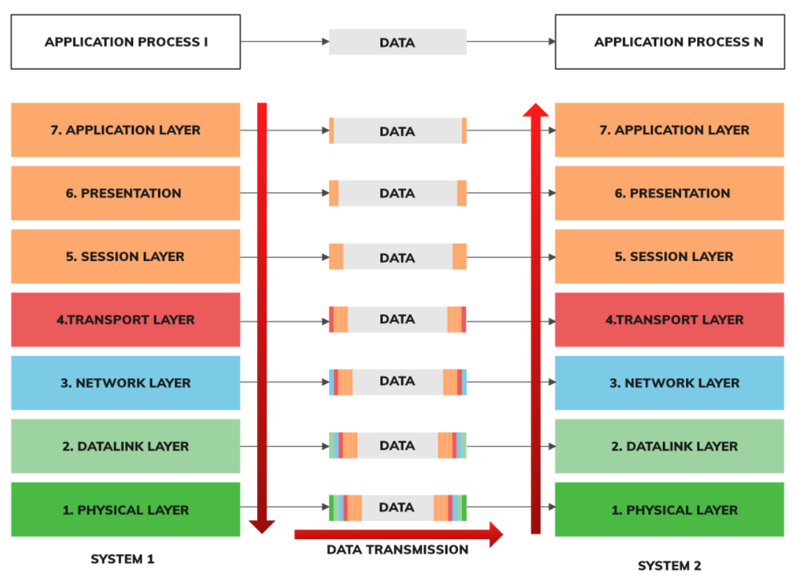
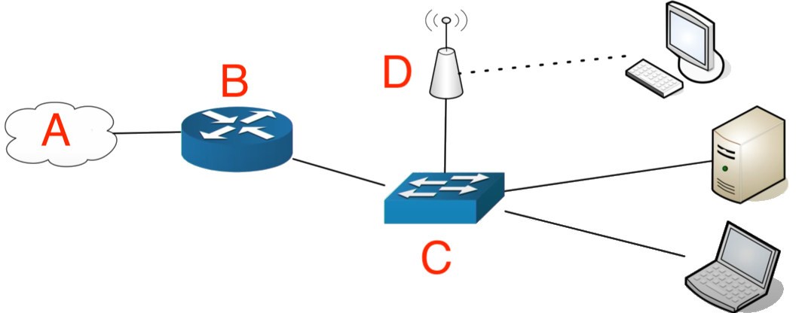

# Assignment 01: Week 01

Before attempting this assignment, please make sure you have completed all of the material in the lessons tab.

Create a copy of this google document [lastname_A01]() (File > Make a Copy) to record all of your assignment answers in.

> :warning: Failure to use answer document properly will result in a 10pt deduction from final score.

The table of contents for this lab is found below.

&nbsp;&nbsp;&nbsp;&nbsp;&nbsp;&nbsp; Part 1: Introduction to IP <br>
&nbsp;&nbsp;&nbsp;&nbsp;&nbsp;&nbsp; Part 2: Common Ports <br>
&nbsp;&nbsp;&nbsp;&nbsp;&nbsp;&nbsp; Part 3: Understanding the OSI Model <br>
&nbsp;&nbsp;&nbsp;&nbsp;&nbsp;&nbsp; Part 4: Ethernet <br>
&nbsp;&nbsp;&nbsp;&nbsp;&nbsp;&nbsp; Part 5: Network Switching <br>
&nbsp;&nbsp;&nbsp;&nbsp;&nbsp;&nbsp; Part 6: Broadcast Domains and Collision Domains<br>
&nbsp;&nbsp;&nbsp;&nbsp;&nbsp;&nbsp; Part 7: Submission <br>

## Part 1: Introduction to IP

:interrobang: Question 1 - The Internet Protocol (IP) is akin to `_______` in the physical world.

:interrobang: Question 2 - An IP Address is akin to `_______` in the physical world.

:interrobang: Question 3 - What is TCP and what does it stand for?

:interrobang: Question 4 - What is UDP and what does it stand for?

:interrobang: Question 5 - Describe a few differences between TCP and UDP.

:interrobang: Question 6 - Describe a few similarities between TCP and UDP.

:interrobang: Question 7 - Consider the below Ethernet packet of data using IP to send a TCP payload of HTTP information. Label each region using the following labels.`IP`,`Ethernet Trailer`,`HTTP Data`,`Ethernet Header`,`TCP`.


* Label A = `_______`
* Label B = `_______`
* Label C = `_______`
* Label D = `_______`
* Label E = `_______`


:interrobang: Question 8 - TCP and UDP operate on the `_______` layer of the OSI model.

:interrobang: Question 9 - Non-ephemeral port number range: `_______` - `_______`

:interrobang: Question 10 - Ephemeral port number range: `_______` - `_______`

## Part 2: Common Ports

:interrobang: Question 11 - For each of the following services/applications, provide the port number and a once sentence description of that that service does.

*Example:* <br>
**Telnet - Telecommunication Network** <br>
tcp/23 - Lets you remotely log into device and administer it. <br>

* SSH - Secure Shell
* DNS - Domain Name System
* SMTP - Simple Mail Transfer Protocol
* SFTP - Secure File Transfer Protocol
* FTP - File Transfer Protocol
* TFTP - Trivial File Transfer Protocol
* DHCP - Dynamic Host Configuration Protocol
* HTTP - Hypertext Transfer Protocol
* HTTPS - Hypertext Transfer Protocol Secure
* SNMP - Simple Network Management Protocol
* RDP - Remote Desktop Protocol
* NTP - Network Time Protocol
* SIP - Session Initiation Protocol
* SMP - Server Message Block
* POP3 - Post Office Protocol v3
* IMAP4 - Internet Message Access Protocol v4
* LDAP - Lightweight Directory Access Protocol

## Part 3: Understanding the OSI Model



:interrobang: Question 12 - In your own words, describe Layer 1 of the OSI model.

:interrobang: Question 13 - In your own words, describe Layer 2 of the OSI model.

:interrobang: Question 14 - In your own words, describe Layer 3 of the OSI model.

:interrobang: Question 15 - In your own words, describe Layer 4 of the OSI model.

:interrobang: Question 16 - In your own words, describe Layer 5 of the OSI model.

:interrobang: Question 17 - In your own words, describe Layer 6 of the OSI model.

:interrobang: Question 18 - In your own words, describe Layer 7 of the OSI model.

:interrobang: Question 19 - What is IP Fragmentation? 

## Part 4: Ethernet

:interrobang: Question 20 - Consider the network diagram below. Label each region using the following labels. `Switch`,`Router`,`Internet`,`Access Point`.



Label A = `_______` <br>
Label B = `_______` <br>
Label C = `_______` <br>
Label D = `_______` <br>

:interrobang: Question 21 - Define the below terms:

* Internet
* Router
* Switch
* Access Point

:interrobang: Question 22 - What does `MAC Address` stand for and what is it used for?

## Part 5: Network Switching

:interrobang: Question 23 - Describe three important functions a `switch` performs.

:interrobang: Question 24 - What is a `MAC Address Table` and and what is it used for?

:interrobang: Question 25 - Assume a MAC address destination is received by a switch and the switch has no record of the destination MAC address. How would that switch handel that traffic?

:interrobang: Question 26 - In your own words, describe what happens when a switch "floods a network"?

:interrobang: Question 27 - What does the below terminal command do?

 ```bash
  $ arp -a
  ``` 

  :interrobang: Question 28 - What is an ARP request?

  ## Part 6: Broadcast Domains and Collision Domains

:interrobang: Question 29 - Assume Device A sends a broadcast within it's broadcast domain. Device B is on the network but there is a router between Device A and Device B. Does Device B receive Device A's broadcast message?

:interrobang: Question 30 - Considering the scenario described in Question 29, replace the word router with the word switch. With this change, does Device B receive Device A's broadcast message?

:interrobang: Question 31 - What network device can be used to segment broadcast domains? 

## Part 7: Submission

Export your answer document to a .PDF and upload a single `lastname_A01.pdf` answer document containing all of your answers to the lab questions to Brightspace through the attachment uploads option.