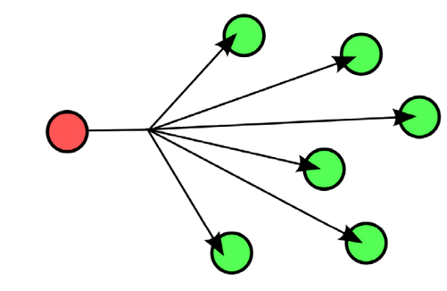
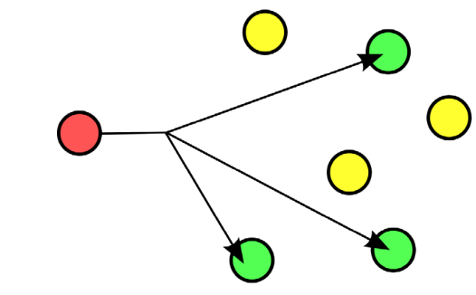
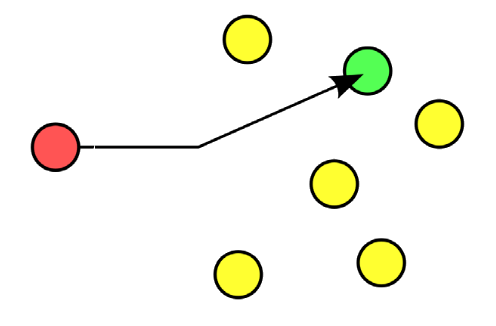
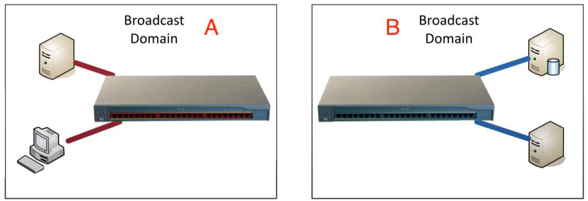
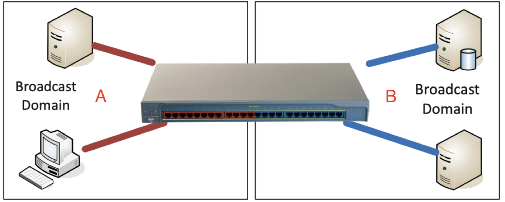
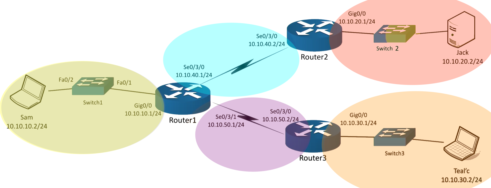

# Assignment 02: Week 02

Before attempting this assignment, please make sure you have completed all of the material in the lessons tab.

Create a copy of this google document [lastname_A02](https://docs.google.com/document/d/14WHu9fQ9xKU9xHUSJYpaj4bAo9lpdfyj9VxS8J9IovE/edit?usp=sharing) (File > Make a Copy) to record all of your assignment answers in.

> :warning: Failure to use answer document properly will result in a 10pt deduction from final score.

The table of contents for this lab is found below.

&nbsp;&nbsp;&nbsp;&nbsp;&nbsp;&nbsp; Part 1: Unicasts, Broadcasts, and Multicasts <br>
&nbsp;&nbsp;&nbsp;&nbsp;&nbsp;&nbsp; Part 2: Protocol Data Units (PDU) <br>
&nbsp;&nbsp;&nbsp;&nbsp;&nbsp;&nbsp; Part 3: Network Segmentation <br>
&nbsp;&nbsp;&nbsp;&nbsp;&nbsp;&nbsp; Part 4: Spanning Tree Protocol <br>
&nbsp;&nbsp;&nbsp;&nbsp;&nbsp;&nbsp; Part 5: Switch Interface Properties <br>
&nbsp;&nbsp;&nbsp;&nbsp;&nbsp;&nbsp; Part 6: Static and Dynamic Routing <br>
&nbsp;&nbsp;&nbsp;&nbsp;&nbsp;&nbsp; Part 7: Submission <br>

## Part 1: Unicasts, Broadcasts, and Multicasts

:interrobang: Question 1 - Define the below network communication terms:

* Unicasts
* Broadcasts
* Multicasts

For the following questions, match each image below with the corresponding label: `Unicasts, Broadcasts, Multicasts`


| Image A             |  Image B |
:-------------------------:|:-------------------------:
  |  

| Image C             |  
:-------------------------:|
  | 


:interrobang: Question 2 - Image A = `_______`. <br>
:interrobang: Question 3 - Image B = `_______`. <br>
:interrobang: Question 4 - Image C = `_______`. <br>


## Part 2: Protocol Data Units (PDU)

:interrobang: Question 5 - Define the term PDU. <br>
:interrobang: Question 6 - Define the term MTU. <br>
:interrobang: Question 7 - What is the maximum size of an IP packet (in bits). <br>
:interrobang: Question 8 - What is the maximum size of an IP packet (in bytes) <br>

> If you need a refresher on what a bit or byte is, please visit this [resource](https://web.stanford.edu/class/cs101/bits-bytes.html) - [PDF](./files/bits-and-bytes.pdf). Having an understanding of how computers encode information is critically important in cyber security, digital forensics, and computer science.

:interrobang: Question 9 - What does the `-f` flag mean when using the ping command (Windows machine). <br>

Example :
```bash
ping -f 8.8.8.8
```

:interrobang: Question 10 - What does the `-l` flag mean when using the ping command (Windows machine). <br>

Example :
```bash
ping -f -l 1472 8.8.8.8
```
## Part 3: Network Segmentation

:interrobang: Question 11 - What does LAN stand for? <br>
:interrobang: Question 12 - Define what a LAN is and how it works.<br>
:interrobang: Question 13 - What does VLAN stand for? <br>
:interrobang: Question 14 - Define what a VLAN is and how it works.<br>
:interrobang: Question 15 - Consider the two separate LANs configuration below. Can devices from *Broadcast Domain A* communicate with devices from *Broadcast Domain B*?



:interrobang: Question 16 - Consider the VLAN configuration below. Can devices from *Broadcast Domain A* communicate with devices from *Broadcast Domain B*?



:interrobang: Question 17 - Describe the difference between a physical segmentation and a logical segmentation. <br>
:interrobang: Question 18 - Through what network device is possible for devices on two different VLANs (or LANs for that matter) to communicate? <br>

## Part 4: Spanning Tree Protocol

:interrobang: Question 19 - `Spanning Tree Protocol (STP)` helps protect against `_______`, which can occur when two switches are connected by two ethernet interfaces.<br>

:interrobang: Question 20 - Define (in your own words) an ethernet loop on a network and how it can inhibit network traffic. <br>

:interrobang: Question 21 - List and describe the 5 possible STP port states discussed in lecture. <br>

:interrobang: Question 22 - Define the below terms (in relation to STP):

* Root Port
* Designated Port
* Blocked Port

## Part 5: Switch Interface Properties

:interrobang: Question 23 - What do the `speed` and `duplex` qualities of an ethernet connection describe? <br>
:interrobang: Question 24 - What are common values for the `speed` of an ethernet connection? <br>
:interrobang: Question 25 - What are common values for the `duplex` of an ethernet connection? <br>

## Part 6: Static and Dynamic Routing

:interrobang: Question 26 - What is a routing table? <br>
:interrobang: Question 27 - Does the routing table have the entire pathway of a packet to it's destination? Or simply the next step (hop) in its pathway? <br>
:interrobang: Question 28 - Compare and contrast Static and Dynamic Routing <br>
:interrobang: Question 29 - List 3 advantages of static routing <br>
:interrobang: Question 30 - Administering a `Default Route` can be helpful in what type of networking scenario? <br>
:interrobang: Question 31 - Consider the network topology below. If you were to statically administer router 1 so it could forward packets to networks `10.10.40.0`, `10.10.50.0`, and `10.10.30.0`, how would you fill out the routing table?  <br>



### Router#01

| Route | Next Hop |
:-------------------------:|:-------------------------:
|`______________`|`______________`|
|`______________`|`______________`|
|`______________`|`______________`|
|`______________`|`______________`|

:interrobang: Question 32 - True or False: The speed of route links matters in Distance Vector Routing. Explain your reasoning.

:interrobang: Question 33 - True or False: The speed of route links matters in Link-state Routing Protocols. Explain your reasoning.


## Part 7: Submission

Export your answer document to a .PDF and upload a single `lastname_A02.pdf` answer document containing all of your answers to the lab questions to Brightspace through the attachment uploads option.