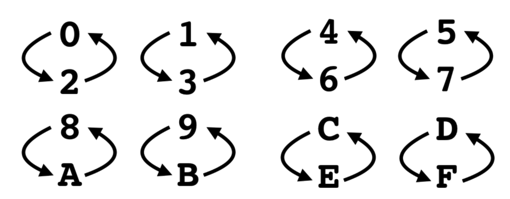
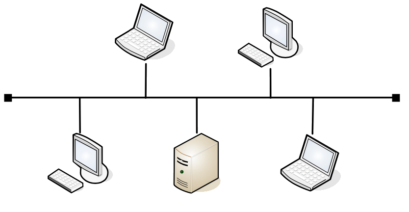

# Assignment 05: Week 05

Before attempting this assignment, please make sure you have completed all of the material in the lessons tab. 

Create a copy of this google document [lastname_A05](https://docs.google.com/document/d/11bDFfc-4dLrManqATa_dON7dukZAJwUeJ-j1OPO9Dlc/edit?usp=sharing) (File > Make a Copy) to record all of your assignment answers in.

> :warning: Failure to use answer document properly will result in a 10pt deduction from final score.

The table of contents for this lab is found below.

&nbsp;&nbsp;&nbsp;&nbsp;&nbsp;&nbsp; Part 1: IPv6 Addressing  
&nbsp;&nbsp;&nbsp;&nbsp;&nbsp;&nbsp; Part 2: Network Topologies and Network Maps  
&nbsp;&nbsp;&nbsp;&nbsp;&nbsp;&nbsp; Part 3: Network Types  
&nbsp;&nbsp;&nbsp;&nbsp;&nbsp;&nbsp; Part 4: Internet of Things (IoT)  
&nbsp;&nbsp;&nbsp;&nbsp;&nbsp;&nbsp; Part 5: Wireless Standards 
&nbsp;&nbsp;&nbsp;&nbsp;&nbsp;&nbsp; Part 6: Cellular Standards  
&nbsp;&nbsp;&nbsp;&nbsp;&nbsp;&nbsp; Part 7: Submission  

## Part 1: IPv6 Addressing

:interrobang: Question 1 - Does DHCP exist for IPv6?  
:interrobang: Question 2 - What is the IPv6 multi-cast address and port used to solicit DHCP servers on a network?  
:interrobang: Question 3 - Convert the following MAC addresses into Static IPv6 addresses.   

> Use the below table to help with your conversions.

* 7E:F5:F0:3F:87:A5
* EA:3A:CB:49:10:1D
* 55:DB:D6:C2:15:89
* 7A:7F:2F:B8:FB:D7
* 0D:A9:10:C9:45:0E
* F5:AC:B2:1A:CB:3C

## Part 2: Network Topologies and Network Maps

Identify and label the below topology types.

| Image A             |  Image B |
:-------------------------:|:-------------------------:
  |  

| Image C             |  Image D |
:-------------------------:|:-------------------------:
  |  

:interrobang: Question 4 - Image A = `_______`  
:interrobang: Question 5 - Image B = `_______`  
:interrobang: Question 6 - Image C = `_______`  
:interrobang: Question 7 - Image D = `_______`  
:interrobang: Question 8 - Describe some advantages of a mesh network topology  
:interrobang: Question 9 - Which topology type is commonly implemented in MANs or WANs  

## Part 3: Network Types

:interrobang: Question 10 - `LAN` stands for  `_______`  
:interrobang: Question 11 - `WLAN` stands for  `_______`  
:interrobang: Question 12 - `MAN` stands for  `_______`  
:interrobang: Question 13 - `WAN` stands for  `_______`  
:interrobang: Question 14 - `CAN` stands for  `_______`  
:interrobang: Question 15 - `PAN` stands for  `_______`  
:interrobang: Question 16 - Compare and contrast `NAS` vs `SAN`  

## Part 4: Internet of Things (IoT)

:interrobang: Question 17 - In your own words, define IoT.  
:interrobang: Question 18 - Describe three IoT topologies or standards that we discussed this week and how they work. 
:interrobang: Question 19 - Do you use any IoT technologies frequently? If so, which one and what do you use it for.  
:interrobang: Question 20 - While IoT does offer many modern conveniences that were not enjoyed 10 - 20 years ago, what are some less "trivial" services IoT devices offer?  
:interrobang: Question 21 - Do a quick google search about the security of IoT devices (don't spend more than 5 mins on your research). Were there any concerns that came up in your google search?  

## Part 5: Wireless Standards

:interrobang: Question 22 - What is the IEEE 802.11 standard?  
:interrobang: Question 23 - When talking about IEEE 802.11 with someone who didn't take CSF 432, what term could you use instead of 802.11?  
:interrobang: Question 24 - Does your home router/access point broadcast two SSIDs (WiFi network names) at two different frequencies?  
:interrobang: Question 25 - If you responded `yes` to `question 24`, what are those two frequencies? If not, what frequency is your router/access point broadcasting on?  
:interrobang: Question 26 - What is the most up-to-date 802.11 standard? 

## Part 6: Cellular Standards

:interrobang: Question 27 - Learning what we did about cellular networks, why do you believe we call our mobile devices cell phones?  
:interrobang: Question 28 - Generally (high level description), how  does the cellular network work? 
:interrobang: Question 29 - GSM and CDMA have since transitioned to `_______`. 
:interrobang: Question 30 - LTE stands for `_______`. 

## Part 7: Submission

Export your answer document to a .PDF and upload a single `lastname_A05.pdf` answer document containing all of your answers to the lab questions to Brightspace through the attachment uploads option.   Image and content sourced from: *[Professor Messer](https://www.professormesser.com/)*
