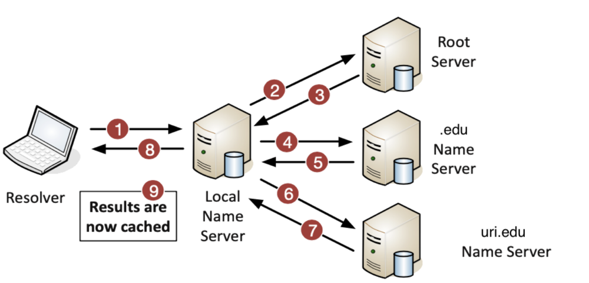

# Assignment 06: Week 06

Before attempting this assignment, please make sure you have completed all of the material in the lessons tab. 

Create a copy of this google document [lastname_A06](https://docs.google.com/document/d/1errpu2Oddl07luKu4roTlh7EOjUXfnd90RzgjXCI2oE/edit?usp=sharing) (File > Make a Copy) to record all of your assignment answers in.

> :warning: Failure to use answer document properly will result in a 10pt deduction from final score.

The table of contents for this lab is found below.

&nbsp;&nbsp;&nbsp;&nbsp;&nbsp;&nbsp; Part 1: Cloud Services and Delivery Models  
&nbsp;&nbsp;&nbsp;&nbsp;&nbsp;&nbsp; Part 2: An Overview of DNS  
&nbsp;&nbsp;&nbsp;&nbsp;&nbsp;&nbsp; Part 3: DNS Record Types  
&nbsp;&nbsp;&nbsp;&nbsp;&nbsp;&nbsp; Part 4: DHCP Addressing Overview  
&nbsp;&nbsp;&nbsp;&nbsp;&nbsp;&nbsp; Part 5: Configuring DHCP  
&nbsp;&nbsp;&nbsp;&nbsp;&nbsp;&nbsp; Part 6: Network Time Protocol (NTP)  
&nbsp;&nbsp;&nbsp;&nbsp;&nbsp;&nbsp; Part 7: Submission  

## Part 1: Cloud Services and Delivery Models

:interrobang: Question 1 - What is a cloud (in the domain of networking)?  

:interrobang: Question 2 - What are the different layers in cloud computing?<be>

:interrobang: Question 3 - Define `SaaS` in your own words.  

:interrobang: Question 4 - Have you used *Software as a Service* on a cloud platform, maybe without realizing it? If so, what service? If not, provided an example of cloud hosted software service. 

:interrobang: Question 5 - `IaaS` can save the upfront cost of hardware. Why?  

:interrobang: Question 6 - What is the platform as a service?  

:interrobang: Question 7 - Describe how `PaaS` can act as a hybrid of `SaaS` and `IaaS`.  

:interrobang: Question 8 - List and define the four cloud deployment models we discussed this week. 

:interrobang: Question 9 - What is a `private cloud`?   

:interrobang: Question 10 - Compare and contrast some differences between cloud and traditional data centers.  

:interrobang: Question 11 - Describe some advantages of cloud services?  

## Part 2: An Overview of DNS

:interrobang: Question 12 - In your own words, describe what `DNS` is and how does it work. 

:interrobang: Question 13 - Describe the processes (in detail) identified by each label in the below diagram.  

Label 1: `______`  
Label 2: `______` 
Label 3: `______` 
Label 4: `______` 
Label 5: `______` 
Label 6: `______` 
Label 7: `______` 
Label 8: `______` 
Label 9: `______` 

:interrobang: Question 14 - How does the DNS hierarchy work and why is it important?  

:interrobang: Question 15 - Describe the differences between internal, external, and third-party DNS servers.  

## Part 3: DNS Record Types

:interrobang: Question 16 - What are DNS `resource records`?  

:interrobang: Question 17 - What function does the DNS Address record (A)/(AAAA) perform?  

:interrobang: Question 18 - What function does the DNS Canonical Name record perform?  

:interrobang: Question 19 - What function does the DNS Mail Exchanger record perform? 

:interrobang: Question 20 - What function does the DNS Name Server record perform? 

:interrobang: Question 21 - What function does the DNS Pointer record perform? 

:interrobang: Question 22 - What function does the DNS Text record perform? 

## Part 4: DHCP Addressing Overview

:interrobang: Question 23 - DHCP stands for `_____`  

:interrobang: Question 24 - Enumerate the steps needed for a DHCP server to dynamically assign an IP address to a host machine on a network.   

:interrobang: Question 25 - How do DHCP servers serve the same static IP address to a specific devices each time it connects to that network?  

## Part 5: Configuring DHCP

:interrobang: Question 26 - When configuring a DHCP server, list some of the important scope properties needed for a DHCP server to function properly.  

:interrobang: Question 27 - What is an IP address pool?  

:interrobang: Question 28 - Recall our `Configuring a DHCP Server (Lab 04)` lab. Did implementing a DHCP server yourself contribute to your understanding of how DHCP works? Elaborate.  

## Part 6: Network Time Protocol (NTP)

:interrobang: Question 29 - Why is NTP critical for day-today network connectivity?  

:interrobang: Question 30 - How can we mitigate the time synchronization issue that presents itself when NTP clients are far (in terms of distance) from the NTP server?  

## Part 7: Submission

Export your answer document to a .PDF and upload a single `lastname_A06.pdf` answer document containing all of your answers to the lab questions to Brightspace through the attachment uploads option.   Image and content sourced from: *[Professor Messer](https://www.professormesser.com/)*
