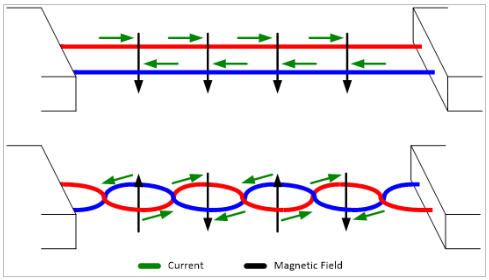
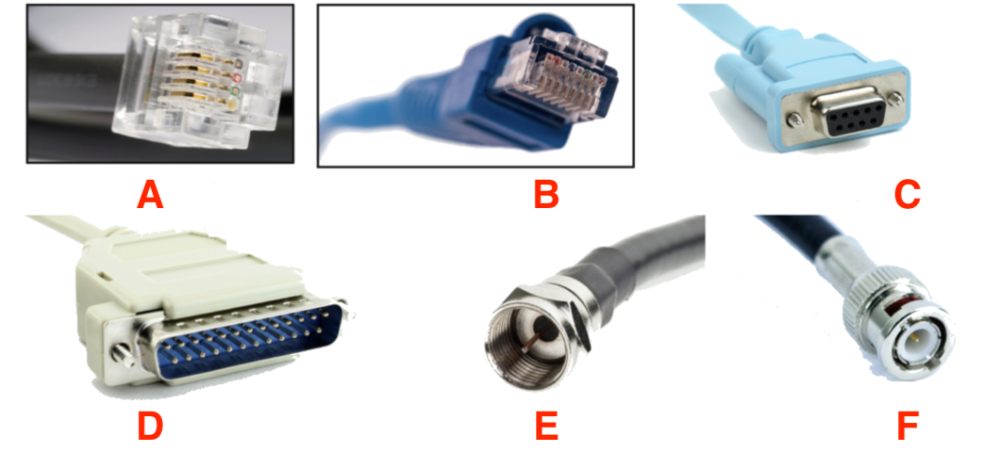
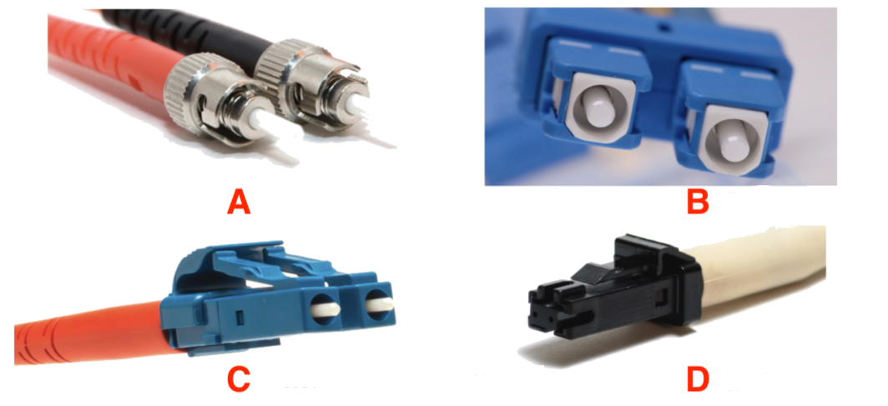
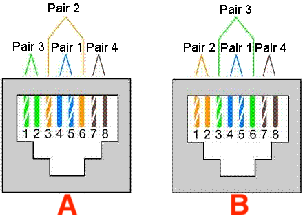
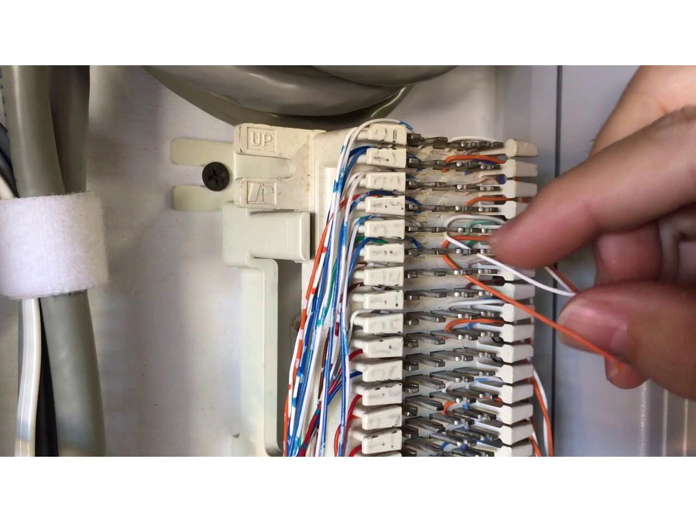
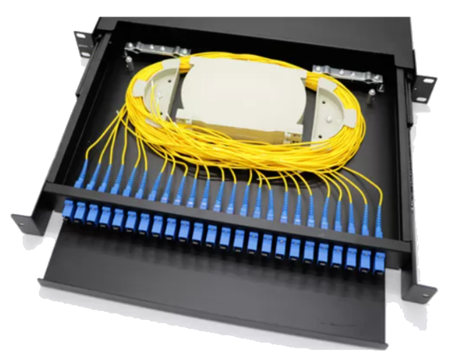
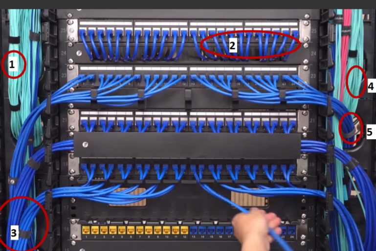
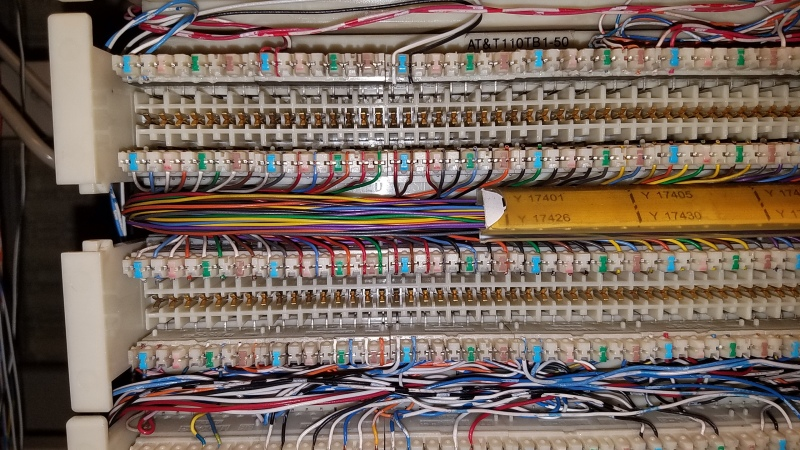
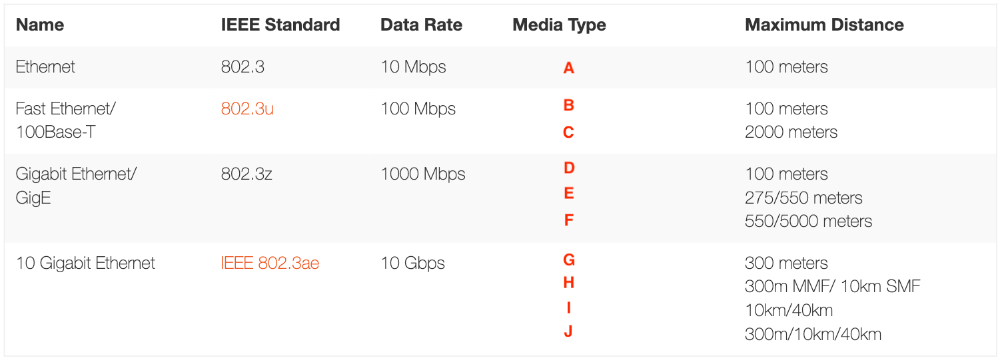

# Assignment 07: Week 07

Before attempting this assignment, please make sure you have completed all of the material in the lessons tab. 

Create a copy of this google document [lastname_A07](https://docs.google.com/document/d/12d7pPWSDwo9QFtv23kcYVZBg5g1XVU_t7FvBHWTRyGw/edit?usp=sharing) (File > Make a Copy) to record all of your assignment answers in.

> :warning: Failure to use answer document properly will result in a 10pt deduction from final score.

The table of contents for this lab is found below.

&nbsp;&nbsp;&nbsp;&nbsp;&nbsp;&nbsp; Part 1: Copper Cabling  
&nbsp;&nbsp;&nbsp;&nbsp;&nbsp;&nbsp; Part 2: Copper Connectors  
&nbsp;&nbsp;&nbsp;&nbsp;&nbsp;&nbsp; Part 3: Optical Fiber  
&nbsp;&nbsp;&nbsp;&nbsp;&nbsp;&nbsp; Part 4: Optical Fiber Connectors  
&nbsp;&nbsp;&nbsp;&nbsp;&nbsp;&nbsp; Part 5: Copper Termination Standards  
&nbsp;&nbsp;&nbsp;&nbsp;&nbsp;&nbsp; Part 6: Network Termination Points  
&nbsp;&nbsp;&nbsp;&nbsp;&nbsp;&nbsp; Part 7: Network Transceivers  
&nbsp;&nbsp;&nbsp;&nbsp;&nbsp;&nbsp; Part 8: Ethernet Standards  
&nbsp;&nbsp;&nbsp;&nbsp;&nbsp;&nbsp; Part 9: Submission  

## Part 1: Copper Cabling

:interrobang: Question 1 - Describe some of the limitations copper cabling have over fiber optic cabling.  

:interrobang: Question 2 - What does the below image convey about twisted pair cabling?  

:interrobang: Question 3 - Compare and contrast UTP and STP cabling.   

:interrobang: Question 4 - Consider the networking cable below. Describe in detail what the writing on the cable jacket tells you about this cable's specifications. The writing on the label is duplicated below:  

> CAT6 UTP PATCH CORD TIA/EIA 5688

:interrobang: Question 5 - What is a `Plenum space`?  

:interrobang: Question 6 - How do coaxal cables differ from UTP or STP cable types? 

## Part 2: Copper Connectors

:interrobang: Question 7 - Identify the connectors below.  

* Label A = `_______`  
* Label B = `_______`  
* Label C = `_______`  
* Label D = `_______`  
* Label E = `_______`  
* Label F = `_______`  

## Part 3: Optical Fiber

:interrobang: Question 8 - Optical fiber uses `_______`  as a signal medium.  

:interrobang: Question 9 - Why are optical fiber cables difficult to monitor or tap when compared to copper cabling?  

:interrobang: Question 10 - Why is it important to limit the amount of reflection (have a high return loss) in fiber optic cables?  

:interrobang: Question 11 - What are two common light sources used in fiber optic communication?  

## Part 4: Optical Fiber Connectors

:interrobang: Question 12 - Identify the connectors below.  

* Label A = `_______`  
* Label B = `_______`  
* Label C = `_______`  
* Label D = `_______`  

## Part 5: Copper Termination Standards

:interrobang: Question 13 - Identify the copper termination standards below:  

> Notice how the twisted pair cables are unwound and set at the termination point - setting the out-pin configuration. This graphic does a nice job keeping track of those twisted pairs once unwound.

* Label A = `_______`  
* Label B = `_______`  

## Part 6: Network Termination Points

:interrobang: Question 14 - 66 Blocks are primarily used for `_______`.  

:interrobang: Question 15 - How to 66 blocks differ from 110 blocks?  

:interrobang: Question 16 - How do RJ-45 patch panels make life easier for network administrators in the event where an employee has to move their workstation?  

:interrobang: Question 17 - Describe how 110 blocks work. Describe the 110 block's layered approach to patching cooper connections  

:interrobang: Question 18 - Identify the below network termination points.  

| Image A             |  Image B |
:-------------------------:|:-------------------------:
  |  

| Image C             |  Image D |
:-------------------------:|:-------------------------:
  |  

* Image A = `_______`  
* Image B = `_______`  
* Image C = `_______`  
* Image D = `_______`  

:interrobang: Question 19 - When installing fiber distribution panels, it's always a good idea to include a service loop. What is the motivation for ensuring a service loop is part of the fiber distribution installation?  

## Part 7: Network Transceivers

:interrobang: Question 20 - In your own words, describe the function of a network transceiver.  

:interrobang: Question 21 - List the different variations and form factors of network transceiver that we discussed this week.  

:interrobang: Question 22 - The system administrator is consulting your about which type of network transceivers your organization should purchase. Which transceiver would you recommend based on the network needs defined below:  

* Must have a maximum data rate of 16 Gbit/s 
* Must have a small form-factor
* Must be bi-directional

## Part 8: Ethernet Standards

:interrobang: Question 23 - Identify the ethernet standards that satisfy below table (media type column):  

* Label A = `_______`  
* Label B = `_______`  
* Label C = `_______`  
* Label D = `_______`  
* Label E = `_______`  
* Label F = `_______`  
* Label G = `_______`  
* Label H = `_______`  
* Label I = `_______`  
* Label J = `_______`  

## Part 9: Submission

Export your answer document to a .PDF and upload a single `lastname_A07.pdf` answer document containing all of your answers to the lab questions to Brightspace through the attachment uploads option.   Image and content sourced from: *[Professor Messer](https://www.professormesser.com/)*
