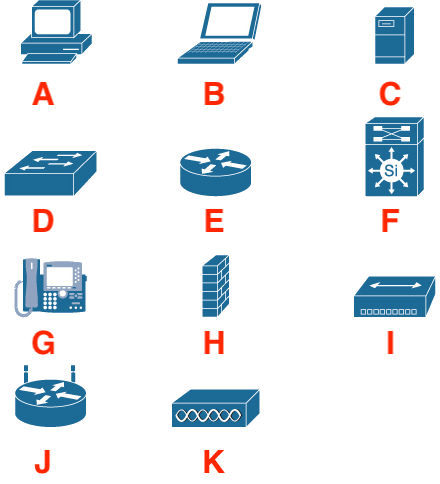
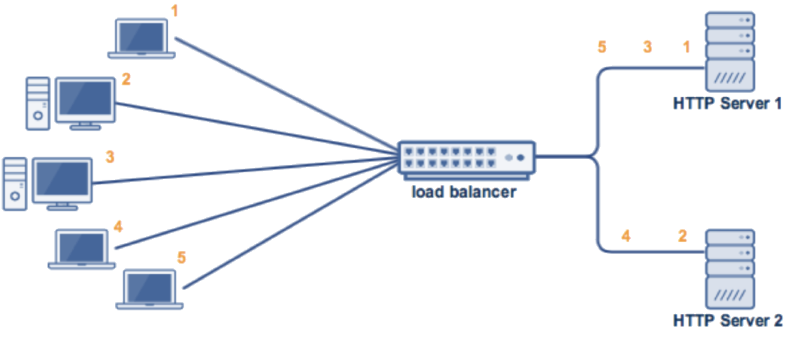
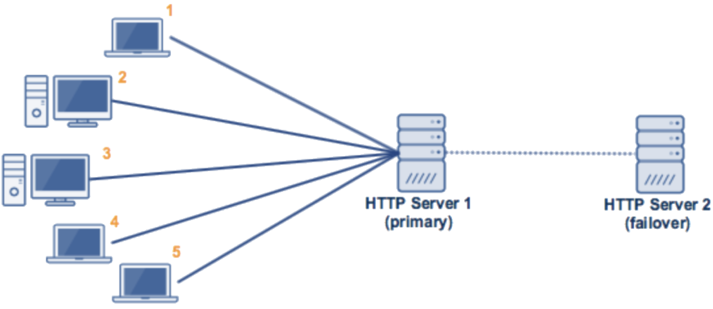

# Assignment 09: Week 09

Before attempting this assignment, please make sure you have completed all of the material in the lessons tab. 

Create a copy of this google document [lastname_A09](https://docs.google.com/document/d/1fp2OPNuKqAlDUC9rieqzTcKTBEb1resCnYZ--enpxCQ/edit?usp=sharing) (File > Make a Copy) to record all of your assignment answers in.

> :warning: Failure to use answer document properly will result in a 10pt deduction from final score.

The table of contents for this lab is found below.

&nbsp;&nbsp;&nbsp;&nbsp;&nbsp;&nbsp; Part 1: Network Documentation  
&nbsp;&nbsp;&nbsp;&nbsp;&nbsp;&nbsp; Part 2: Availability Concepts  
&nbsp;&nbsp;&nbsp;&nbsp;&nbsp;&nbsp; Part 3: Power Management 
&nbsp;&nbsp;&nbsp;&nbsp;&nbsp;&nbsp; Part 4: Recovery Sites 
&nbsp;&nbsp;&nbsp;&nbsp;&nbsp;&nbsp; Part 5: Submission  

## Part 1: Network Documentation

:interrobang: Question 1 - What is network documentation and why is it important to an organization?

:interrobang: Question 2 - If you needed a detailed network map, would you request a logical network map or a physical network map?

:interrobang: Question 3 - Identify the below network map symbols.

 

 

* label a = `________`
* label b = `________`
* label c = `________`
* label d = `________`
* label e = `________`
* label f = `________`
* label g = `________`
* label h = `________`
* label i = `________`
* label j = `________`
* label k = `________`

:interrobang: Question 4 - Define system sprawl.  

:interrobang: Question 5 - How does making a software or hardware change to your network introduce some level of risk to it's security and level of operation?  

:interrobang: Question 6 - What is ANSI/TIA/EIA 606 and how does it help with cable management?  

:interrobang: Question 7 - Summarize the each of the [10 Steps for Network Documentation](https://searchitchannel.techtarget.com/feature/Channel-Checklist-10-steps-for-network-documentation) from this weeks reading.  

:interrobang: Question 8 - Provide some of the advantages you can recognize by periodically baselining your network.  

## Part 2: Availability Concepts

:interrobang: Question 9 - What strategies can be implemented to provide fault tolerance to a network?  

:interrobang: Question 10 - Does having redundancy in you network automatically mean you have high availability?  

:interrobang: Question 11 - Define NIC teaming.  

:interrobang: Question 12 - What availability concept is shown in the image below?  

 

:interrobang: Question 13 - What availability concept is shown in the image below?  

 

:interrobang: Question 14 - Why would it be necessary for some services to have high availability?   

## Part 3: Power Management

:interrobang: Question 15 - Compare and contrast the different types of UPS's that can be implemented in your networks power management strategy. 

:interrobang: Question 16 - What does it mean if your network is hot-swappable?  

## Part 4: Recovery Sites

:interrobang: Question 17 - What is a cold recovery site?  

:interrobang: Question 18 - What is a warm recovery site?  

:interrobang: Question 19 - What is a hot recovery site?  

## Part 5: Backup and Recovery

:interrobang: Question 20 - Complete the table below:  

| Type | Data Selection | Backup / Restore Time | Archive Attribute |
|---|---|---|---|
|Full|  |  |  |
|Incremental|  |  |  |
|Differential|  |  |  |

:interrobang: Question 21 - In your own words, describe the differences between incremental and differential backups. 

## Part 5: Submission

Export your answer document to a .PDF and upload a single `lastname_A09.pdf` answer document containing all of your answers to the lab questions to Brightspace through the attachment uploads option.   
