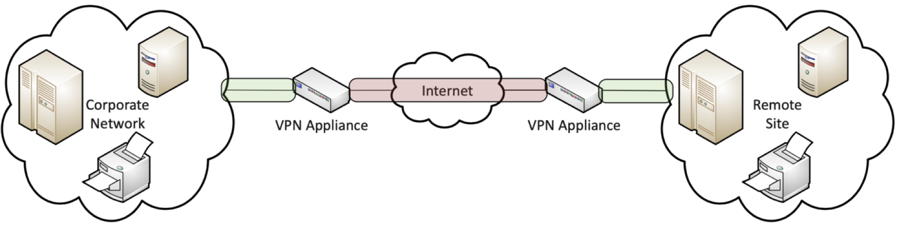

# Assignment 10: Week 10

Before attempting this assignment, please make sure you have completed all of the material in the lessons tab. 

Create a copy of this google document [lastname_A10](https://docs.google.com/document/d/1eJEKrmgVHJ-esWbi8HoXoyehqPXnQORvO5JvcV-mE3A/edit?usp=sharing) (File > Make a Copy) to record all of your assignment answers in.

> :warning: Failure to use answer document properly will result in a 10pt deduction from final score.

The table of contents for this lab is found below.

&nbsp;&nbsp;&nbsp;&nbsp;&nbsp;&nbsp; Part 1: Process Monitoring  
&nbsp;&nbsp;&nbsp;&nbsp;&nbsp;&nbsp; Part 2: Event Management  
&nbsp;&nbsp;&nbsp;&nbsp;&nbsp;&nbsp; Part 3: Performance Metrics  
&nbsp;&nbsp;&nbsp;&nbsp;&nbsp;&nbsp; Part 4: Remote Access  
&nbsp;&nbsp;&nbsp;&nbsp;&nbsp;&nbsp; Part 5: Policies and Best Practices  
&nbsp;&nbsp;&nbsp;&nbsp;&nbsp;&nbsp; Part 6: Submission  

## Part 1: Process Monitoring

:interrobang: Question 1 - Why are logs a critical part of process and network monitoring.  

:interrobang: Question 2 - Having access to stored raw log data is important, but why is it not immediately helpful when trying to isolate a security event that took place? 

:interrobang: Question 3 - What is nmap and what can we use it for?  

:interrobang: Question 4 - Describe how vulnerability scanners can be used (internally and externally) to harden a network's security.  

:interrobang: Question 5 - How do device misconfigurations prevent a security concern networks?  

:interrobang: Question 6 - What is a patch?  

:interrobang: Question 7 - How do protocol analyzers differ from vulnerability scanners? 

:interrobang: Question 8 - What is the name of the protocol analyzer we've used in class.  

## Part 2: Event Management

:interrobang: Question 9 - What types of diagnostic information can device interfaces provides us as network analysts?  

:interrobang: Question 10 - What is a SIEM and what services can one provide to an organizations security team?  

:interrobang: Question 11 - What is Syslog used for?  

:interrobang: Question 12 - Describe how SNMP works.  

## Part 3: Performance Metrics

:interrobang: Question 13 - Which part of our network will often show the first signs of trouble, making them a candidate for real time monitoring?  

:interrobang: Question 14 - What are some of the different states and configurations device interfaces can take?  

## Part 4: Remote Access

:interrobang: Question 15 - Define IPSec and describe what it provides our layer 3 traffic.  

:interrobang: Question 16 - The below image reflects a `___________`.  

:interrobang: Question 17 - The below image reflects a `___________`.  

:interrobang: Question 18 - How do SSL VPNs and Site-to-Site VPNs differ?  

:interrobang: Question 19 - Why type of VPN uses UDP over TCP?  

:interrobang: Question 20 - Remote desktop access is a valuable resource that we can use to troubleshoot workstations remotely. Describe some of the security concerns remote desktop access clients can present.  

:interrobang: Question 21 - SSH allows us to `___________`.  

:interrobang: Question 22 - What is the difference between FTP and FTPS?  

:interrobang: Question 23 - What is the difference between FTPS and SFTP?  

## Part 5: Policies and Best Practices

:interrobang: Question 24 - Privileged User Agreements define what for network admins?  

:interrobang: Question 25 - You are the new CISO at a medium sized organization. You discover that no formal password policies are in place. Provide a short summary of what password policies you would implement at your new organization (consider the different types of user groups that would likely exist and the access levels each group might have).  

:interrobang: Question 26 - What are licensing restrictions and why are they important to keep track of?  

:interrobang: Question 27 - Data loss prevention systems are critically important for the inevitable security breach. Research a security event/breach that was not mentioned in this weeks lecture summary where the DLP policies failed to protect user data. (Don't spend too much time on this. Not a full report ~ just a quick summary and details about the event.  

:interrobang: Question 28 - Because of COVID-19, your organization as an increased amount of remote workers that need to pull and push sensitive data to your organizations network. What remote access policies would you implement to insure the integrity and confidentiality of that sensitive data?  

:interrobang: Question 29 - BYOD is a device model that where the employee `___________`. 

:interrobang: Question 30 - What do AUPs define? 

:interrobang: Question 31 - Research the penalty fee (range) that could be imposed if an NDA is violated. Keep in mind that penalty fee is likely for each instance that breach of contract occurred.  

:interrobang: Question 32 - Why is simply throwing end-of-life systems into a trash/dumpster unsafe?  

## Part 5: Submission

Export your answer document to a .PDF and upload a single `lastname_A10.pdf` answer document containing all of your answers to the lab questions to Brightspace through the attachment uploads option.   
