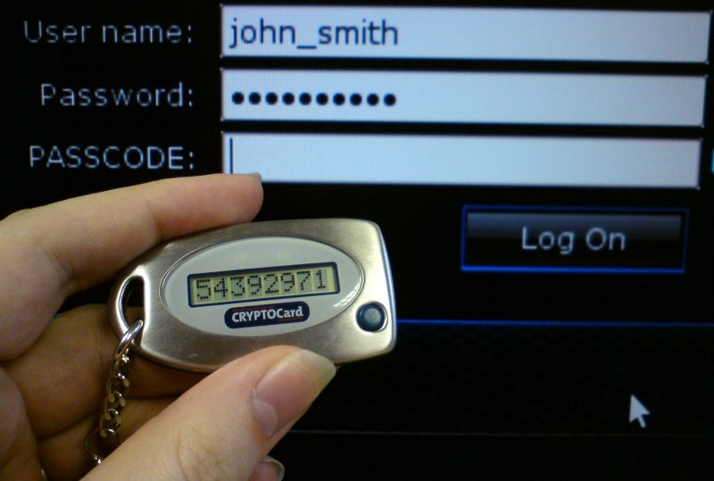
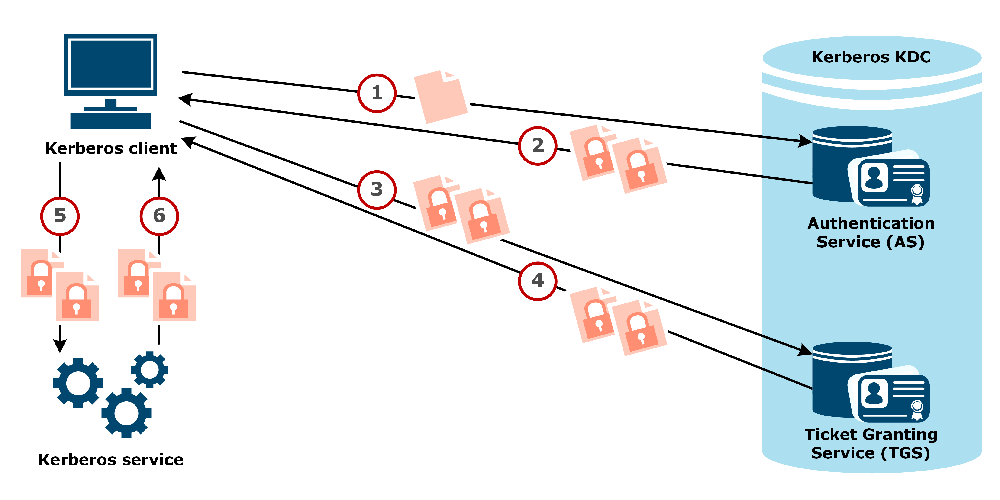

# Assignment 11: Week 11

Before attempting this assignment, please make sure you have completed all of the material in the lessons tab. 

Create a copy of this google document [lastname_A11](https://docs.google.com/document/d/1XGM3u7NsibPYaOP9Os0RXoje9mDMylPO0GumVvknIhc/edit?usp=sharing) (File > Make a Copy) to record all of your assignment answers in.

> :warning: Failure to use answer document properly will result in a 10pt deduction from final score.

The table of contents for this lab is found below.

&nbsp;&nbsp;&nbsp;&nbsp;&nbsp;&nbsp; Part 1: Physical Security  
&nbsp;&nbsp;&nbsp;&nbsp;&nbsp;&nbsp; Part 2: Authorization, Authentication, and Accounting  
&nbsp;&nbsp;&nbsp;&nbsp;&nbsp;&nbsp; Part 3: Multi-factor Authentication  
&nbsp;&nbsp;&nbsp;&nbsp;&nbsp;&nbsp; Part 4: Access Control  
&nbsp;&nbsp;&nbsp;&nbsp;&nbsp;&nbsp; Part 5: Wireless Encryption  
&nbsp;&nbsp;&nbsp;&nbsp;&nbsp;&nbsp; Part 6: Wireless Authentication and Security  
&nbsp;&nbsp;&nbsp;&nbsp;&nbsp;&nbsp; Part 7: Submission  

## Part 1: Physical Security

:interrobang: Question 1 - Describe the difference between IP and CCTV video surveillance.  

:interrobang: Question 2 - Enumerate the different types of tracing features asset tracking tags can use to help organizations manage their assets.  

:interrobang: Question 3 - Describe some of the tamper detection tools discussed this week in lecture.  

:interrobang: Question 4 - Why is the physical security of an organization important?  

:interrobang: Question 5 - Why is it important to control the physical access of both internal and external personal?  

## Part 2: Authorization, Authentication, and Accounting

:interrobang: Question 6 - What does AAA stand for?  

:interrobang: Question 7 - Define Authorization, Authentication, and Accounting.  

:interrobang: Question 8 - What authentication tool is depicted below?  

:interrobang: Question 9 - Describe some of the services that RADIUS provides.  

:interrobang: Question 10 - What is Kerberos (in the world of networking)? How is it different from RADIUS.  

:interrobang: Question 11 - Describe each step of the Kerberos authentication process depicted below.  

:interrobang: Question 12 - In this weeks lecture, what analogy was used to describe the Kerberos ticket granting service and ticket it provides?  

:interrobang: Question 13 -  Why should we always have at least one local authentication service (account credential set) on our network infrastructure devices?  

:interrobang: Question 14 -  Describe what certificate-based authentication is.  

## Part 3: Multi-factor Authentication

:interrobang: Question 15 - What is multi-factor authentication?  

:interrobang: Question 16 - What different types of authentication factors exist?  

:interrobang: Question 17 - Provide a concrete example for each type of authentication factor.  

:interrobang: Question 18 - List three online personal accounts you have. Investigate if these three accounts offer multi-factor (two-step/two-factor authentication) as a security service. (If you don't have three online accounts, research three popular websites that offer two-factor authentication)  

:interrobang: Question 19 - Assume your credentials are posted on the dark web. How would multi-factor authentication protect your account.  

:interrobang: Question 19.5 (**optional question**) - Check to see if your email (and password/personal information) have been compromised in a data breach [here](https://haveibeenpwned.com/). All you need to do is enter an email of your choice. Was your account compromised? If so, would you feel safer with two-step authentication enabled on your account?  

## Part 4: Access Control

:interrobang: Question 20 - How does port security work?  

:interrobang: Question 21 - What is MAC filtering?  

:interrobang: Question 22 - What are captive portals used for?  

:interrobang: Question 23 - In what network device do ACL's usually act as our first line of defense against external connection requests?  

## Part 5: Wireless Encryption

:interrobang: Question 24 - Should we use WEP over WPA? Why or why not?  

:interrobang: Question 25 - Describe how TKIP works.  

:interrobang: Question 26 - Determine what wireless encryption protocol is used on your home network.  

## Part 6: Wireless Authentication and Security

:interrobang: Question 27 - What does EAP and PEAP stand for?  

:interrobang: Question 28 - Describe how geofencing can improve security and authentication?  

:interrobang: Question 29 - Compare and contrast the different wireless security modes we've talked about this week.  

## Part 7: Submission

Export your answer document to a .PDF and upload a single `lastname_A11.pdf` answer document containing all of your answers to the lab questions to Brightspace through the attachment uploads option.   
