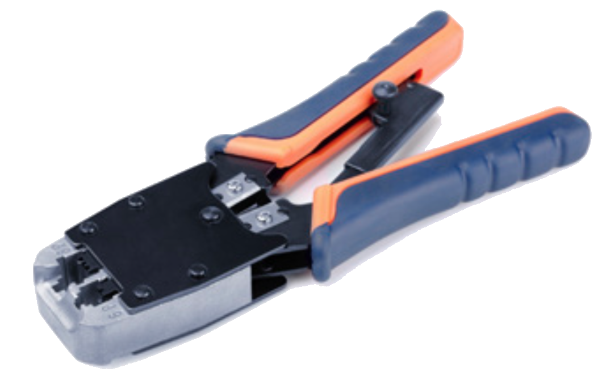
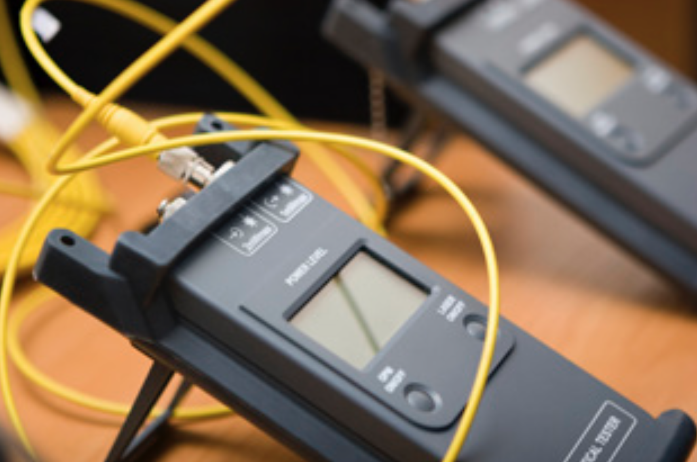
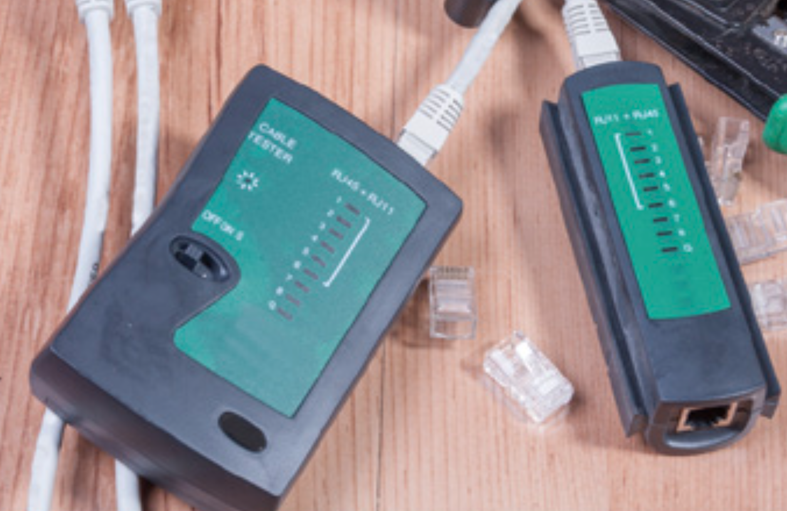
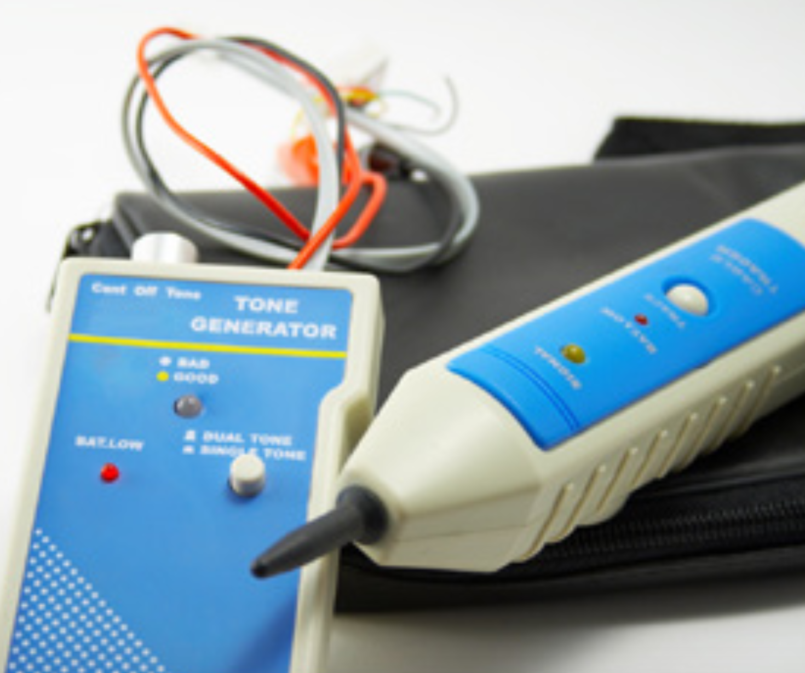
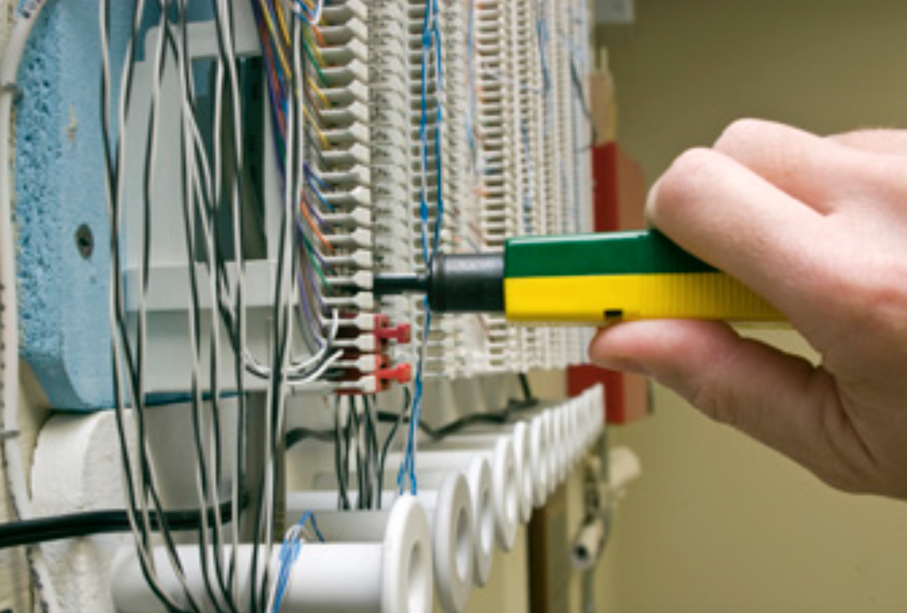
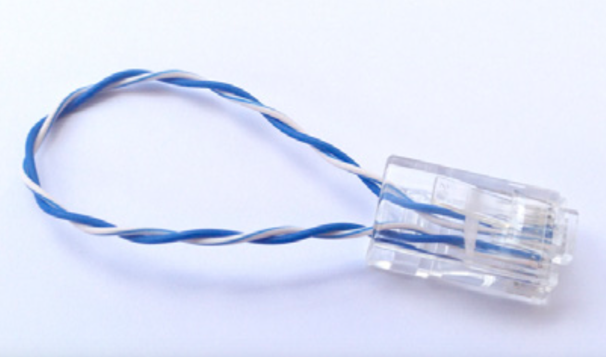
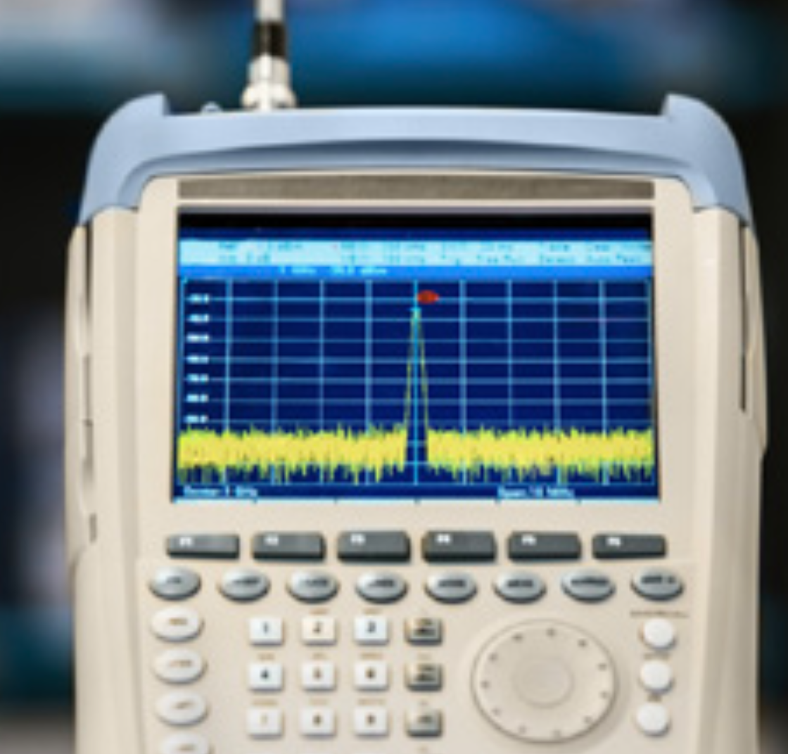

# Assignment 13: Week 13

Before attempting this assignment, please make sure you have completed all of the material in the lessons tab. 

Create a copy of this google document [lastname_A13](https://docs.google.com/document/d/1byYH7O31746tZtAAzt8SywMG8zUVh0CjFHQk9_28ik8/edit?usp=sharing) (File > Make a Copy) to record all of your assignment answers in.

> :warning: Failure to use answer document properly will result in a 10pt deduction from final score.

The table of contents for this lab is found below.

&nbsp;&nbsp;&nbsp;&nbsp;&nbsp;&nbsp; Part 1: Network Troubleshooting Methodology <br>
&nbsp;&nbsp;&nbsp;&nbsp;&nbsp;&nbsp; Part 2: Hardware Tools <br>
&nbsp;&nbsp;&nbsp;&nbsp;&nbsp;&nbsp; Part 3: Software Tools <br>
&nbsp;&nbsp;&nbsp;&nbsp;&nbsp;&nbsp; Part 4: Command Line Tools <br>
&nbsp;&nbsp;&nbsp;&nbsp;&nbsp;&nbsp; Part 5: Wired Network Troubleshooting <br>
&nbsp;&nbsp;&nbsp;&nbsp;&nbsp;&nbsp; Part 6: Wireless Network Troubleshooting <br>
&nbsp;&nbsp;&nbsp;&nbsp;&nbsp;&nbsp; Part 7: Network Service Troubleshooting <br>
&nbsp;&nbsp;&nbsp;&nbsp;&nbsp;&nbsp; Part 8: Submission <br>

## Part 1: Network Troubleshooting Methodology

:interrobang: Question 1 - Describe each step of the network troubleshooting methodology


## Part 2: Hardware Tools

:interrobang: Question 2 - Label the below images with the correct hardware tool name and the function of that tool. <br>

| Image A             |  Image B |
:-------------------------:|:-------------------------:
  |  

| Image C             |  Image D |
:-------------------------:|:-------------------------:
  |  

| Image E             |  Image F |
:-------------------------:|:-------------------------:
  |  

| Image G             |  Image H |
:-------------------------:|:-------------------------:
  |  

| Image I             |  
:-------------------------:|
!  |  

* Image A - 
* Image B - 
* Image C - 
* Image D - 
* Image E - 
* Image F - 
* Image G - 
* Image H - 
* Image I - 

## Part 3: Software Tools

:interrobang: Question 3 - Label the below images with the correct software tool name and the function of that tool. <br>

| Image A             |  Image B |
:-------------------------:|:-------------------------:
  |  

* Image A - 
* Image B - 

:interrobang: Question 4 - Test your network speeds at [speedtest.net](https://www.speedtest.net/). Report your upload and download speeds.

:interrobang: Question 5 - It's likely that you'll have improved speeds at night. Why might this be the case?


## Part 4: Command Line Tools

:interrobang: Question 6 - Provide the command to ping google's DNS server (8.8.8.8) exactly 5 times <br>

:interrobang: Question 7 - What does the below command do? <br>

```text
mike@Mikes-MacBook-Pro ~ % dig aol.com +short
```

:interrobang: Question 8 - Provide the ipconfig / ipconfig command will renew the DHCP lease of IPs on a network? <br>

:interrobang: Question 9 - Provide the netstat command that shows all active connections on a network. <br>

:interrobang: Question 10 - What kind of tool is tcpdump?  <br>

:interrobang: Question 11 - Provide an nmap command that scans all of the TCP ports on workstation 192.168.21.3. <br>

:interrobang: Question 12 - Provide the ARP command that outputs the local ARP table of a network device. <br>


## Part 5: Wired Network Troubleshooting

:interrobang: Question 13 - Define the term `attenuation` and some potential resolutions to this problem. <br>

:interrobang: Question 14 - Define the term `latency` and some reasons excessive latency might exist on a network. <br>

:interrobang: Question 15 - What is jitter (in the context of networking)? <br>

:interrobang: Question 16 - What troubleshooting steps can be taken to resolve jitter? <br>

:interrobang: Question 17 - What term describes when the signal from one wire affects (leaks into) another? <br>

:interrobang: Question 18 - What are some troubleshooting strategies that can be implemented to resolve XT? <br>

:interrobang: Question 19 - What is EMI and how can it be avoided? <br>

:interrobang: Question 20 - Describe the difference between an open circuit and short circuit. <br>

:interrobang: Question 21 - Why should cable termination pin-out configurations match? <br>

:interrobang: Question 22 - What tool would you use to identify a cable with an internal open circuit? <br>

:interrobang: Question 23 - If you discover a cable is intermittently working (likely due to some type of damage to the cable wires), you should spend your time fixing the cable or re-running a new line? Why? <br>

:interrobang: Question 24 - What are some of the places or metrics that can be checked to determine if a bottleneck exists on a network? <br>

:interrobang: Question 25 - What types of issues might present when using the wrong cable type for a high throughput communication line? <br>

:interrobang: Question 26 - Enumerate possible interface configurations that can cause that interface to not work properly. <br>

:interrobang: Question 27 - Describe some of the issues that can present when a VLAN mismatch exists on a network. <br>


## Part 6: Wireless Network Troubleshooting

:interrobang: Question 28 - What is reflection and why does to much of it negatively impact a wireless network? <br>

:interrobang: Question 29 - What is the difference between reflection and refraction? <br>

:interrobang: Question 30 - When a signal passes through an object and loses some of it's signal strength, we call it `____________`. <br>

:interrobang: Question 31 - How does an AP's antenna effect a devices ability to connect to a network? <br>

:interrobang: Question 32 - What causes device and bandwidth saturation? Device and bandwidth saturation is more likely to occur in what types of networking environments?  <br>

:interrobang: Question 33 - Define `frequency mismatch` and how it can when different (or deprecated) 802.11 standards are used by a client. <br>

:interrobang: Question 34 - Encryption can take a lot of computational power, which is why network devices that implement better wireless encryption standards (like WPA2) might not be able to connect to legacy equipment. This incompatibility is referred to as `______`. <br>


## Part 7: Network Service Troubleshooting

:interrobang: Question 35 - What troubleshooting steps should you take if DNS servers are not working an a workstation? <br>

:interrobang: Question 36 - What troubleshooting steps should you take if a device on your network can not sent or receive Layer 3 traffic?  <br>

:interrobang: Question 37 - What troubleshooting steps should you take in the event of a duplicate IP being issued?  <br>

:interrobang: Question 38 - What troubleshooting steps should you take if IP addresses are prematurely expiring on a network? <br>

:interrobang: Question 39 - What troubleshooting steps should you take if untrusted SSL certificate are being issued to your browser, preventing you from accessing important websites? <br>

:interrobang: Question 40 - How can an incorrect system date or time negatively effect a systems ability to authenticate to a network or to communicate with other devices on that network?<br>

:interrobang: Question 41 - What troubleshooting steps should you take to mitigate a DHCP scope that's been exhausted? <br> 

:interrobang: Question 42 - How can long ACL rulesets sometimes negatively impact legitimate network communication? <br> 

:interrobang: Question 43 -  What are some troubleshooting steps that can be implemented if a service is unresponsive on your network? <br> 

## Part 8: Submission

Export your answer document to a .PDF and upload a single `lastname_A13.pdf` answer document containing all of your answers to the lab questions to Brightspace through the attachment uploads option. <br> 
