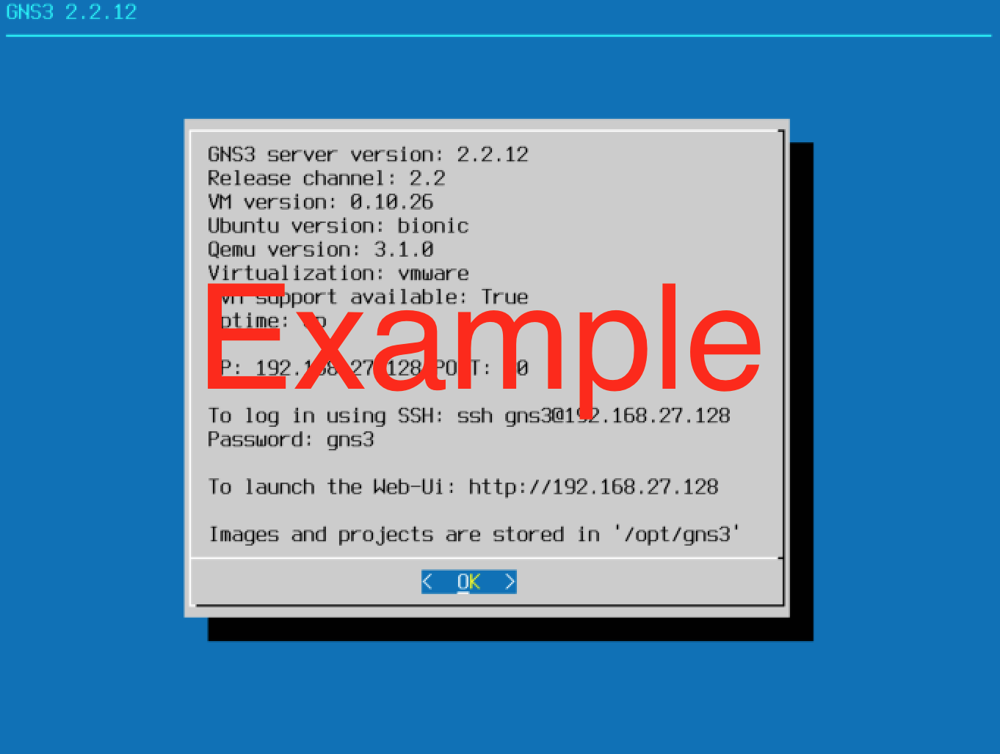
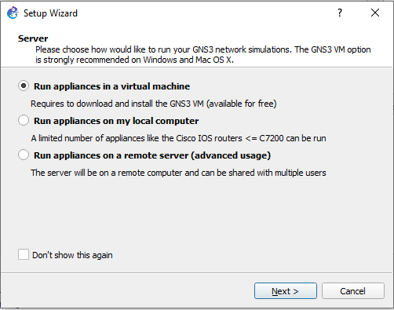
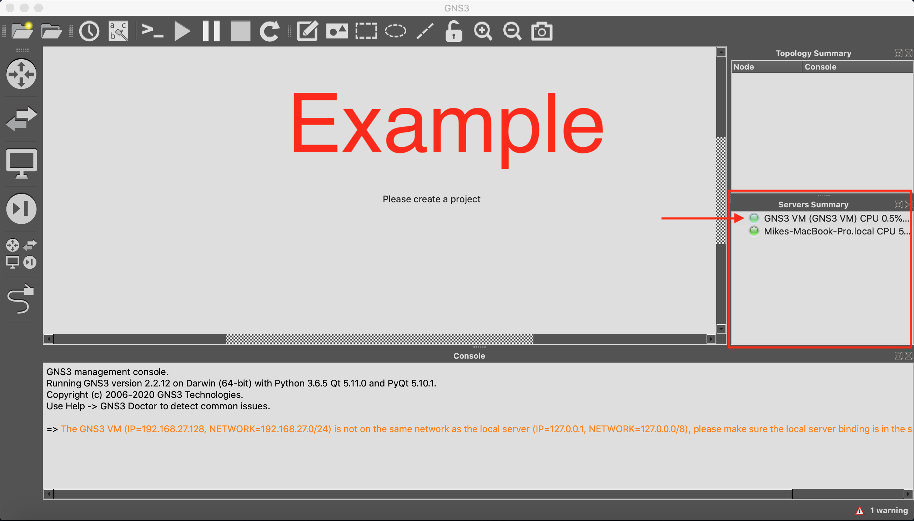
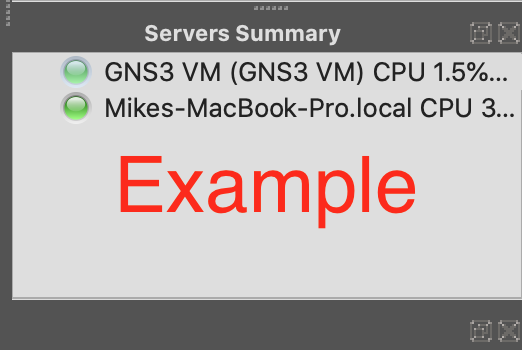
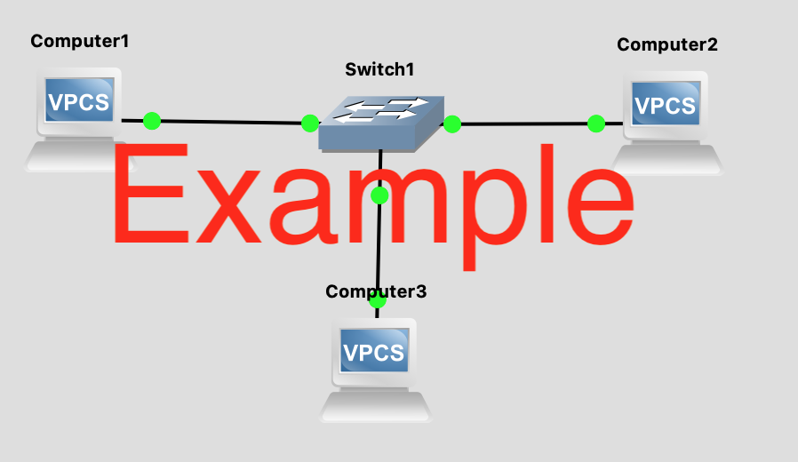

# Lab 01: Setting Up GNS3 & VMware Workstation

Before attempting this lab, please make sure you have completed all of the material in the lessons tab.

Create a copy of this google document [lastname_lab01](https://docs.google.com/document/d/1OR1FFqrKc8_OgpllDyhPpqvjYnxhpkl05PmW57s67fo/edit?usp=sharing) (File > Make a Copy) to record all of your assignment answers in.

> :warning: Failure to use answer document properly will result in a 10pt deduction from final score.

The table of contents for this lab is found below.

&nbsp;&nbsp;&nbsp;&nbsp;&nbsp;&nbsp; Part 1: Installing VMWare (10 pts)  
&nbsp;&nbsp;&nbsp;&nbsp;&nbsp;&nbsp; Part 2: Installing GNS3 VM (20 pts)  
&nbsp;&nbsp;&nbsp;&nbsp;&nbsp;&nbsp; Part 3: Installing GNS3 Application (30pts)  
&nbsp;&nbsp;&nbsp;&nbsp;&nbsp;&nbsp; Part 4: Your First GNS3 Topology(40pts)  
&nbsp;&nbsp;&nbsp;&nbsp;&nbsp;&nbsp; Part 5: Submission  

> Note that the instructions will vary slightly depending on the host OS and machine you are using (Windows 10 /  macOS). Windows machines VMWare Workstation and macOS machines VMWare Fusion. Both are [Type-2 hypervisors](https://en.wikipedia.org/wiki/Hypervisor) that allow you to create and deploy virtual machines on your computer.

## Part 1: Installing VMWare (10pts)

**Step 1.1.** Log into Brightspace and navigate to `Lab#01` (Assignments > Lab#01). There you should see the link `VMware Store` under the assignment instructions section. Click on that link to navigate to the VMware store. It's here you'll be able to download VMware workstation (windows) or VMware Fusion (macOS).

**Step 1.2.** At this point you should have successfully logged into the VMware store, downloaded the VMware version that relates to your OS, and installed VMware on your host machine.

 :interrobang: Question 1 - Provide a screenshot of VMware running.

## Part 2: Installing GNS3 VM (20pts)

Now, our goal will be to download and install your GNS3 VM on your VMWare Workstation.

**Step 2.1.** Go to the GNS3 [download page](https://www.gns3.com/software/download-vm) and download and install the `GNS3 VM` that is compatible with `VMware Workstation`.

> Note: For this step you want the GNS3 VM, not the application. The GNS3 application and GNS3 VM work in tandem but are separate entities.

=================

#### macOS
Once downloaded and extracted, you should have a folder named `GNS3 VM` with the following resources (macOS):

* GNS3 VM.mf
* GNS3 VM.ovf
* GNS3_VM-disk1.vmdk
* GNS3_VM-disk2.vmdk

#### Windows 10
Once downloaded and extracted, you should have a folder named `GNS3 VM` with the following resources (Windows):

* GNS3 VM.ova

=================

When working with virtual machines it's important that you understand what each file is, how they work together, and each file extension.

Research each file extension online (.mf, .ovf, .ova, .vmdk) and answer the below questions.

:interrobang: Question 2 - What is a `.mf` file?  
:interrobang: Question 3 - What is a `.ovf` file?  
:interrobang: Question 4 - What is a `.ova` file?  
:interrobang: Question 5 - What is a `.vmdk` file?  

**Step 2.2.** Import your GNS3 VM `.ova` file in VMWare Workstation to create a GNS3 VM on your machine. 

***Windows*** - [How to import OVA on VMWare Workstation 15](https://docs.vmware.com/en/VMware-Workstation-Pro/15.0/com.vmware.ws.using.doc/GUID-DDCBE9C0-0EC9-4D09-8042-18436DA62F7A.html) - [PDF](files/workstation-ova.pdf)  
***macOS*** - [How to import OVA on VMWare Fusion Pro 11](https://docs.vmware.com/en/VMware-Fusion/11/com.vmware.fusion.using.doc/GUID-275EF202-CF74-43BF-A9E9-351488E16030.html) - [PDF](files/fusion-ova.pdf)  

:interrobang: Question 6 - Once successful, provide a screenshot of your GMS3 virtual machine running (example provided below).

> Do not close out of the GNS3 VM once it's running. We will be needing it for the next few steps.

## Part 3: Installing GNS3 Application (30pts)

Now, our goal will be to download and install your GNS3 Application on your host machine.

**Step 3.1.** Go to the [GNS3 Download Page](https://www.gns3.com/software/download) and download the GNS3 Platform for your respective operating system.

> GNS3 might (will probably) ask you to create an account for download. Feel free to use any email account you like to do this, but I recommend you use your URI email.

**Step 3.2.** Follow the installation prompts to install the GNS3 application on your machine. You can use the installation guides below as reference if needed.

***Windows*** - [How to install GNS3 on Windows](https://docs.gns3.com/docs/getting-started/installation/windows/) - [PDF](files/gns3-windows.pdf)  
***macOS*** - [How to install GNS3 on macOS](https://docs.gns3.com/docs/getting-started/installation/mac/) - [PDF](files/gns3-mac.pdf)  

:warning: For Windows Installation: Make sure that you select **Run appliances in a virtual machine** as shown below.

:interrobang: Question 7 - Once successful, launch your GNS3 application provide a screenshot of your GMS3 Application (example provided below).

You'll notice that under the `Servers Summary` window there are two servers listed. One server is named `GNS3 VM` and the other is named `Mikes-MacBook-Pro.local`. It's important to have both of these servers listed with a green light next to it.

:interrobang: Question 8 - Provide a screenshot of your GMS3 Application `Servers Summary` window with both your VM and local host servers marked with a green status light (example provided below).

#### Troubleshooting GNS3 VM status light

If you only see your local host server in your `Servers Summary` window or your GNS3 VM has a red status ball, try the following troubleshooting steps.

* Make sure your GNS3 VM is running in VMWare
* Make sure the version number of your GNS3 VM and GNS3 Application are the same (currently v.2.2.12)
* Check GNS3 > Preferences > GNS3 VM and make sure VMWare and GNS3 VM are targeted in virtualization engine and settings

## Part 4: Your First GNS3 Topology (40pts)

**Step 4.1:** Follow the steps outlined in [this procedure](https://docs.gns3.com/docs/getting-started/your-first-gns3-topology/) - [PDF](files/gns3-basic.pdf) to create and run your first GNS3 Topology.

**Step 4.2:** Rename your PC1, PC2, and PC3 to Computer1, Computer2, and Computer3 ~ respectively. 

:interrobang: Question 9 - Provide a screenshot of your running topology (example provided below).

:interrobang: Question 10 - What console command did you use to assign an IP address to Computer1?

:interrobang: Question 11 - What console command did you use to verify Computer1 could ping Computer2?

## Part 5: Submission

Convert your answer document in to a **.PDF** and upload a single `lastname_lab1.pdf` answer document containing all of your answers to the lab questions to Brightspace through the attachment uploads option.