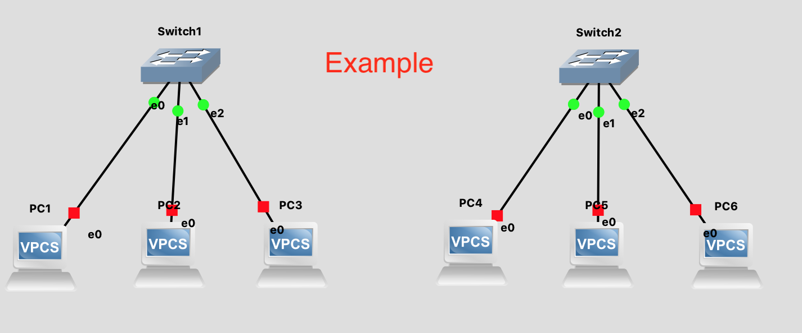
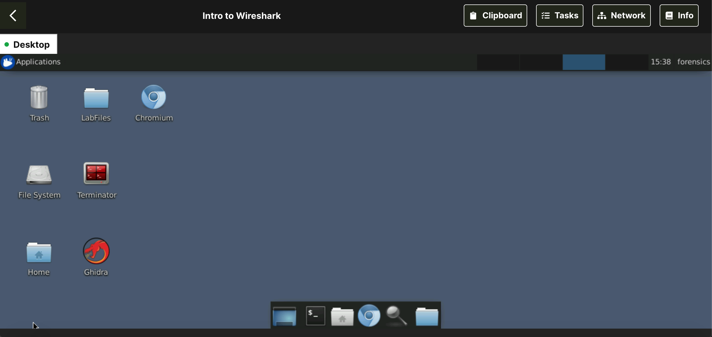
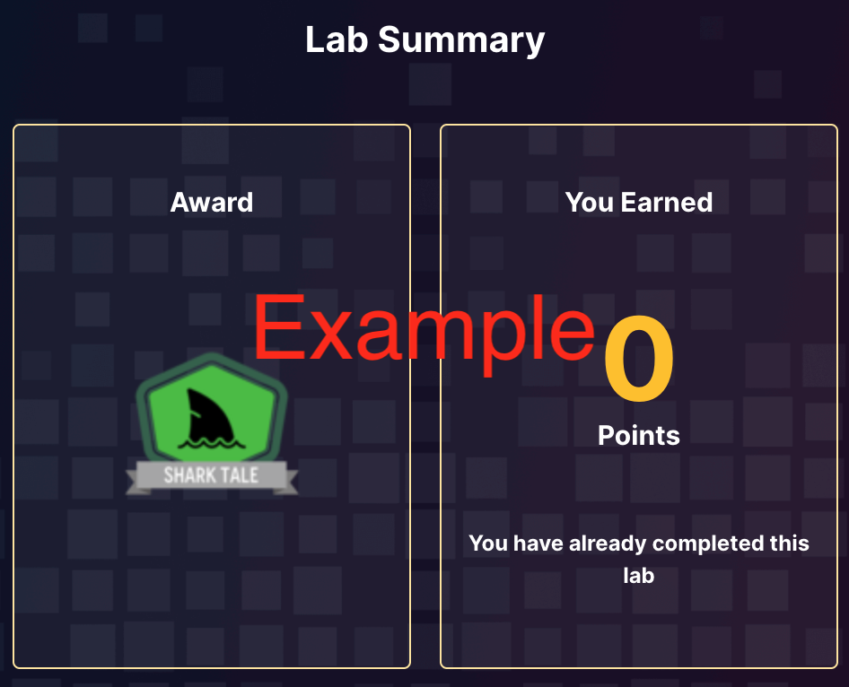
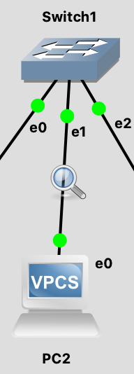

# Lab 02: Wireshark - Packet Capture and Inspection

Before attempting this lab, please make sure you have completed all of the material in the lessons tab.

Create a copy of this google document [lastname_lab02](https://docs.google.com/document/d/1dAlNkbJUyFlK7gjOazwBycnV55VUsYvoAh59Pq--f14/edit?usp=sharing) (File > Make a Copy) to record all of your assignment answers in.

> :warning: Failure to use answer document properly will result in a 10pt deduction from final score.

The table of contents for this lab is found below.

&nbsp;&nbsp;&nbsp;&nbsp;&nbsp;&nbsp; Part 1: GNS3 Topology Setup <br>
&nbsp;&nbsp;&nbsp;&nbsp;&nbsp;&nbsp; Part 2: Introduction to Wireshark <br>
&nbsp;&nbsp;&nbsp;&nbsp;&nbsp;&nbsp; Part 3: Wireshark capture in GNS3 <br>
&nbsp;&nbsp;&nbsp;&nbsp;&nbsp;&nbsp; Part 4: Submission <br>

## Part 1: GNS3 Topology Setup

**Step 1.1** Launch your GNS3 app and VM. <br>
**Step 1.2** Create a new project `lab02`.<br>
**Step 1.3** Drag and drop the correct appliances to create the network topology below.<br>

:warning: Use the GNS3 Server instead of your local server for each appliance.



**Step 1.4** Use the below tables to assign the correct IP to each device.

| PC1 | PC2 | PC3 |
|---|---|---|
| 10.1.1.1 | 10.1.1.2 | 10.1.1.3 |

| PC4 | PC5 | PC6 |
|---|---|---|
| 10.1.1.4 | 10.1.1.5 | 10.1.1.6 |

> We learned how to assign IP addresses to GNS3 machines last lab. Use LAb01 as a reference if needed.

:interrobang: Question 1 - What were the commands your ran to do this?<br>
:interrobang: Question 2 - Include a screenshot of your topology running. <br>

**Step 1.5** Launch the console for PC1 and ping PC2 and PC3. 

> :bulb: Pro Tip: Use the up-arrow key while in a terminal to run previous commands. Doing this helps to easily re-run or slightly modify previous commands.

**Step 1.6** Launch the console for PC1 and ping PC2 and PC3. 

:interrobang: Question 3 - What were the commands you ran to do this? <br>

**Step 1.7** Run the below command to show the arp table.

```bash
$ show arp
```

:interrobang: Question 4 - Describe the contents of this output. What does each grouped block of text represent? <br>
:interrobang: Question 5 - Include a screenshot of your arp table <br>

## Part 2: Introduction to Wireshark

**Step 2.1** For this part of the lab, you'll need access to the Immersive Lab account that you created in [A00](https://github.com/mikeconti/csf432-fall2020/tree/master/assignments/a00). The module you will need to complete is named [Intro to Wireshark](https://immersivelabs.online/labs/wireshark-intro/).

Once in the correct module, you'll be provided the desktop below.



You'll also notice the menu buttons located in the top right corner (depicted below).


**Step 2.2** Click the `Tasks` button and read the tasks note.

**Step 2.3** Select the `Info` button and thoroughly read it's documentation.

**Step 2.4** Select the `Tasks` button again and answer this module's questions. You can press `Enter/Return` to submit your answers to each question. Immersive labs will notify you if you've gotten it correct or incorrect.

**Step 2.5** Once you complete the lab, make sure you take a screenshot of your completion badge (depicted below) :warning: ***before you close out of the lab window***!



:interrobang: Question 6 -  Submit a screenshot of your badge demonstrating the completion of this Immersive Lab module.

## Part 3: Wireshark capture in GNS3

During the GNS3 install, it's possible some of the Windows users already downloaded Wireshark through the installation options GNS3 provided. If you ***already*** have Wireshark installed on your machine, you can skip steps 3.1 and 3.2.

Our goal is to install Wireshark on your machine so you can capture network traffic inside of GNS3 (and on your actual machine).

**Step 3.1** Visit [Wireshark's download page](https://www.wireshark.org/download.html) and select the appropriate download for your computer (host machine).

**Step 3.2** Follow the installation prompts to install Wireshark on your computer.

**Step 3.3** Once installed, go back to the GNS3 network topology created in part 1 of this lab and shut down the network activity (click the stop button).

**Step 3.4** Right click on the `Switch e01 <=> e02 PC2` ethernet connection and select `Start Capture`. You should notice a magnifying glass on this ethernet connection (depicted below). *Wireshark should auto-launch at this point.*



**Step 3.5** Turn the network on by clicking the start button in GNS3.

:interrobang: Question 7 -  Submit a screenshot of your Wireshark capture window. <br>
:interrobang: Question 8 -  Considering all of the current traffic that Wireshark has recorded, what is the most common protocol listed under the `Protocol` column? <br>

**Step 3.6** Read through the text in the `Info` column. 

:interrobang: Question 9 -  In your own words, describe what happened once you started the network <br>

**Step 3.7** Ping PC2 from PC1.

:interrobang: Question 10 -  Submit a screenshot of your Wireshark capture window. <br>
:interrobang: Question 11 -  Considering all of the current traffic that Wireshark has recorded, what is the most common protocol listed under the `Protocol` column? <br>

**Step 3.8** Open (double click) an `Echo (ping) reply` packet and expand the `Internet Control Message Protocol` option.

:interrobang: Question 12 -  How many bytes of data was in this IP segment?

**Step 3.8** Stop the GNS network activity and close Wireshark.

## Part 4: Submission

Convert your answer document in to a **.PDF** and upload a single `lastname_lab2.pdf` answer document containing all of your answers to the lab questions to Brightspace through the attachment uploads option.
