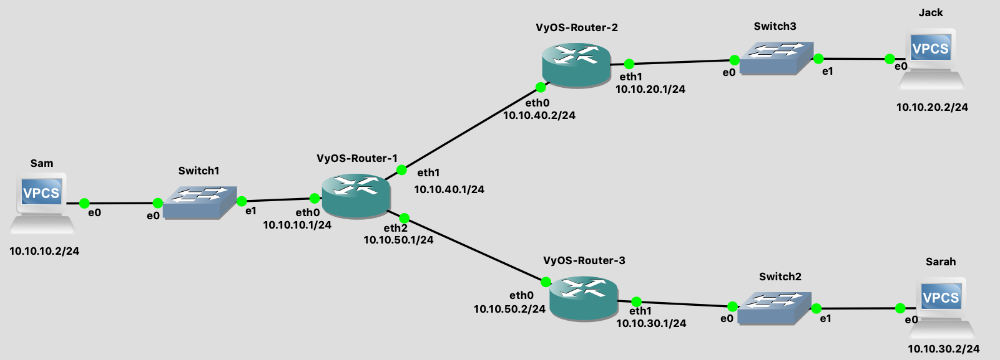

# Lab 03: Configuring Static Routing Tables on a GNS3 Network Topology.

Before attempting this lab, please make sure you have completed all of the material in the lessons tab.

Create a copy of this google document [lastname_lab03](https://docs.google.com/document/d/16SS9L4Ovk1OIzNFlXgE1LldPlkKE7829mKU-0p8qlAw/edit?usp=sharing) (File > Make a Copy) to record all of your assignment answers in.

> :warning: Failure to use answer document properly will result in a 10pt deduction from final score.

The table of contents for this lab is found below.

&nbsp;&nbsp;&nbsp;&nbsp;&nbsp;&nbsp; Part 1: VyOS Router Install (10 pts) <br>
&nbsp;&nbsp;&nbsp;&nbsp;&nbsp;&nbsp; Part 2: Topology Setup (20 pts) <br>
&nbsp;&nbsp;&nbsp;&nbsp;&nbsp;&nbsp; Part 3: IP and Interface Configuration (30 pts) <br>
&nbsp;&nbsp;&nbsp;&nbsp;&nbsp;&nbsp; Part 4: Static Routing Configuration (40 pts) <br>
&nbsp;&nbsp;&nbsp;&nbsp;&nbsp;&nbsp; Part 5: Submission <br>

## Part 1: VyOS Router Install (10 pts)

Last week we took a look at a network topology in our lecture and in A02. A summary of that topology can be found below.


 This week, we are going to deploy and configure this exact network in GNS3. The ultimate goal of this lab is to allow for each work station (Sam, Jack, and Sarah) to be able to ping each other. We can accomplish this goal by importing the correct network devices, assigning each device interface it's respective IP, and configuring a static routing table so each router can properly direct network traffic.

**Step 1.1** Launch your GNS3 app and VM. <br>
**Step 1.2** Create a new project `lab03`.<br>
**Step 1.3** Download the [VyOS router .IOS file](https://drive.google.com/uc?export=download&id=1Gp60ADYR0OalUlEM8l7Nrsawrgifkizx). <br>
**Step 1.4** Download the [VyOS router empty8G qcow2 file](https://github.com/mikeconti/csf432-fall2020/raw/master/labs/lab03/files/empty8G.qcow2 ). <br>
**Step 1.5** Click the router icon in GNS3 and select new template. <br>

 


**Step 1.6** Select "Install an appliance from the GNS3 server (recommended)". <br>
**Step 1.7** Expand the router drop-down, select VyOS, and click install. <br>


**Step 1.8** Install the appliance on the GNS3 VM (recommended). <br>
**Step 1.9** Leave the install path the same and select next. <br>
**Step 1.10** Select VyOS version 1.1.8 and click next > install > finish. <br>


> GNS3 should automatically detect the `.iso` and `.qcoq2` (downloaded in steps *1.3 and 1.4*) files on your machine for the VyOS router install.


At this point, you should have the VyOS v.1.1.8 in your `router` appliance tray.

:interrobang: Question 1 - Include a screenshot of your VyOS router in your router appliance tray.

## Part 2: Topology Setup (20 pts)

Now that we have all of the networking devices (switches, routers, machines) needed to build a proper network topology, the next goal will be to create the structure of the network topology. Here, we won't be worrying about configuring the *semantic* behavior of the network. Instead, we'll simply focus on placing, connecting, and labeling each network device and it's interfaces. We'll actual assign each device interface in `Part 3` of this lab.

**Step 2.1** Drag and drop your network devices to recreate the topology below.



**Step 2.2** Make sure that when you drop a network device into your workspace, you select the `GNS3 VM` as the server for *all* devices.


> At this stage, it's important to label *everything you can* so you have a clear idea of what each interfaces IP is and how the topology will work as a whole. <br> <br> :warning: For this reason, **10 pts will be deducted** from your overall lab if your labels do not match *exactly* with the example topology referenced in **Step 2.1**.

### GNS3 Pro-Tips


* Label A: Automatically labels each interface (eth0, eth1, ect..) 
* Label B: Creates a new custom label (text box)
* Label C: Your VyOS router might look different than mine (Yellow Box with V). The appearance of my VyOS router is simply a person preference ~ points will *not be deducted* if you use the default router icon. However, if you would like to change it you can right click on the router (once it's been dragged to your workspace) > Change Symbol >  expand `classic` > select `router`.
* You can copy and past network devices by right clicking > duplicate.

At this point, you should have a network topology that matches *exactly* the topology referenced in **Step 2.1**. This includes all labels, network devices, and connections.

:interrobang: Question 2 - Include a screenshot of your network topology and submit it in your answer document.

## Part 3: IP and Interface Configuration (30 pts)

Now that all of our devices and connections are in the appropriate places, we can begin to assign the interfaces to each device. Lets start with assigning each machine an IP address and a default gateway.

**Step 3.1** Start up your network by clicking the green start button. <br>
**Step 3.2** Double click on Sam's machine to open that devices console. <br>
**Step 3.3** Execute the below commands <br>

```bash
> ip 10.10.10.2/24 gateway 10.10.10.1
> save
```

> **Q:** What did the terminal commands in **Step 3.3** do? <br>
  **A:** Here, we configured the IP address and gateway for Sam's machine. Looking at the IP address, we see /24 at the end of the IP. This is called CIDR (Classless Inter-Domain Routing) notation and is just a shorthand way to write a subnet mask for the IP address. Because of this CIDR we know Sam's machine exists on subnet `10.10.10`.0 and is device number 0.0.0.`2` on that subnet. The gateway 10.10.10.1 is targeting the interface that Sam should go to when connecting to the outside world. Gateway 10.10.10.1 is the *same exact* interface address as Router#01 - eth0 (by looking at the IP address 10.10.10.1/24 we know that interface exists on subnet `10.10.10`.0 and is device number 0.0.0.`1`) This becomes clear by looking at the topology in *Step 2.1*. The only interface Sam's machine is directly connected is Router#01 eth0.

  **Step 3.4** Repeat **Step 3.3** to configure Jack and Sarah's machines with the appropriate IP addresses and gateways. Use the topology referenced in **Step 2.1** and the table below as a guide.

<table>

<tr><th> Machines</th></tr>
<tr>
<td>

| Sam | Jack | Sarah |
|---|---|---|
|10.10.10.2/24| 10.10.20.2/24 | 10.10.30.2/24 |

</tr> 
</table>

Now that Sam, Jack, and Sarah's workstations have IP address and gateways we need to assign each router interface an IP address so they can talk to each workstation.

**Step 3.5** Open `Router#01`'s console by double clicking on it. You should be presented with the below login screen.


**Step 3.6** Login with the username `vyos` and password `vyos` <br>
**Step 3.7** Execute the below command <br>

```bash
> install image
```
**Step 3.8** Follow installation prompts:
* Would you like to continue? (Yes/No): >  Enter 
* Partition (Auto/Parted/Skip): > Enter
* Continue? (Yes/No) [No]: > YES (:warning: Type yes here and press enter)
* How big of a root partition should I create? (1000MB - 8589MB): > Enter
* What would you like to name this image?: > Enter
* Which one should I copy to sda?: > Enter
* Enter password for user 'vyos': type vyos then > Enter
* Retype password for user 'vyos': type vyos then > Enter
* Which drive should GRUB modify the boot partition on? > Enter

You've finished installing the vyos image when you get the below message:


**Step 3.9** To make sure all of your configuration settings persist (save) when you close out of your project, right click on your router icon in your GNS3 workspace, select `configure`, and make sure `Save the VM state` is selected in the `On close` field. Click `Apply` and `Ok`.


**Step 3.10** Return to your Router#01 VyOS console.

Finally, it's time to configure Router#01's interfaces. There are two modes your should be aware of when working on a VyOS router `Configure Mode` and `Operation Mode`. `Operation Mode` is the default mode and is denoted by a `$` as the final character of your terminal prompt. `Configure Mode` is denoted by a `#` as the final character of your terminal prompt and the word `edit` underneath the console prompt.

### Operation Mode


### Configure Mode


**Step 3.11** Type the below command while in `Operation Mode`

```bash
$ show interfaces
```
You'll notice in the table that is presented, eth0 - eth2 do not have an IP address associated with it. Our goal right now is to assign IP's to each interface.


**Step 3.12** Enter `Configure Mode` by executing the below command:

```bash
$ configure
```

**Step 3.13** Assign eth0 the IP address 10.10.10.1/24 by executing the below command:

```text
# set interface ethernet eth0 address 10.10.10.1/24
```
**Step 3.14** Commit and save this assignment by executing the below command:

```text
# commit
# save
```

**Step 3.15** Repeat **Step 3.13** and **Step 3.14** to complete the interface assignment for `Router#01`.


<table>
<tr><th> Router 1 </th></tr>
<tr>
<td>

| eth0 | eth1 | eth2 |
|---|---|---|
| 10.10.10.1/24 | 10.10.40.1/24 | 10.10.50.1/24|

</td>

</tr> 

</table>

**Step 3.16** Exit `Configure mode` by executing the below command:

```text
# exit
```

**Step 3.17** Look at your updated interface table by executing the below command:

```text
$ show interfaces
```

:interrobang: Question 3 - Include a screenshot of your filled out interface table for `Router#01` with the correct IP addresses found in the `Router 1` (and network topology) and submit it in your answer document.


**Step 3.18** Repeat **Step 3.5 - Step 3.17** to configure `Router#02` and `Router#03`. Ensure each interface assignment matches the table below for `Router#01 - Router#03`.

<table>
<tr><th> Router 1 </th><th> Router 2</th><th> Router 3</th></tr>
<tr>
<td>

| eth0 | eth1 | eth2 |
|---|---|---|
| 10.10.10.1/24 | 10.10.40.1/24 | 10.10.50.1/24|

</td>

<td>

| eth0 | eth1 | 
|---|---|
| 10.10.40.2/24 | 10.10.20.1/24 |

</td>

<td>

| eth0 | eth1 | 
|---|---|
| 10.10.50.2/24 | 10.10.30.1/24 |

</td>

</tr> 

</table>


:interrobang: Question 4 - Include a screenshot of your filled out interface table for `Router#02` with the correct IP addresses found in the `Router 2` table (and network topology) and submit it in your answer document. <br>
:interrobang: Question 5 - Include a screenshot of your filled out interface table for `Router#03` with the correct IP addresses found in the `Router 3` table (and network topology) and submit it in your answer document.<br>

## Part 4: Static Routing Configuration (40 pts)

Now that each interface on our network has an IP address, let's see how much we can communicate with each device under our current configuration.

**Step 4.1** Open Sam's console and ping router interfaces at `10.10.10.1/24`, `10.10.40.1/24`, and `10.10.50.1/24`. <br>

:interrobang: Question 6 - Did you get a ping reply? Was this an expected outcome and why? <br>

**Step 4.2** While still in Sam's console ping router interfaces at `10.10.40.2/24`, `10.10.50.2/24`. <br>

:interrobang: Question 7 - Did you get a ping reply? Was this an expected outcome and why?<br>

**Step 4.3**  While still in Sam's console ping router Jack and Sarah's workstations. <br>

As you might expect, you would get the same outcome as **Step 4.1** if Jack's device tried to ping `10.10.20.1/24` and `10.10.40.2/24` or Sarah's device tried to ping `10.10.30.1/24` and `10.10.50.2/24`.

Similarly, if Jack tried to ping `10.10.40.1/24`, `10.10.50.1/24`, `10.10.50.2/24`, `10.10.10.1/24`, `10.10.10.2/24`, `10.10.30.1/24`, `10.10.30.2/24` or Sarah tried to ping `10.10.20.1/24`,`10.10.20.2/24`, `10.10.40.2/24`, `10.10.10.1/24`, `10.10.40.1/24`, `10.10.50.1/24` they would get the same outcome as **Step 4.2**.

> :bulb: Understanding *why* this is the case is critically important for your overall understanding of how network devices communicate with each other and when you should expect a device to be "visible" to others devices on that network. Breaking down each devices' visibility will significantly help you when diagnosing network connectivity issues.

Now, lets fix our connectivity issues so Sam, Jack, and Sarah can ping each other. First, lets take a look at our current routing protocols (how our routers handel inbound (ingress) and outbound (egress) traffic for each subnet).

**Step 4.4** Open the console for `Router#01` and execute the below command:

```text
$ show ip route
```

The below table should be displayed.


Hopefully, this routing table makes it clear as to why `Sam` received ping responses from `10.10.10.1/24`, `10.10.40.1/24`, and `10.10.50.1/24`. Because these three interfaces are connected to `Router#01`, Router#01 knows them automatically and doesn't need to be explicitly told how to route traffic to those destinations. Because `10.10.10.1/24` was assigned to Sam's device as her gateway, she can communicate from eth0 to the router interface `10.10.10.1/24`, giving her access to `10.10.10.1/24`, `10.10.40.1/24`, and `10.10.50.1/24`.

For Sam to communicate with device outside of this connection, we need to explicitly tell Router#01 where to send this ping request next. Remember, routers should only determine the next hop for the packet by inspecting it's routing table and the packet's source and destination addresses.

**Step 4.5** Enter configuration mode by executing the command:

```text
configure
```

**Step 4.6** Execute the below commands:
```text
# set protocols static route 10.10.20.0/24 next-hop 10.10.40.2
# set protocols static route 10.10.30.0/24 next-hop 10.10.50.2
# commit
# save
```
At this point Sam is able to send packets to router Router#02, bur Router#02 is dropping those packets because it doesn't know how to send them back. Open router#02's console and set up the return path for those packets with the below command:

```text
# set protocols static route 10.10.10.0/24 next-hop 10.10.40.1
# commit
# save
```

> **Q:** What did the terminal commands in **Step 4.6** do? <br>
  **A:** Because Router#01 is directly connected to the subnets 10.10.10.0/24, 10.10.40.0/24, and 10.10.40.0/24 (as seen in the routing table in **Step 4.4**), we know that these networks are visible to Router#01. The first command we ran `set protocols static route 10.10.20.0/24 next-hop 10.10.40.2` in a natural language is saying **"Another subnet with the ID 10.10.20.0/24 exists on this network. If your packet is trying to get there, the next destination for that packet is going to be interface 10.10.40.2"**. If Sam were to ping Jack, the destination address would be 10.10.20.2/24. Inspecting Jacks address we see the subnet Jacks computer sits on is 10.10.20.0. Router#01 would inspect Sam's ping request, notice it's trying to get to a device on subnet 10.10.20.0, look at it's routing table, and send that pack to interface 10.10.40.2 (eth0 on Router#02). The second command is doing the same exact thing but for subnet 10.10.30.0/24 and sending all packets to interface 10.10.50.2 (eth0 on Router#03). Commit and save ensure these settings are saved.

**Step 4.7** Execute configure mode by executing the below command.
```text
# exit
```

**Step 4.8** Inspect your new routing table configuration by executing the below command:

```text
$ show ip route
```

:interrobang: Question 8 - Take a screenshot of your updated routing table for `Router#01` and submit it in your answer document<br>

At this point, Sam should be able to ping eth0 on Router#02.

**Step 4.9** Repeat **Steps 4.4 - 4.8** to configure `Router#02` and `Router#03`.

:interrobang: Question 9 - Take a screenshot of your updated routing table for `Router#02` and submit it in your answer document<br>

:interrobang: Question 10 - Take a screenshot of your updated routing table for `Router#03` and submit it in your answer document<br>

**Step 4.10** From Sam's workstation, ping `Jack` and `Sarah`. You should be getting successful ping responses from both `Jack` and `Sarah`.

:interrobang: Question 11 - Take a screenshot of your successful ping responses from both `Jack` and `Sarah`.<br>

**Step 4.11** From Jack's workstation, ping `Sam` and `Sarah`. You should be getting successful ping responses from both `Sam` and `Sarah`.

:interrobang: Question 12 - Take a screenshot of your successful ping responses from both `Sam` and `Sarah`.<br>

**Step 4.12** From Sarah's workstation, ping `Sam` and `Jack`. You should be getting successful ping responses from both `Sam` and `Jack`.

:interrobang: Question 13 - Take a screenshot of your successful ping responses from both `Sam` and `Jack`.<br>

## Part 5: Submission 

Convert your answer document in to a **.PDF** and upload a single `lastname_lab3.pdf` answer document containing all of your answers to the lab questions to Brightspace through the attachment uploads option.
