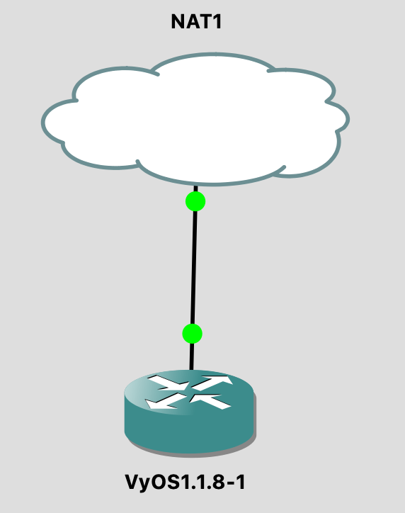

# Lab 04: Configuring a DHCP Server

Before attempting this lab, please make sure you have completed all of the material in the lessons tab.

Create a copy of this google document [lastname_lab04](https://docs.google.com/document/d/1IePCFWAKL4MTaU5M8plcbJQRqBkhO88CWA8vrtss4N0/edit?usp=sharing) (File > Make a Copy) to record all of your assignment answers in.

> :warning: Failure to use answer document properly will result in a 10pt deduction from final score.

The table of contents for this lab is found below.

&nbsp;&nbsp;&nbsp;&nbsp;&nbsp;&nbsp; Part 1: Topology Setup <br>
&nbsp;&nbsp;&nbsp;&nbsp;&nbsp;&nbsp; Part 2: Configuring DHCP - Guided <br>
&nbsp;&nbsp;&nbsp;&nbsp;&nbsp;&nbsp; Part 3: Configuring DHCP - Self-Guided <br>
&nbsp;&nbsp;&nbsp;&nbsp;&nbsp;&nbsp; Part 4: Using the GNS3 NAT Node <br>
&nbsp;&nbsp;&nbsp;&nbsp;&nbsp;&nbsp; Part 5: Submission <br>

## Part 1: Topology Setup

So far, all of the topology configurations we've made have been static in nature, for both IP and routing. Of course, static configuration is not a scalable solution for large network topologies. In this lab we'll explore how to configure a VyOS router to provide DHCP services to our devices.

Because you already have all of the appliances you need for this lab, simply recreate the topology below.

**Step 1.1** Drag and drop your network devices to recreate the topology below.

> :warning: The DHCP-Server that you see below is a VyOS router. I've simple changed the icon image to make it clear that this device is being used as a DHCP server. You can duplicate this by right clicking your VyOS router > Change Symbol > Classic > Server

**Step 1.2** Make sure your interface connections and labels match `exactly` to the showing topology.

:interrobang: Question 1 - Submit a screenshot of your topology in your answer document. <br>


## Part 2: Configuring DHCP - Guided

Now that you've set up the topology we can start to configure our VyOS router to serve IP addresses to host devices based on an IP pool that we designate.

**Step 2.1** Start your topology up by clicking the start button.<br>
**Step 2.2** Console into your VyOS router (DHCP-Server) and install the VyOS image by using the `install image` command. Follow the necessary prompts to complete the install process.<br>
**Step 2.3** To make sure all of your configuration settings persist (save) when you close out of your project, right click on your router icon in your GNS3 workspace, select `configure`, and make sure `Save the VM` state is selected in the `On close` field. Click Apply and Ok.<br>
**Step 2.4** If you are not already, enter into `configure mode` on your DHCP-Server. <br>
**Step 2.5** Assign your eth0 interface the ip address below:

```txt
vyos@vyos# set interfaces ethernet eth0 address 172.16.17.2/24
```

**Step 2.6** Commit and save to your config file.

```txt
vyos@vyos# commit
vyos@vyos# save
```

Now, it's time to start our DHCP-Server services. The below command is a configuration parameter for the subnet, saying that as part of the DHCP response, tell the client that I am the default router for this network.

**Step 2.7** Run the below command

```txt
vyos@vyos# set service dhcp-server shared-network-name dhcp-svr1 subnet 172.16.17.0/24 default-router 172.16.17.1
```

The next command  is a configuration parameter for the subnet, saying that as part of the DHCP response, tell the client that I am the DNS server for this network. If you do not want to run a DNS server, you could also provide one of the public DNS servers, such as google's. You can add multiple entries by repeating the command.

**Step 2.8** Run the below command

```txt
vyos@vyos# set service dhcp-server shared-network-name dhcp-svr1 subnet 172.16.17.0/24 dns-server 172.16.17.1
```

Next, we want to define how long we want to assign an IP address to machine's DHCP request. By default, this time limit is usual 24 hours. It is unlikely you'd need to shorten this period, unless you are running a network with lots of devices appearing and disappearing. 

**Step 2.9** To do this, run the below command

```txt
vyos@vyos# set service dhcp-server shared-network-name dhcp-svr1 subnet 172.16.17.0/24 lease 86400
```

Finally, we need to define a set of IP addresses that we want to pull from.

**Step 2.10** To do this, run the below command

```txt
vyos@vyos# set service dhcp-server shared-network-name dhcp-svr1 subnet 172.16.17.0/24 start 172.16.17.100 stop 172.16.17.199
```

**Step 2.11** Commit and save these configuration changes. <br>
**Step 2.12** Exit `configuration mode`  and enter `operation mode` with the command `exit` <br>
**Step 2.13** Inspect your configurations with the below command:

```txt
vyos@vyos$ show config
```

> :bulb: VyOS ProTip: If you're not sure what a next valid command is, you can type ? or press `tab` mid-command to see all possible completions of your command. Give it a try!

Under the `Interfaces` category, you should see that your eth0 interface has the IP address 172.16.17.2/24. Additionally, under the `Services > DHCP-Server` category you should see DHCP services have been configured. That is, the fields {shared-network name, subnet, default-router, dns-server, lease, start, stop} should all have values.

:interrobang: Question 2 - Submit a screenshot of your `Interface` category config report in your answer document.<br>
:interrobang: Question 3 - Submit a screenshot of your `Services` category config report in your answer document.<br>

Let's test our DHCP server.

**Step 2.14** Open the consoles for PC1, PC2, and PC3. <br>
**Step 2.15** In PC1 run the below command

```txt
vyos@vyos$ show ip
```

You'll notice that no IP address has been assigned to this machine. This holds true for PC1, PC2, and PC3.

**Step 2.15** In PC1, PC2, and PC3's console, run the below commands:

```txt
vyos@vyos$ ip dhcp
vyos@vyos$ show ip
```

You should see that each PC has been assigned an IP address in the range 172.16.17.100 - 172.16.17.199.

:interrobang: Question 4 - Why are the DHCP IPs restricted to this range? <br>
:interrobang: Question 5 - Submit a screenshot of PC1's `show ip` report. <br>
:interrobang: Question 6 - Submit a screenshot of PC2's `show ip` report. <br>
:interrobang: Question 7 - Submit a screenshot of PC3's `show ip` report. <br>

## Part 2: Configuring DHCP - Self-Guided

**Step 3.1** Open PC4's console and run the below command:

```txt
vyos@vyos$ ip dhcp
vyos@vyos$ show ip
```

:interrobang: Question 8 - Does it make sense that DHCP failed to assign an IP address to PC4? Explain why? <br>

**Step 3.2** Configure eth01 on your DHCP server to provide the workstation cluster (PC4, PC5, PC5) DHCP assigned IP addresses that conform to the below specifications:

* DHCP eth01:  10.10.10.2/24
* DHCP subnet: 10.10.10.0/24
* shared-network-name: dhcp-svr2
* dns-server: 10.10.10.1
* lease time: 86400


:interrobang: Question 9 - Submit a screenshot of your `Interface` category config report of your DHCP server in your answer document.<br>
:interrobang: Question 10 - Submit a screenshot of your `Services` category config report of your DHCP server in your answer document.<br>
:interrobang: Question 11 - Submit a screenshot of PC4's `show ip` report. <br>
:interrobang: Question 12 - Submit a screenshot of PC5's `show ip` report. <br>
:interrobang: Question 13 - Submit a screenshot of PC6's `show ip` report. <br>

At this point, your DHCP server should have assigned all of your workstations IP addresses.

**Step 3.3** Save and close your GNS3 Lab4 file.

## Part 4: Using the GNS3 NAT Node

Starting with GNS3 2.0, the NAT node became available. This node allows you to connect a topology to internet via NAT. The Internet node was deprecated in favor of this node, and the Cloud node.

> Your topology will not be directly accessible from the internet or local LAN, when using the NAT node. If that is required, then the Cloud node should be used. It’s useful when you need to download things from the internet.

**Step 4.1** Create a new GNS3 Lab4-NAT project. <br> 
**Step 4.2** Drag and drop your network devices to recreate the topology below. <br>



**Step 4.3** Start your topology up by clicking the start button.<br>
**Step 4.4** Console and log into your VyOS router and run the below commands: <br>

```txt
vyos@vyos:~$ config
vyos@vyos# set interfaces ethernet eth0 address dhcp
vyos@vyos# commit
vyos@vyos# save
vyos@vyos# exit
vyos@vyos:~$ show interfaces
```

You'll notice that your host network connectivity's DHCP server gave your interface an IP address. Let's test our connectivity to the outside world.

**Step 4.5** Run the below command:

```txt
vyos@vyos:~$ ping www.google.com
```

**Step 4.6** After your ping to google's server sends a few replies, stop the ping with `shift + c`.

:interrobang: Question 14 - Submit a screenshot of google's ping responses and the `--- www.google.com ping statistics ---` report. <br>

## Part 5: Submission 

Convert your answer document in to a **.PDF** and upload a single `lastname_lab4.pdf` answer document containing all of your answers to the lab questions to Brightspace through the attachment uploads option.