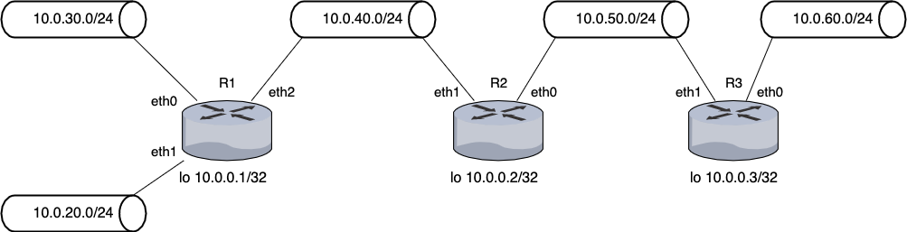
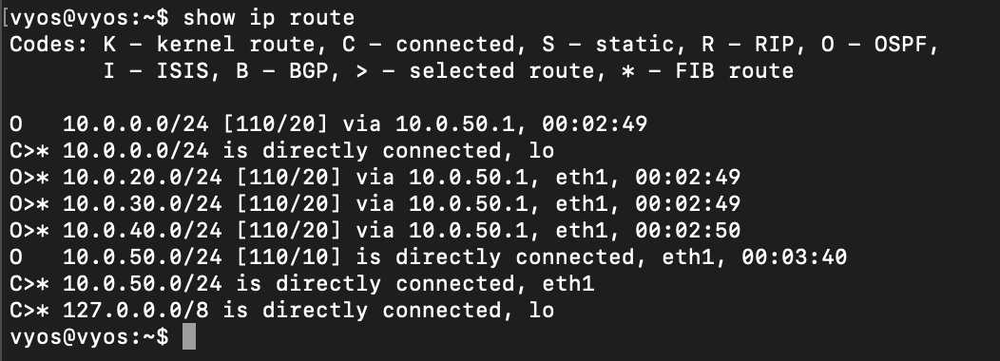

# Lab 05: Dynamic Routing via OSPF (Open Shortest Path First) 

Before attempting this lab, please make sure you have completed all of the material in the lessons tab.

Create a copy of this google document [lastname_lab05](https://docs.google.com/document/d/1QRdU-9tZb_RVhgunPZ3JPmd-T9qXTdFQHHrX3yBSYRs/edit?usp=sharing) (File > Make a Copy) to record all of your assignment answers in.

> :warning: Failure to use answer document properly will result in a 10pt deduction from final score.

The table of contents for this lab is found below.

&nbsp;&nbsp;&nbsp;&nbsp;&nbsp;&nbsp; Part 1: Topology Setup <br>
&nbsp;&nbsp;&nbsp;&nbsp;&nbsp;&nbsp; Part 2: Setting Interface IP addresses <br>
&nbsp;&nbsp;&nbsp;&nbsp;&nbsp;&nbsp; Part 3: OSPF Setup <br>
&nbsp;&nbsp;&nbsp;&nbsp;&nbsp;&nbsp; Part 4: Confirming OSPF Configuration <br>
&nbsp;&nbsp;&nbsp;&nbsp;&nbsp;&nbsp; Part 5: Submission <br>

## Part 1: Topology Setup

Before last week, all of the topology configurations we've made have been static in nature, for both IP and routing. Of course, static configuration is not a scalable solution for large network topologies.
<br><br>
In the previous lab, we were able to configure a DHCP server so we no longer needed to assign static IP addresses to our workstation and router interfaces. In this lab we'll explore how to configure a VyOS router to dynamically route network traffic using OSPF. By doing this, of course, we won't need to statically configure the routing policy for our routers. While there is still some configuration housekeeping that needs to take place, OSPF can significantly simplify routing for large network topologies (and, it scales quite nicely).

Because you already have all of the appliances you need for this lab, simply recreate the topology below.

**Step 1.1** Drag and drop your network devices to recreate the topology below.



> :bulb: While I know it's a small detail, it's important that you are able to look at a network map (regardless of the software used to generate it) and understand the layout of that topology. I've given you this labs topology in a different format than what you've seen so far (GNS3 screenshot). 

Notice that each bar's IP has a subnet address on it. Because of this, the number of host devices that are attached to each subnet is abstracted out of this network map. A small, but very important detail here.

**Step 1.2** Make sure your interface connections and labels match `exactly` to the showing topology.

**Step 1.3** Attach two VPCS devices to R1, Place one on subnet `10.0.30.0/24` and the other VPCS device on subnet `10.0.20.0/24` 

:interrobang: Question 1 - Submit a screenshot of your topology in your answer document. <br>

## Part 2: Setting Interface IP addresses

Now that you've set up the topology we can start to assign IP addresses to each of our device interfaces. Yes, we could do this by setting up a DHCP server like we did last week, but to simplify this lab we're going to focus on setting up OSPF and not the dynamic assigning of IP addresses. 
<br> <br>
I'm going to omit the nitty-gritty, step-by-step details of things we've already done because you (should) know how to do them by now. So, the next few steps high level instructions. Of course, when we get to new commands that you haven't seen yet in this class I'll provide step-by-step instruction. <br>

> :bulb: If you've forgotten how to perform some of these steps, you can always refer to previous labs/assignments/lecture material. I recommend you keep a "cheat sheet" of common VyOS shell commands that we use with a short description of what each command is doing. This *might* come in handy for the practical part of our final exam.

**Step 2.1** Start your topology up by clicking the start button.

**Step 2.2** Console into all three of your VyOS routers and install the VyOS image by using the `install image` command. Follow the necessary prompts to complete the install process.

**Step 2.3** To make sure all of your configuration settings persist (save) when you close out of your project, right click on your router icon in your GNS3 workspace, select `configure`, and make sure `Save the VM` state is selected in the `On close` field. Click Apply and Ok.

**Step 2.4** Use the below tables to set the interfaces and gateways for each device.


<table>

<tr><th> Workstations</th></tr>
<tr>
<td>

| VPCS1 | VPCS2 |
|---|---|
|10.0.30.2/24 <br> gateway: 10.0.30.1| 10.0.20.2/24 <br> gateway: 10.0.20.1|

</tr> 
</table>

<table>
<tr><th> Router 1 </th><th> Router 2</th><th> Router 3</th></tr>
<tr>
<td>

| eth0 | eth1 | eth2 |
|---|---|---|
| 10.0.30.1/24 | 10.0.20.1/24  | 10.0.40.1/24|

</td>

<td>

| eth0 | eth1 | 
|---|---|
|10.0.50.1/24 | 10.0.40.2/24 |

</td>

<td>

| eth0 | eth1 | 
|---|---|
| 10.0.60.1/24  | 10.0.50.2/24 |

</td>

</tr> 

</table>

Now, we're going to set the loopback address for each router. You can find the loopback address for each router below (and in the topology in part 1).


| Router 1 | Router 2 | Router 3 |
|---|---|---|
|10.0.0.1/32 | 10.0.0.2/32 | 10.0.0.3/32 |


**Step 2.5** Console into config mode for Router 1 and use the below command to set it's loopback address.

```text
vyos@vyos# set interfaces loopback lo address 10.0.0.1/32
```
**Step 2.6** Use the above syntax to set the loopback address for Router 2 and Router 3.

**Step 2.7** Commit and save all of your interface assignments.

:interrobang: Question 2 - Submit a screenshot of Router 1's `show interface` report while in `operation` mode. <br>

:interrobang: Question 3 - Submit a screenshot of Router 2's `show interface` report while in `operation` mode. <br>

:interrobang: Question 4 - Submit a screenshot of Router 3's `show interface` report while in `operation` mode. <br>

## Part 3: OSPF Setup 

### Router 01

**Step 3.1** Open Router 1's console and enter configure mode.

**Step 3.2** Set the identifer of the OSPF router to that of the loopback address with the command below:

```text
vyos@vyos# set protocols ospf parameters router-id 10.0.0.1
```

**Step 3.3** Advertise to the 10.0.40.0/24 network with the command below:

```text
vyos@vyos# set protocols ospf area 0.0.0.0 network 10.0.40.0/24
```

**Step 3.5** Redistribute connected routes to OSPF with the command below:

```text
vyos@vyos# set protocols ospf redistribute connected
```

**Step 3.6** Commit and save these configuration settings.

### Router 02

**Step 3.7** Open Router 2's console and enter configure mode.

**Step 3.8** Set the identifier of the OSPF router to that of the loopback address with the command below:

```text
vyos@vyos# set protocols ospf parameters router-id 10.0.0.2
```

**Step 3.9** Advertise to the 10.0.40.0/24 network with the command below:

```text
vyos@vyos# set protocols ospf area 0.0.0.0 network 10.0.40.0/24
```

**Step 3.10** Advertise to the 10.0.50.0/24 network with the command below:

```text
vyos@vyos# set protocols ospf area 0.0.0.0 network 10.0.50.0/24
```

**Step 3.11** Redistribute connected routes to OSPF with the command below:

```text
vyos@vyos# set protocols ospf redistribute connected 
```
**Step 3.12** Commit and save these configuration settings.

### Router 03

**Step 3.13** Open Router 3's console and enter configure mode.

**Step 3.14** Set the identifier of the OSPF router to that of the loopback address with the command below:

```text
vyos@vyos# set protocols ospf parameters router-id 10.0.0.3
```

**Step 3.15** Advertise the 10.0.50.0/24 network with the command below:

```text
vyos@vyos# set protocols ospf area 0.0.0.0 network 10.0.50.0/24
```

**Step 3.16** Redistribute connected routes to OSPF with the command below:

```text
vyos@vyos# set protocols ospf redistribute connected 
```
**Step 3.17** Commit and save these configuration settings.

**Step 3.18** Enter operation mode on Router 3 and run the below command:

```text
vyos@vyos# show ip route
```

You should see the below routing table:



> :warning: It might take 30 - 60 seconds for OSPF to find all available routes and display them in this show ip route view. If you're routing table doesn't include the OSPF routes after a minute, your configuration might be off.

The output shows that routes to 10.0.0.0/24, 10.0.20.0/24, 10.0.20.0/24, 10.0.30.0/24, and 10.0.40.0/24 have been learned through OSPF (and are the selected routes). In addition, packets to those networks are forwarded from eth1 to 10.0.50.2. The 10.0.50.0/24 and 10.0.60.0/24 networks are directly connected to R3. Directly connected routes are always preferred over OSPF discovered routes.

:interrobang: Question 5 - Submit a screenshot of Router 1's `show ip route` routing table while in `operation` mode. <br>
:interrobang: Question 6 - Submit a screenshot of Router 2's `show ip route` routing table while in `operation` mode. <br>
:interrobang: Question 7 - Submit a screenshot of Router 3's `show ip route` routing table while in `operation` mode. <br>
 
## Part 4: Confirming OSPF Configuration

Let's just do a quick sanity check to make sure that our setup in part 3 was successful.

**Step 4.1** From Router 3, ping address `10.0.20.1`. 

You should have connectivity between Router 3 and interface 10.0.20.1. This ping confirms that the OSPF configuration is working and that you can reach a remote network.

:interrobang: Question 8 - Submit a screenshot of Router 3's successful ping response to address `10.0.20.1`.

## Part 5: Submission 

Convert your answer document in to a **.PDF** and upload a single `lastname_lab5.pdf` answer document containing all of your answers to the lab questions to Brightspace through the attachment uploads option.
