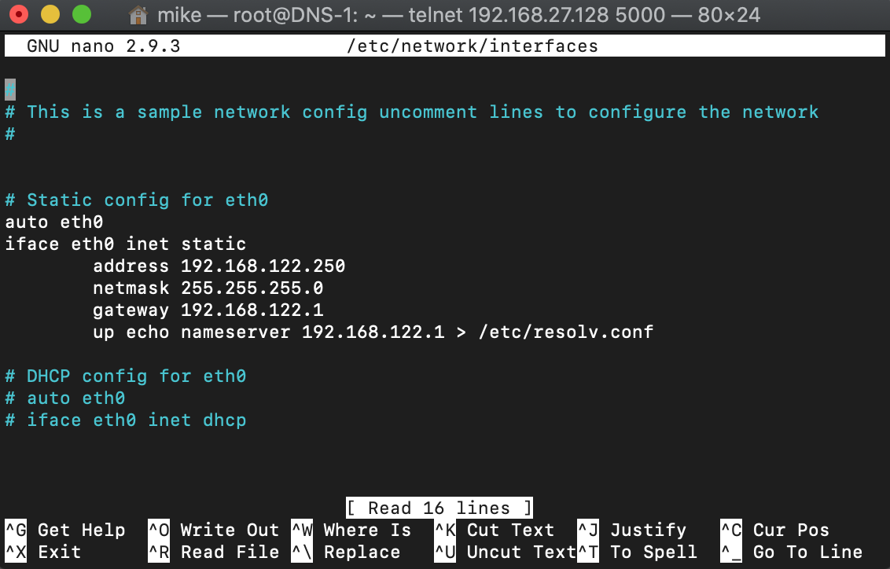

# Lab 06: Configuring DNS using an Ubuntu Docker Container

Before attempting this lab, please make sure you have completed all of the material in the lessons tab.

Create a copy of this google document [lastname_lab06](https://docs.google.com/document/d/1IgPEjstAqmtEXFMk4evxflD8VeHro6nqd_P_rK4IkGk/edit?usp=sharing) (File > Make a Copy) to record all of your assignment answers in.

> :warning: Failure to use answer document properly will result in a 10pt deduction from final score.

The table of contents for this lab is found below.

&nbsp;&nbsp;&nbsp;&nbsp;&nbsp;&nbsp; Part 1: Topology Setup <br>
&nbsp;&nbsp;&nbsp;&nbsp;&nbsp;&nbsp; Part 2: Setting Interface IP addresses <br>
&nbsp;&nbsp;&nbsp;&nbsp;&nbsp;&nbsp; Part 3: DNS Setup - Guided <br>
&nbsp;&nbsp;&nbsp;&nbsp;&nbsp;&nbsp; Part 4: DNS Setup - Self-Guided <br>
&nbsp;&nbsp;&nbsp;&nbsp;&nbsp;&nbsp; Part 5: DNS - Immersive Lab <br>
&nbsp;&nbsp;&nbsp;&nbsp;&nbsp;&nbsp; Part 6: Submission <br>

## Part 1: Topology Setup

This week, we discussed a few of the important roles that DNS provides our networks. In this lab we'll explore how to configure a Domain Name System hosted on an Ubuntu Docker Container. We'll discuss Docker and virtualization in better detail this semester but for now, all you need to know is that we will be using a virtual machine-like appliance that is running Ubuntu and set up as a DNS server.

First, we'll need to import this DNS appliance. 

**Step 1.1** Follow the below steps in import the DNS appliance:


**Step 1.2** Follow the below steps in import the DNS appliance:


**Step 1.3** Follow the below steps in import the DNS appliance:


**Step 1.4** Follow the below steps in import the DNS appliance:


**Step 1.5** Drag and drop your network devices to recreate the topology below.


:interrobang: Question 1 - Submit a screenshot of your topology. <br>

## Part 2: Setting Interface IP addresses

**Step 2.1** Start your topology and open the console for your DNS server. <br>

**Step 2.2** Start your topology and open the console for your DNS server.

> Because the operating system for this device is Ubuntu, this console will accept linux-style terminal commands (ls, cd, clear, ifconfig, cat, nano).

**Step 2.3** Observe the current IP configuration for your DNS server by running the below command:

```txt
root@DNS-1:~# ifconfig
```
You'll notice no IP address has been set for this device.

**Step 2.4** Open up interface config file for this device by running the below command:

```txt
root@DNS-1:~# nano /etc/network/interfaces 
```

> :bulb: nano servers as a command line editor much like vim. You can read up more about nano [here](https://wiki.gentoo.org/wiki/Nano/Basics_Guide) - [PDF](files/file1.pdf).


**Step 2.5** Comment out the static config for eth0 settings as shown below.



**Step 2.6** Modify the below fields with the following config settings so your settings match the above screenshot settings.

* address: 192.168.122.250
* netmask: 255.255.255.0
* gateway: 192.168.122.1
* up echo nameserver 192.168.122.1 > /etc/resolv.config

**Step 2.7** Write these changes to the /etc/networking/interface file with `ctrl+x`, type in `Y`, and `Enter`. <br>

**Step 2.8** Let's verify that our changes saved in this file by running the below command.

```txt
root@DNS-1:~# cat /etc/network/interfaces
```

 > :bulb: The `cat` can be used to print out the concents, redirect a file's contents into another file, or concatenate two files. You can read up on the `cat` command [here](https://phoenixnap.com/kb/linux-cat-command) - [PDF](files/file2.pdf). <br>

We need to shut down and restart our DNS server for eth0 to be configured with these new settings.

**Step 2.9** Right click your DNS server, select stop, right click again, and select start. <br>

**Step 2.10** Verify eth0 as been configured by running the `ifconfig` command again.

At this point you should see the IP 192.168.122.250 with subnet mask 255.255.255.0

**Step 2.11** Console into all three of your VyOS routers and install the VyOS image by using the `install image` command. Follow the necessary prompts to complete the install process.

**Step 2.12** To make sure all of your configuration settings persist (save) when you close out of your project, right click on your router icon in your GNS3 workspace, select `configure`, and make sure `Save the VM` state is selected in the `On close` field. Click Apply and Ok.

**Step 2.13** Use the below table to set up the interfaces for Router#01 and Router#02.

<table>
<tr><th> Router 1 </th><th> Router 2</th></tr>
<tr>
<td>

| eth0 |
|---|
|192.168.122.201/24|

</td>

<td>

| eth0 |
|---|
|192.168.122.202/24|

</td>


</tr> 

</table>


**Step 2.14** Set the host name and domain name for R1 with the below commands

```text
vyos@vyos# set system host-name r1
vyos@vyos# set system domain-name example.com
vyos@vyos# commit
vyos@vyos# save
```

Let's do some testing on our current network configuration.

**Step 2.15** Open the DNS server console and ping 192.168.122.201/24 and 192.168.122.202/24

> :bulb: Use `ctrl + c` to stop a ping request.

At this point, there should be connectivity between the DNS server and r1 (192.168.122.201) and r2 (192.168.122.202).

:interrobang: Question 2 - Submit a screenshot of DNS - >  192.168.122.201 ping <br>

:interrobang: Question 3 - Submit a screenshot of DNS - >  192.168.122.202 ping <br>

**Step 2.16** From the DNS server console, ping example.com

**Step 2.17** From the r2 console, ping example.com

:interrobang: Question 4 - Describe what happened for **Steps 2.16 and 2.17**. 

:interrobang: Question 5 - Were the results from **Steps 2.16 and 2.17** expected? Why?<br>

:interrobang: Question 6 - Why were we able to communicate with r1 using it's IP address (192.168.122.201) but not it's qualified domain name (example.com)?<br>

## Part 3: DNS Setup - Guided

Ok, we've set the interface for our two routers and DNS server and we've configured the qualified domain name for r1. We have not yet written an A record that translates the domain name for r1 to it's related IP address. That is, we have no DNS translation.

It's important to note that in `Part 2`, we demonstrated that the DNS server and two routers do have connectivity to each other by directly referencing each device by its IP address.

**Step 3.1** Open the DNS console and run the below command:

```text
root@DNS-1:~# nano /etc/hosts
```

**Step 3.2** Modify this file with the below text so it matches the image below:

```text
192.168.122.201 example.com r1
```


**Step 3.3** Write these changes to the /etc/hosts file with `ctrl+x`, type in `Y`, and `Enter`. <br>

**Step 3.4** Let's verify that our changes saved in this file by running the below command.

```txt
root@DNS cat /etc/hosts
```

:interrobang: Question 7 - Provide a screenshot of the cat output from the /etc/hosts file<br>

**Step 3.5** Reset the DNS server with the below command, making those changes accessible to all of the devices using this DNS server (192.168.122.250).

```text
root@DNS-1:~# service dnsmasq restart
```

**Step 3.6** From the DNS server console, ping example.com

**Step 3.7** From the r2 console, ping example.com

:interrobang: Question 8 - Provide a screenshot of your successful ping from the DNS server to example.com <br>

:interrobang: Question 9 - Provide a screenshot of your successful ping from r2 to example.com <br>

## Part 4: DNS Setup - Self-Guided

**Step 4.1** Configure DNS for r2 using the below qualified domain name:

* example2.com

**Step 4.2** From the DNS server console, ping example2.com

:interrobang: Question 10 - Provide a screenshot of your successful ping from the DNS server to example2.com <br>

**Step 4.3** From the DNS server console, ping example2.com

:interrobang: Question 11 - Provide a screenshot of your successful ping from r1 to example2.com <br>

## Part 5: DNS - Immersive Lab

The below image is simply pulled from [www.immersivelabs.com](www.immersivelabs.com). Please, read the information below and complete the [Domain Name System](https://immersivelabs.online/labs/networking-domain-names/) lab on immersivelabs.


:interrobang: Question 12 - Submit a screenshot of your badge demonstrating the completion of this immersive lab module.


## Part 6: Submission

Convert your answer document in to a **.PDF** and upload a single `lastname_lab6.pdf` answer document containing all of your answers to the lab questions to Brightspace through the attachment uploads option.
