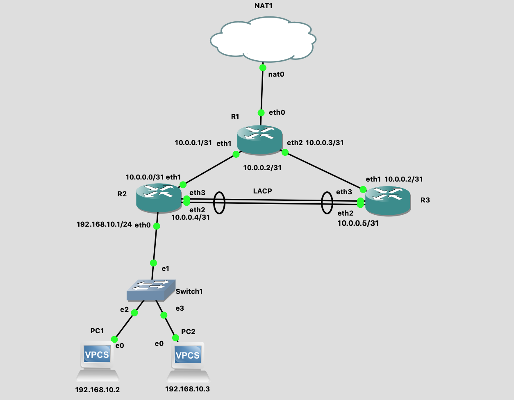
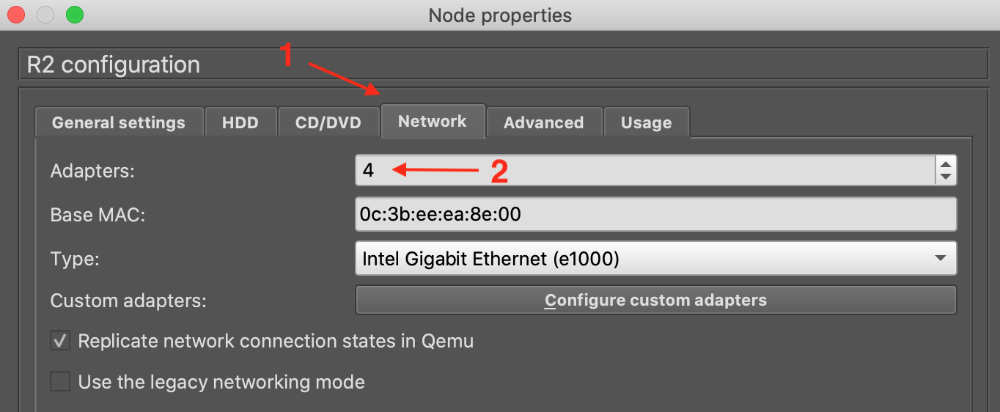

# Lab 07: Configuring LACP and NAT (with self-guided OSFP and DNS)

Before attempting this lab, please make sure you have completed all of the material in the lessons tab.

Create a copy of this google document [lastname_lab07](https://docs.google.com/document/d/1qiPmml3yIPPWXTtk9e948RwnUVMzfjlPz__V5IPrA_c/edit?usp=sharing) (File > Make a Copy) to record all of your assignment answers in.

> :warning: Failure to use answer document properly will result in a 10pt deduction from final score.

The table of contents for this lab is found below.

&nbsp;&nbsp;&nbsp;&nbsp;&nbsp;&nbsp; Part 1: Topology Setup <br>
&nbsp;&nbsp;&nbsp;&nbsp;&nbsp;&nbsp; Part 2: Link Aggregation (Link Bonding) and Interface Addressing <br>
&nbsp;&nbsp;&nbsp;&nbsp;&nbsp;&nbsp; Part 3: Setting Interface IP addresses <br>
&nbsp;&nbsp;&nbsp;&nbsp;&nbsp;&nbsp; Part 4: OSPF and DNS <br>
&nbsp;&nbsp;&nbsp;&nbsp;&nbsp;&nbsp; Part 5: NAT <br>
&nbsp;&nbsp;&nbsp;&nbsp;&nbsp;&nbsp; Part 6: Submission <br>

## Part 1: Topology Setup

This week, we discussed the importance of the cabling that our networks are made up of. In this lab, we'll take a closer look at how we can aggregate the throughput of two unique cables into one using `Link Aggregation Control Protocol (LACP)`. We've also taken a theoretical look at `Network Address Translation (NAT)` in previous lectures, so in this lab we'll actually be implementing NAT services in our topology.


In this lab we'll be merging a few of the skills that we've practiced over the past few weeks. I'm going to omit the nitty-gritty, step-by-step details of things we've already done because you (should) know how to do them by now. So, the next few steps high level instructions. Of course, when we get to new commands that you haven't seen yet in this class I'll provide step-by-step instruction.

First, lets start by setting up our topology.

**Step 1.1** Drag and drop your network devices to recreate the topology below.

:warning: Be sure to save save the state of your VyOS VM's on shutdown (right click > On close: save the VM state).



> :warning: You'll notice some new notation in the above topology. The two loops that you see connecting the cables running from R2 and R3 denote `Link aggregation` for those cables. Link aggregation is also referred to as `Link Bonding` or a `Bonded Interface`.

The link aggregation loops that you see are `not` part of the GNS3 application, so you don't need to worry about adding the two loops on your topology. We'll be logically implementing these loops later in the lab.

You might have noticed that R2 has a total of four interfaces. By default, GNS3 provides us three interfaces for our VyOS routers so we'll need to configure R2 and R3 to have four interfaces.

**Step 1.2** Right click on R2 and select configure. <br>

**Step 1.3** Right click on R2 and select configure, set the interface count to four, and accept these changes.



**Step 1.4** Repeat *Step 1.3* for R3.

:interrobang: Question 1 - Submit a screenshot of your topology setup.

## Part 2: Link Aggregation (Link Bonding) and Interface Addressing 

Now that we have all of our GNS3 appliances in place, lets start to add some semantic meaning to this network.

**Step 2.1** Set the host name for each router using the names:

* Router 1 -> R1
* Router 2 -> R2
* Router 3 -> R3

**Step 2.2** Use the below interface tables to configure each router and VPCs.

:warning: You don't have to worry about the bond0 interfaces for R2 and R3. We'll be doing this together soon.

<table>

<tr><th> Workstations</th></tr>
<tr>
<td>

| VPCS1 | VPCS2 |
|---|---|
|192.168.10.2/24  <br> gateway: 192.168.10.1| 192.168.10.3/24 <br> gateway: 192.168.10.1|

</tr> 
</table>

<table>

<tr><th> Router 1</th></tr>
<tr>
<td>

| eth0 | eth1 | eth2 |
|---|---|---|
| dhcp | 10.0.0.1/31 | 10.0.0.3/31 |

</tr> 
</table>

<table>

<tr><th> Router 2</th></tr>
<tr>
<td>

| eth0 | eth1 | eth2 | eth3 | bond0 | Loopback1|
|---|---|---|---|---|---|
|192.168.10.1/24| 10.0.0.0/31 |None; part of bond0| None; part of bond0 | 10.0.0.4/31| 10.2.2.2/32 |

</tr> 
</table>


<table>
<tr><th> Router 3</th></tr>
<tr>
<td>

| eth0 | eth1 | eth2 | eth3 | bond0 |Loopback1|
|---|---|---|---|---|---|
| None | 10.0.0.2/31 |None; part of bond0| None; part of bond0 | 10.0.0.5/31 | 10.3.3.3/32|

</tr> 
</table>

#### Bond / Link Aggregation

The bonding interface provides a method for aggregating multiple network interfaces into a single logical “bonded” interface, or LAG, or ether-channel, or port-channel. The behavior of the bonded interfaces depends upon the mode; generally speaking, modes provide either hot standby or load balancing services. Additionally, link integrity monitoring may be performed. [source](https://docs.vyos.io/en/latest/interfaces/bond.html) - [PDF](files/file1.pdf)

Now that we have our interfaces addressed, lets aggregate the `eth2` and  `eth3` interfaces for R2 and R3.

**Step 2.2** Open the console for R2, enter `configuration` mode and run the below commands:

```text
vyos@R2# set interfaces bonding bond0 address 10.0.0.4/31
vyos@R2# set interfaces ethernet eth2 bond-group bond0
vyos@R2# set interfaces ethernet eth3 bond-group bond0
```

**Step 2.2** Open the console for R3, enter `configuration` mode and run the below commands:

```text
vyos@R3# set interfaces bonding bond0 address 10.0.0.5/31
vyos@R3# set interfaces ethernet eth2 bond-group bond0
vyos@R3# set interfaces ethernet eth3 bond-group bond0
```

> In this step, we're creating a bond group named bond0 and assigning that bond group an IP address. We can then target interfaces (eth2 and eth3) on R2 and R3 to be a part of that bond group. 

Let's do a quick sanity test and verify that LACP is bonding `eth2` and `eth3`. We can use Wireshark to inspect the network behavior on these two channels. If we periodically see LACP packets reminding each interface that the other exists, we can claim success.

**Step 2.3** Inspect the `R2 eth2 <=> eth2 R3` channel using Wireshark.

:interrobang: Question 2 - Submit a screenshot of your Wireshark capture showing LACP traffic. <br>

:interrobang: Question 3 - Submit a screenshot of Router 1's show interface report while in operation mode. <br>

:interrobang: Question 4 - Submit a screenshot of Router 2's show interface report while in operation mode. <br>

:interrobang: Question 5 - Submit a screenshot of Router 3's show interface report while in operation mode. <br>

Let's do another small sanity check to see the current level of visibility each network device has.

**Step 2.3** From R1, ping `8.8.8.8`. Use `ctrl+c` to terminate the ping stream.<br>

8.8.8.8 is the well known primary DNS server for Google DNS. Because out NAT cloud should have connectivity to internet, you should be getting a successful reply.

**Step 2.4** From R1, check to see if we have name services by pinging google.com<br>

Again, this should be you should be getting a successful reply.

**Step 2.4** From R2, ping `8.8.8.8`. <br>

This ping should fail.

**Step 2.5** From R3, ping `8.8.8.8`. <br>

This ping should also fail.

**Step 2.6** Stop monitoring the `R2 eth2 <=> eth2 R3` channel (right click on interface > stop capture) and close Wireshark. <br>

> From R2 and R3, you should be able to ping each of the routers connected interfaces, but not further than that. Why? Because we have not set up any static or dynamic routing policies.

## Part 4: OSPF and DNS

**Step 4.1** Configure R1, R2 and R3 to use single area ospf (Lab 5).<br>

I've enumerated some important observations about our network topology for your convenience below:

#### Router 1
* Router ID: 10.1.1.1

#### Router 2
* Router ID: 10.2.2.2
* Over ospf area 0, R2 should be able to detect networks
    * 10.0.0.0/31
    * 192.168.0.0/24
    * 10.0.0.4/31
    * dhcp assigned subnet (R1's eth0)

#### Router 3
* Router ID: 10.3.3.3
* Over ospf area 0, R3 should be able to detect networks
    * 10.0.0.0/31
    * 10.0.0.2/31
    * 192.168.0.0/24
    * dhcp assigned subnet (R1's eth0)


After successfully setting up OSFP, you should be able to successfully ping 8.8.8.8 from R2 and R3 after we set up a default route. Don't forget ~ by setting up a default route we're essentially saying, "if you give me an address to ping to and I don't have that address in my routing table, I'll send it to this interface directly and let them worry about it".

Because R1's eth0 can talk to the entire internet we should use that interface as our default route.

**Step 4.2** From R2's console in `configure` mode, run the below command: <br>

```text
set protocols static route 0.0.0.0/0 next-hop <R1's eth0 address (dhcp assigned)>
```

**Step 4.3** From R3's console in `configure` mode, run the below command: <br>

```text
set protocols static route 0.0.0.0/0 next-hop <R1's eth0 address (dhcp assigned)>
```

**Step 4.4** From R2, ping 8.8.8.8 <br>

**Step 4.5** From R3, ping 8.8.8.8 <br>

Finally, we should have a successful reply from googles DNS server for R2 and R3.

**Step 4.6** From R2, ping google.com <br>

No response? That's because we have not identified a DNS server to use for name services yet. Well, we know that we can talk to google's DNS server (8.8.8.8), so why not use it?

**Step 4.7** From R2's console in `configure` mode, run the below command:<br>

```text
set system name-server 8.8.8.8
```

**Step 4.8** From R3's console in `configure` mode, run the below command:<br>

```text
set system name-server 8.8.8.8
```

**Step 4.9** From R2, ping google.com <br>

**Step 4.9** From R3, ping google.com <br>

:interrobang: Question 6 - Submit a screenshot of Router 2's successful ping to google.com <br>

:interrobang: Question 7 - Submit a screenshot of Router 3's successful ping to google.com <br>

## Part 5: NAT

By now, we should have strong theoretical knowledge of what NAT does. Let's turn that conceptual knowledge into practical knowledge. Just to summarize, NAT allows a single device, such as a router, to act as an agent between the Internet (or public network) and a local network (or private network), which means that only a single unique IP address is required to represent an entire group of computers to anything outside their network [source](https://www.cisco.com/c/en/us/support/docs/ip/network-address-translation-nat/26704-nat-faq-00.html#:~:text=Basically%2C%20NAT%20allows%20a%20single,to%20anything%20outside%20their%20network.) - [PDF](files/file2.pdf).

Let's take a look at how R2 packets look leaving our topology before NAT is configured.

**Step 5.1** Inspect the `R1 eth0 <=> nat0 NAT1` channel using Wireshark. <br>

**Step 5.2** From R2's console, ping google.com <br>

**Step 5.3** The source IP address for these packets should be a R2 IP address.<br>

As we can see, no network address translation is taking place. Because R1's eth0 is our default-route, any internal traffic that is going outbound (to the internet) will need to go through that interface. So, this seems like the perfect place to perform NAT.<br>

**Step 5.4** Open R1's console to `configure` mode<br>

We need to translate *all* packets coming from *any* subnet on our internal network. <br>

**Step 5.5** Set these `nat source rules` with the below commands:<br>

```text
vyos@R1# set nat source rule 100 source address 10.1.1.1/32
vyos@R1# set nat source rule 101 source address 10.2.2.2/32
vyos@R1# set nat source rule 102 source address 10.3.3.3/32
vyos@R1# set nat source rule 103 source address 10.0.0.0/31
vyos@R1# set nat source rule 104 source address 10.0.0.2/31
vyos@R1# set nat source rule 105 source address 10.0.0.4/31
vyos@R1# set nat source rule 106 source address 192.168.10.0/24
```
Now that we know which subnets to keep an eye out for NAT, we need to specific the interface that we want to perform NAT on for each rule.<br>

**Step 5.6** We can do this by running the below commands:<br>

```text
vyos@R1# set nat source rule 100 outbound-interface eth0
vyos@R1# set nat source rule 101 outbound-interface eth0
vyos@R1# set nat source rule 102 outbound-interface eth0
vyos@R1# set nat source rule 103 outbound-interface eth0
vyos@R1# set nat source rule 104 outbound-interface eth0
vyos@R1# set nat source rule 105 outbound-interface eth0
vyos@R1# set nat source rule 106 outbound-interface eth0
```

Finally, we use the `masquerade` command so all packets coming from any of the identified subnets become masked it so it appears to be coming from the IP address of the interface. <br>

**Step 5.6** We can do this by running the below commands:<br>

```text
vyos@R1# set nat source rule 100 translation address masquerade
vyos@R1# set nat source rule 101 translation address masquerade
vyos@R1# set nat source rule 102 translation address masquerade
vyos@R1# set nat source rule 103 translation address masquerade
vyos@R1# set nat source rule 104 translation address masquerade
vyos@R1# set nat source rule 105 translation address masquerade
vyos@R1# set nat source rule 106 translation address masquerade
```
**Step 5.7** While still inspect the `R1 eth0 <=> nat0 NAT1` channel using Wireshark, ping google.com from R2. <br>

You should see ICMP ping request/reply packets, but the source address of should be the same as the IP address of R1's eth0. 

:interrobang: Question 8 - Submit a single screenshot that contains both R2's console pinging and the Wireshark window capturing the translated ping. <br>

**Step 5.8** While still inspect the `R1 eth0 <=> nat0 NAT1` channel using Wireshark, ping google.com from R3. <br>

You should see ICMP ping request/reply packets, but the source address of should be the same as the IP address of R1's eth0. 

:interrobang: Question 9 - Submit a single screenshot that contains both R3's console pinging and the Wireshark window capturing the translated ping. <br>

:warning: Be sure to save this lab and all of your config settings. We'll be extending this lab in the future.

## Part 6: Submission

Convert your answer document in to a **.PDF** and upload a single `lastname_lab7.pdf` answer document containing all of your answers to the lab questions to Brightspace through the attachment uploads option. Source: [Dr. Ben Franske](https://wiki.ihitc.net/w/Franske_ITC-2900_Syllabus#Course_Description) - [PDF](files/file3.pdf)
