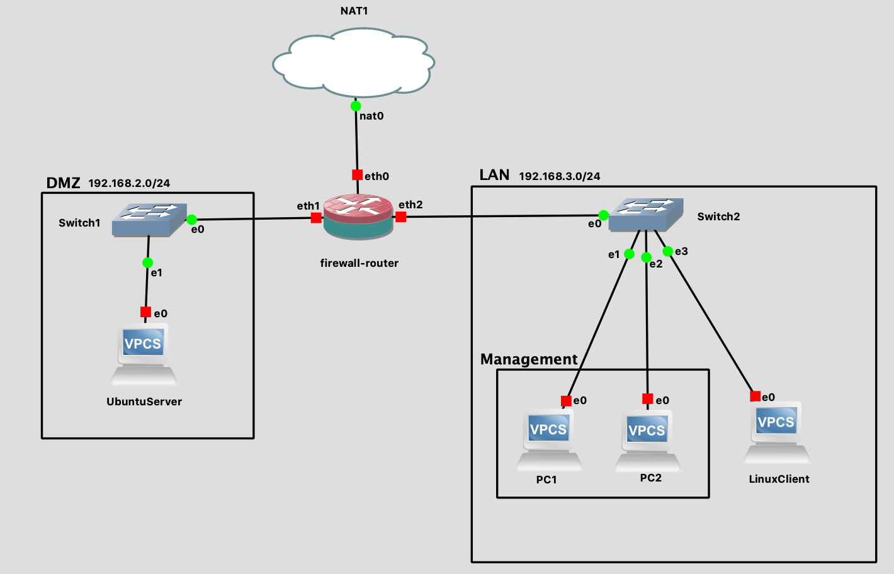

# Lab 08: Configuring Firewall Rules

Before attempting this lab, please make sure you have completed all of the material in the lessons tab.

Create a copy of this google document [lastname_lab08](https://docs.google.com/document/d/1Wz-9ZXH6saf5t8LscjjEEgvT9FYcvXBxhW9ezn3kcxk/edit?usp=sharing) (File > Make a Copy) to record all of your assignment answers in.

> :warning: Failure to use answer document properly will result in a 10pt deduction from final score.

The table of contents for this lab is found below.

&nbsp;&nbsp;&nbsp;&nbsp;&nbsp;&nbsp; Part 1: Topology Setup <br>
&nbsp;&nbsp;&nbsp;&nbsp;&nbsp;&nbsp; Part 2: Interface Addressing <br>
&nbsp;&nbsp;&nbsp;&nbsp;&nbsp;&nbsp; Part 3: DNS Forwarding and NAT<br>
&nbsp;&nbsp;&nbsp;&nbsp;&nbsp;&nbsp; Part 4: Firewall Rule Set <br>
&nbsp;&nbsp;&nbsp;&nbsp;&nbsp;&nbsp; Part 5: Submission <br>

## Part 1: Topology Setup

This week, we talked about some important networking devices. In this lab, we'll take a closer look at how firewalls and their rule sets can allow or reject inbound and outbound traffic between our local network and the outside world.

First, lets start by setting up our topology.

**Step 1.1** Drag and drop your network devices to recreate the topology below.



> You'll notice that the router I have connected to the NAT cloud is using a firewall-router symbol. That's because we'll be configuring this router to block traffic based on layer 4 information. I'm using the square shape boxes with a transparent filling to illustrate the different segments on this network. It's also important to note that we haven't installed true Ubuntu or Linux systems on our GNS topologies yet so our DMZ and linux client won't function as true network areas yet.

:interrobang: Question 1 - Submit a screenshot of your topology setup.

## Part 2: Interface Addressing

**Step 2.1** Use the below interface tables to configure each router and VPCs.


<table>

<tr><th> Workstations in LAN</th></tr>
<tr>
<td>

| VPCS1 | VPCS2 | LinuxClient |
|---|---|---|
|192.168.3.2/24  <br> gateway: 192.168.3.1| 192.168.3.3/24 <br> gateway: 192.168.3.1| 192.168.3.200/24 <br> gateway: 192.168.3.1|

</tr> 
</table>


<tr><th> Workstation in DMZ</th></tr>
<tr>
<td>

| UbuntuServer |
|---|
|192.168.2.2/24  <br> gateway: 192.168.2.1| 

</tr> 
</table>


<table>

<tr><th> Firewall/Router</th></tr>
<tr>
<td>

| eth0 | eth1 | eth2 |
|---|---|---|
| dhcp | 192.168.2.1/24 | 192.168.3.1/24|

</tr> 
</table>

Because our networks are starting to get a bit more complicated, let's do some housekeeping and provide a description of each of our firewall/router interfaces.

**Step 2.2** Set each interface description with the below commands:

```text
vyos@vyos# set interfaces ethernet eth0 description 'OUTSIDE'
vyos@vyos# set interfaces ethernet eth1 description 'DMZ'
vyos@vyos# set interfaces ethernet eth2 description ‘LAN’
```

> Because we are only using lightweight VPCs on our topology that can only use telnet and not ssh, we don't need to set up ssh services for this device. If we wanted to, we could use the `set service ssh port '22'` command.

At this point, if you exit configuration mode and show interfaces, you'll see the descriptions set on the right hand side.

## Part 3: DNS Forwarding and NAT

Let's make it so the devices in our DMZ and LAN can communicate with the outside world.

**Step 3.1** Run the below commands to configure NAT both our "LAN" & "DMZ" networks.

```text
vyos@vyos# set nat source rule 100 outbound-interface eth0
vyos@vyos# set nat source rule 100 source address '192.168.0.0/16'
vyos@vyos# set nat source rule 100 translation address masquerade
```

At this point we should be able to ping 8.8.8.8 from all of our network devices.

**Step 3.2** Run the below commands from your VyOS device to configure DNS forward and name services for your router.

```text
vyos@vyos# set service dns forwarding cache-size 0
vyos@vyos# set service dns forwarding listen-on eth1
vyos@vyos# set service dns forwarding listen-on eth2
vyos@vyos# set service dns forwarding name-server 8.8.8.8
```

**Step 3.3** Run the below commands from your VPCs devices to configure DNS services for your virtual PCs.

```text
PC#> ip dns 8.8.8.8
```

Now, you should be able to ping google.com from all of your devices.

:interrobang: Question 2 - Submit a screenshot of VPCS1 and VPCS2 pinging google.com <br>

## Part 4: Firewall Rule Set

Now that all of our devices are able to reach out to google and get a response back, we want to now configure our VyOS router/firewall device to reject inbound about outbound packets with ping (aka: ICMP) data in it.

The firewall for VyOS is powered by Linux Netfilter (more commonly known by it’s user-space utility “iptables”). Netfilter is one of the most widely adopted and peer-reviewed firewall implementations in the world.

Firewall policy in VyOS can be applied using two methods: Per-Interface or Zone Policy.

We've set up a standard three zone firewall configuration with an “outside” or “WAN” on interface eth0, “DMZ” on eth1, and “inside” or “LAN” on eth2.

First, we need to create group objects. Once we have defined all of our group objects we can apply rule sets to them.

**Step 4.1** Run the below commands on your firewall to create group objects.

```text
vyos@vyos# set firewall group network-group NET-DMZ network '192.168.2.0/24'
vyos@vyos# set firewall group network-group NET-LAN network '192.168.3.0/24'
vyos@vyos# set firewall group network-group NET-MANAGEMENT network '192.168.3.2/32'
vyos@vyos# set firewall group network-group NET-MANAGEMENT network '192.168.3.3/32'
vyos@vyos# set firewall group network-group NET-WAN network <eth0 subnet (assigned via DHCP)>
```

> :warning: You'll notice that separate network groups were created for `NET-LAN` and `NET-MANAGEMENT`. Although all of these devices still exist on the 192.168.3.0/24 subnet, we might want the devices in the management domain to have different properties (e.g. ssh access to our router and firewall).

Note that we can reference individual IP addresses as part of a network group object by using a prefix-length of 32.

Next we will create a named local policy for each interface. 

**Step 4.2** Run the below commands on your firewall to create a named local policy for your `WAN-LOCAL` group:

```text
vyos@vyos# set firewall name WAN-LOCAL default-action 'drop'
vyos@vyos# set firewall name WAN-LOCAL rule 1020 action 'drop'
vyos@vyos# set firewall name WAN-LOCAL rule 1020 icmp type-name 'echo-request'
vyos@vyos# set firewall name WAN-LOCAL rule 1020 protocol 'icmp'
vyos@vyos# set firewall name WAN-LOCAL rule 1020 state new 'enable'

```

**Step 4.3** Run the below commands on your firewall to create a named local policy for your `LAN-LOCAL` group:

```text
vyos@vyos# set firewall name LAN-LOCAL default-action 'drop'
vyos@vyos# set firewall name LAN-LOCAL rule 1020 action 'drop'
vyos@vyos# set firewall name LAN-LOCAL rule 1020 icmp type-name 'echo-request'
vyos@vyos# set firewall name LAN-LOCAL rule 1020 protocol 'icmp'
vyos@vyos# set firewall name LAN-LOCAL rule 1020 state new 'enable'

```

**Step 4.4** Run the below commands on your firewall to create a named local policy for your `DMZ-LOCAL` group:

```text
vyos@vyos# set firewall name DMZ-LOCAL default-action 'drop'
vyos@vyos# set firewall name DMZ-LOCAL rule 1020 action 'drop'
vyos@vyos# set firewall name DMZ-LOCAL rule 1020 icmp type-name 'echo-request'
vyos@vyos# set firewall name DMZ-LOCAL rule 1020 protocol 'icmp'
vyos@vyos# set firewall name DMZ-LOCAL rule 1020 state new 'enable'
```

Now, lets apply the policies we've just defined for each group to each interface:

**Step 4.5** Apply the policies we've just defined for each group to each interface with the below commands.

```text
vyos@vyos# set interfaces ethernet eth0 firewall local name 'WAN-LOCAL'
vyos@vyos# set interfaces ethernet eth1 firewall local name 'DMZ-LOCAL'
vyos@vyos# set interfaces ethernet eth2 firewall local name 'LAN-LOCAL'
```

We still need to filter traffic inbound and outbound to our internal networks. For filtering traffic through the firewall it’s recommended to filter in the “in” and “out” direction for local networks (e.g. LAN and DMZ) but not filter on the uplink interface (WAN). A common mistake is to filter on both the WAN and LAN interface which creates redundant policy. As the need for additional internal interfaces grow over time so does the size and complexity of a WAN policy. <br>

First we’ll create the default “incoming” policy. This will match outgoing traffic from the client perspective. For our LAN we will permit all outgoing traffic by default. For our DMZ we will deny all outgoing traffic by default.

**Step 4.6** Set the rule set for outgoing traffic from the lan subnet.

```text
vyos@vyos# set firewall name LAN-IN default-action 'drop'
vyos@vyos# set firewall name LAN-IN rule 1020 action 'accept'
vyos@vyos# set firewall name LAN-IN rule 1020 state established 'enable'
vyos@vyos# set firewall name LAN-IN rule 1020 state related 'enable'
```

**Step 4.7** Set the rule set for outgoing traffic from the DMZ subnet.

```text
vyos@vyos# set firewall name DMZ-IN default-action 'drop'
vyos@vyos# set firewall name DMZ-IN rule 1020 action 'accept'
vyos@vyos# set firewall name DMZ-IN rule 1020 state established 'enable'
vyos@vyos# set firewall name DMZ-IN rule 1020 state related 'enable'
vyos@vyos# set firewall name DMZ-IN rule 1020 action 'drop'
vyos@vyos# set firewall name DMZ-IN rule 1020 state invalid 'enable'
```

**Step 4.8** Apply these policies to their respective interfaces:

```text
set interfaces ethernet eth1 firewall in name 'DMZ-IN'
set interfaces ethernet eth2 firewall in name 'LAN-IN'
```

Next we’ll look to create the “outgoing” policy for the LAN and DMZ. This will be inbound traffic from the client perspective.

**Step 4.9** Set the rule set for incoming traffic from the LAN subnet.

```text
set firewall name LAN-OUT rule 1020 action 'drop'
set firewall name LAN-OUT rule 1020 icmp type-name 'echo-request'
set firewall name LAN-OUT rule 1020 protocol 'icmp'
set firewall name LAN-OUT rule 1020 state new 'enable'
```

**Step 4.10** Set the rule set for incoming traffic from the DMZ subnet.

```text
set firewall name DMZ-OUT rule 1020 action 'drop'
set firewall name DMZ-OUT rule 1020 icmp type-name 'echo-request'
set firewall name DMZ-OUT rule 1020 protocol 'icmp'
set firewall name DMZ-OUT rule 1020 state new 'enable'
```

Finally we apply these rules to our interfaces: 

```text
set interfaces ethernet eth1 firewall out name 'DMZ-OUT'
set interfaces ethernet eth2 firewall out name 'LAN-OUT'
```

Let's test our rule set.

:interrobang: Question 3 - Ping 8.8.8.8 from VPCS1. Submit a screenshot of your failed ping <br>

:interrobang: Question 4 - Ping 8.8.8.8 from your VyOS router. Submit a screenshot of your failed ping <br>

If we get an icmp timeout on both of these devices, that means that our VyOS router/firewall is successfully blocking inbound and outbound ping traffic according to our rule set.

:interrobang: Question 5 - While in `operation` mode on your VyOS device, run the `history` command. Submit a screenshot of your console. <br>

:interrobang: Question 6 - Save your VyOS device console in a `.txt` file and include it into your .zip submission (in your console, cmd+s or ctrl+s depending on your host OS). <br>


## Part 5: Submission

Convert your answer document into a **.PDF** and upload a single `lastname_lab8.zip` containing your answer document and your VyOS device console history containing all of your VyOS device commands to Brightspace through the attachment uploads option. Source: 
