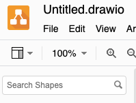
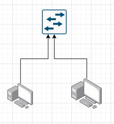

# Lab 09: Documenting a Network

Before attempting this lab, please make sure you have completed all of the material in the lessons tab.

The table of contents for this lab is found below.

&nbsp;&nbsp;&nbsp;&nbsp;&nbsp;&nbsp; Part 1: Network Documentation Review  
&nbsp;&nbsp;&nbsp;&nbsp;&nbsp;&nbsp; Part 2: Creating a network map  
&nbsp;&nbsp;&nbsp;&nbsp;&nbsp;&nbsp; Part 3: Creating your network documentation report  
&nbsp;&nbsp;&nbsp;&nbsp;&nbsp;&nbsp; Part 4: Submission  

## Part 1: Network Documentation Review 

This week, we talked about the importance of creating and maintaining documentation that describes our network devices, topology, and changes. In this lab, we will get some some first hand practice in network documentation.

First, lets start by reviewing an example of what these network documentation documents might look like.

**Step 1.1** Review the below documentation files to get an idea of how you might want to format your network documentation file.

* [Net-doc1](files/file1.pdf)
* [Net-doc2](files/file2.pdf)
* [Net-doc-checklist](files/file3.pdf)

> You'll notice in these network documentation documents you'll find very specific information about the network, guidelines to implement changes on the network, and records of every change that is being made. You might also notice that important device properties are listed for each device (like the brand and OS version running on each network device). Small details like this can be an important part of a network security review (e.g. router running compromised OS version with a zero-day vulnerability)

It's encouraged that you provide *as much* detail as possible in your network documentation. Use the `Net-doc-checklist` as a guideline about what you should include in your network report. 

## Part 2: Creating a network map

We'll be using the topology we build in [lab 07](https://github.com/mikeconti/csf432-fall2020/tree/master/labs/lab07) as the network we are going to document.

First, let's create a physical network map of this topology.

**Step 2.1** Use [Draw.io](https://draw.io/) to create a physical network map of the topology you created in lab07.  

Create a new diagram and start with a blank template.

:bulb: Tip -  You can use the "Search Shapes" to find network device symbols (like router, or switch). Don't forget to use the more results button if you cant find the symbol you want.

:bulb: Tip -  You can click, hold, and drag your cursor on object arrows to created connected edges from one device to another.

Remember to label as many of your devices, interfaces, and connections as possible. You'll be using this network map in your network documentation document.

## Part 3: Creating your network documentation report 

**Step 3.1** Create a detailed network documentation report for the topology you created in lab07. Your network document does not need to be "beautiful" but it should be formatted and organized to a professional standard (table of contents, section headers, section numbers, page numbers, correctly aligned tables, etc.).

> Imagine the CISO at your organization requested this document from you. This is the level of professionalism this document should reflect.

You can use any word processor you would like to create this report. For formal documents, I usually write in [LaTeX](https://www.overleaf.com/) - [example](files/file4.pdf). For a quick but still good looking writeup, I use [markdown](https://stackedit.io/) (all of the csf432 course documents are written in markdown). I use draw.io for flowcharting, circuit design, and of course, network mapping.

If you want to include the "physical location" of your network devices in this fictitious hosting your network, you can make up a building layout (number of floors, networking closet location, etc.)

Here are some suggestions you should consider drafting your network documentation.

* Network map
* What network devices exist on the network?
* What are the configurations details for those network devices?
* What connection medium is being used to connect network devices?
* Where is the demarc point on your network?
* What version operating system is being used on your network devices? (Workstation OSs can be made up (e.g Windows 10))
* What protocols are flowing over your network?
* What are your interface addresses?
* What routing policy is being used on your network?
* What services are being used on your network?

Of course, this is not an exhaustive list of what you should include in your document ~ just a few suggestions.

:warning: Your document will be graded on completeness, accuracy, and formatting.

## Part 5: Submission

Convert your network document into a **.PDF** and upload a single `lastname_lab9.pdf` file to Brightspace through the attachment uploads option. 
