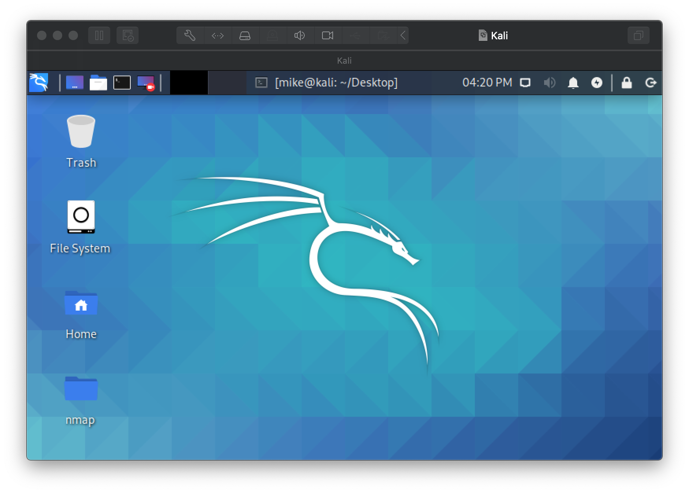

# Lab 10: Scanning with nmap and Netcat

Before attempting this lab, please make sure you have completed all of the material in the lessons tab.

The table of contents for this lab is found below.

&nbsp;&nbsp;&nbsp;&nbsp;&nbsp;&nbsp; Part 1: Workstation Setup <br>
&nbsp;&nbsp;&nbsp;&nbsp;&nbsp;&nbsp; Part 2: Scanning with nmap <br>
&nbsp;&nbsp;&nbsp;&nbsp;&nbsp;&nbsp; Part 3: Immersive Labs <br>
&nbsp;&nbsp;&nbsp;&nbsp;&nbsp;&nbsp; Part 4: Submission <br>

## Part 1: Workstation Setup 

The key to successfully exploit or intrude a remote system is about the information you have. The first step for penetration is the scanning and reconnaissance. In this lab, you will learn how to use tools to scan and retrieve information from a targeting system. You will be using nmap and nacp to scan a vulnerable machine and identify exploits that can be used to attack it. We will use two Linux virtual machines: One is a Kali Linux with nmap and OpenVAS installed; and the other one is intentionally vulnerable Linux. 

First, lets take a look at this labs software requirements:

#### Software Requirements

##### Download to host

* VMWare (Already installed)
* [The Kali Linux (64 bit), Penetration Testing Distribution](https://www.kali.org/downloads/) - [file]()
* [Metasploitable2: Vulnerable Linux Platform](http://sourceforge.net/projects/metasploitable/files/Metasploitable2/) - [file]()

##### Do not download to host (we'll be doing this together in our guest Kali VM)
* [nmap: the Network Mapper - Free Security Scanner](https://nmap.org/)

> :bangbang: :warning:  Metasploitable is an intentionally vulnerable Linux virtual machine. This VM can be used to conduct security training, test security tools, and practice common penetration testing techniques. Never expose this VM to an untrusted network (use NAT or Host-only mode if you have any questions what that means). As long as you don't change any of the networking settings on your Metasploitable Vm, you won't run into any issues.

First lets set up our Kali machine. This VM install will be slightly different than our GNS3 VM install because we will be installing from an .ISO file instead of a .ova appliance. That is, we'll be doing a fresh install of an operating system ~ like you might do with a windows, macOS, or linux .iso file.

**Step 1.1** Follow the below instructions to create a new VM and install Kali on it.

Windows 10 - [VMWare Workstation](https://www.nakivo.com/blog/install-kali-linux-vmware/) - [PDF](files/file1.pdf) <br>
macOS - [VMWare Fusion](https://geekflare.com/kali-linux-installation-guide-vmware/) - [PDF](files/file2.pdf)

Use the below specifications and options to create your VM:

* Memory Size: 512 MB minimum; 1024 MB is recommended (You may allocate more RAM if your system can handle it. It is recommended that you use no more than 50% of your system's RAM. We will be running several virtual machine's at one time and you may need to optimize your virtual machines memory usage.)
* Host name: csf432-student
* Password: pa55word


**Step 1.2** Once installed and logged in, you should be greeted with the Kali desktop. <br>



**Step 1.3** Open a terminal on your Kali machine and run the below command:

```text
csf432-student@kali:~$ whoami
```

:interrobang: Question 1 - Submit a screenshot of your Kali terminal.

Now that you have your Kali machine up and running, lets set up metasploitable2. Because the Metasploitable is already a pre-configured VM, all you need to do is open/import it into VMWare and launch it (much like the setup followed for the GNS3 VM appliance). <br>

**Step 1.3** Unpack the compressed Metasploitable2 file you downloaded, import it in VMWare and launch it. You should see the below banner. <br>


**Step 1.4** Sign into Metasploitable using the default credentials set (username: msfadmin / pass: msfadmin)<br>

**Step 1.5** Run the below command in your Metasploitable VM:

```text
msfadmin@metasploitable:~$ ifconfig
```

:interrobang: Question 2 - Submit a screenshot of your ifconfig results.

:interrobang: Question 3 - What is the IPv4 address assigned to your metasploitable VM?

At this point, both of your VMs for this lab should be up and running.

## Part 2: Scanning with nmap

Our first goal is to scan the vulnerable linux machine (metasploitable) we just created with nmap to discover any open ports. In cybersecurity, the term *open port* refers to a TCP or UDP port number that is configured to accept packets. In contrast, a port which rejects connections or ignores all packets, is a closed port.

Open ports aren't dangerous by default but can become dangerous when legitimate services are exploited through security vulnerabilities or malicious services are introduced to a system via malware or social engineering. Cybercriminals can use these services in conjunction with open ports to gain unauthorized access to sensitive data - [source](https://www.upguard.com/blog/open-port) - [File](files/file3.pdf). [This](https://www.upguard.com/blog/open-port) is a great (and short) read on this issue that provides some really good insight on this topic.

Ok, let's install nmap on our Kali vm.

**Step 2.1** Install nmap by running the below command in your Kali terminal:

```text
csf432-student@kali:~$ git clone https://github.com/nmap/nmap.git
```

We can verify a successfully install by checking the version of nmap we a running with `csf432-student@kali:~$ nmap -V`

Let's scan our metasploitable VM to check for any open ports.

**Step 2.2** Scan the metasploitable VM with the below command:

```text
csf432-student@kali:~$ nmap –T4 <IP of metasploitable VM>
```

Here, *nmap* is the execution command; option -T4 asks for faster execution; and the `<ip>` is a variable statement for the IP address of the scan target. Because the IP of your metasploitable VM will likely differ form mine, we use the < and > as place holders for dynamic values.

:interrobang: Question 4 - Submit a screenshot of your scan results. <br>

In your results you should see that there are many open ports and services on the target system including FTP, SSH, HTTP, and MySQL. These services may contain vulnerabilities ~ creating exploit opportunities for adversarial agents to deliver malicious payloads through.

We'll be using these VMs in future labs ~ so make sure you don't delete them.

## Part 3: Immersive Labs

### Network Scanning

The below language is simply pulled from www.immersivelabs.com for your convenience. Please, read the information below and complete the [Network Scanning](https://immersivelabs.online/labs/network-scanning/) lab on immersivelabs.

#### Quick Summary

Network scanning tools are used to identify live hosts in a network range and the status of network ports running on these hosts. You can use scanning tools such as Nmap and Nessus to perform network port scans and vulnerability scans automatically during the information gathering phase of pen-tests.

:interrobang: Question 5 - Submit a screenshot of your badge demonstrating the completion of this immersivelab module.

### Nmap: Episode 1 – Basic Scanning

The below language is simply pulled from www.immersivelabs.com for your convenience. Please, read the information below and complete the [Nmap: Episode 1 – Basic Scanning](https://immersivelabs.online/labs/nmap-episode-1/) lab on immersivelabs.

#### Quick Summary

Nmap is an extremely powerful tool for network admins, pen testers, and everyone in between. This is the first episode of a three-part series, which covers the basics of scanning, OS detection, and using custom scripts in Nmap.

:interrobang: Question 6 - Submit a screenshot of your badge demonstrating the completion of this immersivelab module.

### Netcat

The below language is simply pulled from www.immersivelabs.com for your convenience. Please, read the information below and complete the [Netcat](https://immersivelabs.online/labs/netcat/) lab on immersivelabs.

#### Quick Summary

Attackers often make use of the network command line tool Netcat (running as nc or ncat, providing Nmap is installed). The tool is referred to as 'The Swiss Army knife of networking'.

:interrobang: Question 7 - Submit a screenshot of your badge demonstrating the completion of this immersivelab module.

### Banner Grabbing

The below language is simply pulled from www.immersivelabs.com for your convenience. Please, read the information below and complete the [Banner Grabbing](https://immersivelabs.online/labs/banner-grabbing/) lab on immersivelabs.

#### Quick Summary

When a service listens on a network awaiting connections it may advertise the service running, including the version or application name. This is useful information for attackers, because if they’re able to identify individual software versions, they may be able to identify known (or developed) vulnerabilities, potentially allowing them to access a system.

:interrobang: Question 8 - Submit a screenshot of your badge demonstrating the completion of this immersivelab module.


## Part 5: Submission

Convert your network document into a **.PDF** and upload a single `lastname_lab10.pdf` file to Brightspace through the attachment uploads option. 
