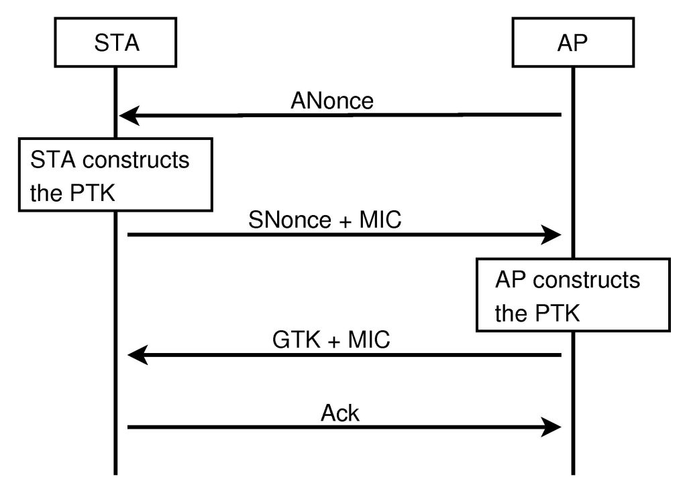
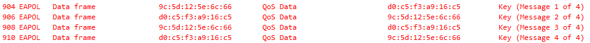
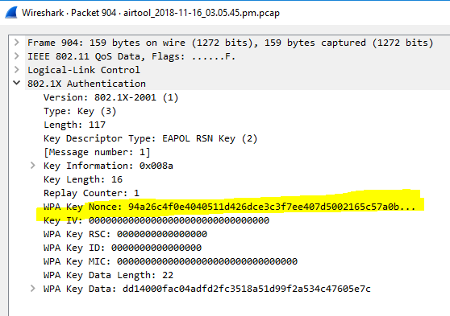
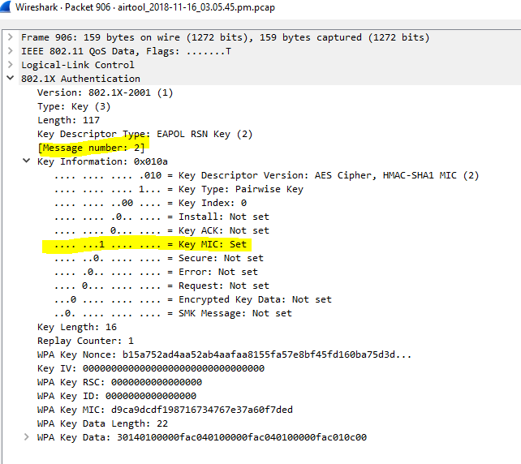
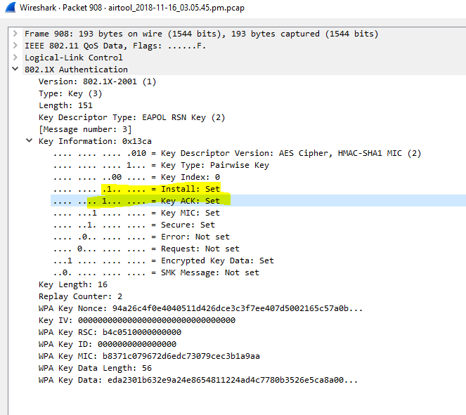
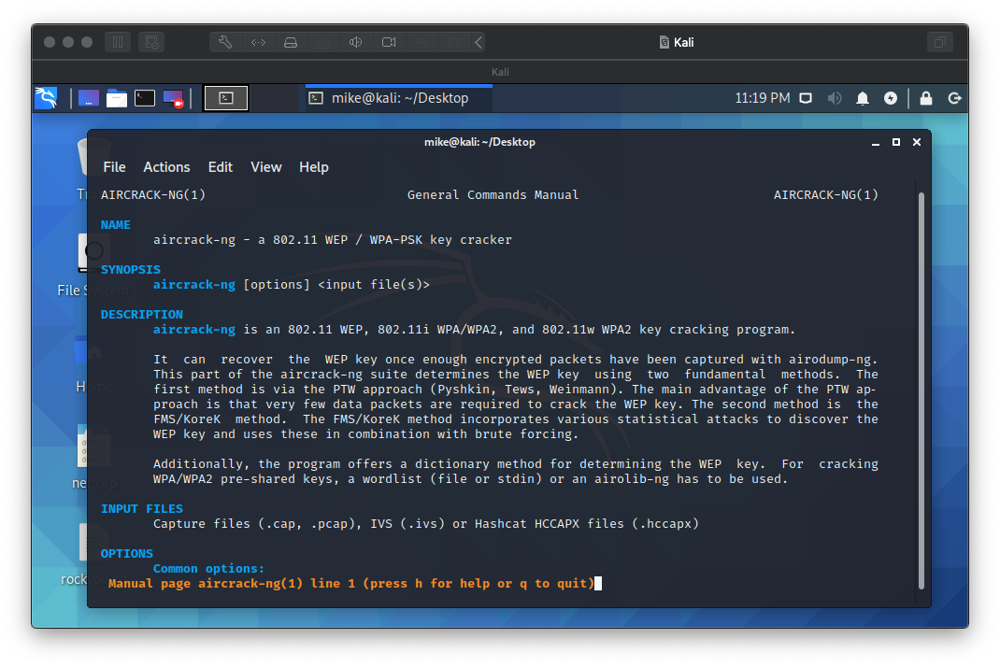

# Lab 11: 4-way Handshake Over EAPoL and WiFi Cracking With aircrack-ng

Before attempting this lab, please make sure you have completed all of the material in the lessons tab.

Create a copy of this google document [lastname_lab11](https://docs.google.com/document/d/1J69lzTvH51rluclHLyIxImLWlbM1oiWhPrUfPlyFC-g/edit?usp=sharing) (File > Make a Copy) to record all of your assignment answers in.

> :warning: Failure to use answer document properly will result in a 10pt deduction from final score.

The table of contents for this lab is found below.

&nbsp;&nbsp;&nbsp;&nbsp;&nbsp;&nbsp; Part 1: Understanding the 4-way Handshake <br>
&nbsp;&nbsp;&nbsp;&nbsp;&nbsp;&nbsp; Part 2: Analyzing a Wireless Capture File <br>
&nbsp;&nbsp;&nbsp;&nbsp;&nbsp;&nbsp; Part 3: Key Cracking with aircrack-ng <br>
&nbsp;&nbsp;&nbsp;&nbsp;&nbsp;&nbsp; Part 4: Submission <br>

This week, we talked about EAP and the importance of which encryption protocols we should use to secure our wireless networks. In this lab, we're going to take a closer look at a capture file of a machine connected to the internet over WiFi. We're going to see what information we can extract from this capture session and see how easy it is to launch a dictionary attack against a network capture file.

## Part 1: Understanding the 4-way Handshake

Based on this weeks lecture, we know that EAP (Extensible Authentication Protocol) is used frequently in our network connections and allows for many different ways to authenticate on a wireless network. Lets take a look at some EAPoL (EAP over LAN) protocols that were used in a 4-way handshake to authenticate a user over 


The 4-way handshake is the process of exchanging 4 messages between an access point (authenticator) and the client device (supplicant) to generate some encryption keys which can be used to encrypt actual data sent over Wireless medium.

To understand the 4 stages we need firstly to get over few keys that will be essential:

* PMK (Pairwise Master Key)
* PTK (Pairwise Transit Key)
* GTK(Group Temporal Key)
* GMK(Group Master Key)
* ANONCE
* SNONCE
* MIC

First of all we need to understand what every key is stand for to continue.

#### PMK- Pairwise Master Key:

Ok so for this key we need to understand a few things. PSK (Pre-Shared Key)and passphrase. they are the same but different. The passphrase is the password that we are giving to our network- to our AP. The PSK is the passphrase but he (the PSK) took it and translate it to 256 bits of string. In WPA/WPA2/personal the PMK is the PSK.
Both the machines have the PMK in assumed the the client knows the password for the WI-FI.

#### GMK- Group Master Key:

The GMK is used in this action to create the GTK, the GTK is generated on every AP and shared with the devices that are connected with it.

#### PTK — Pairwise Transit Key:

The PTK is encryption for uni-cast traffic. In this example between the client and the AP.To get this encryption the client and the AP needs several parameters.

* PTK = PMK + ANONCE + SNONCE + MAC(AA) + MAC(SA)
* ANONCE- is a random number that the AP has made.
* SNONCE- is a random number that the client has made.
* MAC(AA)- the mac address of the AP (authenticator).
* MAC(SA)- the mac address of the client (supplicant).

The PTK is depend on a higher-level key also — PMK.

#### GTK- Group Temporal Key:

The GTK is the encryption for broadcast and multicast for the traffic between one AP to his clients. For every different AP there is a different GTK to secure the traffic in the “air” that belongs to the same network. All the clients that connect to the same AP have the same GTK.

MIC- Message Integrity Code, its like a stamp from the sender who sent the message.

We can visually represent this handshake below (here, STA is the client and AP is the access point):



#### Device States:

A device going through states from authentication to association. Once the device is authenticated and associated and now security will be checked, and 4-way handshake will start.



**Message 1:** AP sends to the client his ANONCE. Now the client has everything he needs to create the PTK because he got the ANONCE, it was the only thing that was missing for him.<br>



**Message 2:** The client sends to the AP his SNONCE with a MIC, the MIC is mainly for the AP to recognize that this message is really from this client, its like a signature (a high level algorithm signature).
Now, after the AP got the message he has everything he needs to create the PTK and that is what he does.<br>



**Message 3:** The AP sends to the client the GTK because he is going to be his new client.
The client get the GTK and install it. <br>



**Message 4:** The client sends to the AP that everything is OK and installed.


Why it is important to understand the stages in the messages?

If we want to crack the WI-FI and we don’t have the passphrase (PSK), we need to capture the handshake between the client and the AP that we want to connect to. We can force the client to reconnect by simply attacking it with deauthentication messages, and than capture the handshake.

Using a long list of potential passwords, you can use aircrack-ng to run a dictionary attack against your handshake messages. Aircracki-ng takes the handshake that you capture (specifically the first two messages) and separate the MIC from the other parameters that all together is equal to the PTK `(PTK = PMK + ANONCE + SNONCE + MAC(AA) + MAC(SA))`. Then the command runs the list with your potential passwords (your PSK (pre-shared key)) and puts it together with the other parameters, and then checks if the MIC that the command gets from the combination is equal to the original MIC. As you'll see ~ this process can take a lot of time depending on the complexity of the password. 

## Part 2: Analyzing a Wireless Capture File

Ok, now that we have some context for what we're about to do, let's jump right in.

**Step 2.1** Download this [.cap file](files/net.cap) <br>

**Step 2.2** Open the .cap file with Wireshark. <br>

> :warning: Because this file is a .cap and not .pcap file, you might need to open it *from* Wireshark instead of double-clicking on the file to auto-launch Wireshark.

**Step 2.3** Open the .cap file with Wireshark. <br>

**Step 2.4** Use the filter string `eapol` to filter for EAPoL traffic. <br>

:interrobang: Question 1 - How many sets of 4-way handshake exchanges are there (4 messages in one set) <br>

:interrobang: Question 2 - Submit a screenshot of your filtered results. <br>

:interrobang: Question 3 - What protocol is listed under the protocol column? <br>

**Step 2.5** Open the first packet by double-clicking on it. <br>

**Step 2.6** Expand the `802.1x Authentication` field in Wireshark. <br>

:interrobang: Question 4 - What encryption key type is being used for this key exchange?<br>

:interrobang: Question 5 - Based on that encryption key type, what possible encryption standards are being used for this communication?  <br>

:interrobang: Question 6 - Look through the first set of key exchanges under the `802.1x Authentication > Key Information` field. What changes do you notice during the handshake. <br>

## Part 3: Key Cracking with aircrack-ng

Because I can't assume that everyone in our class has a wireless network card that supports monitor mode ~ we won't be able to generate and capture our own WEP traffic and then solve for the initialization vector (IV) and private key to gain unauthorized access to the network. So instead, we'll take the capture pact from Part 2 of this lab and launch a dictionary attack against it to try and brute force a private key.

**Step 3.1** Launch and long into your Kali machine you created in our previous lab. <br>

**Step 3.2** Drag and drop the net.cap file you downloaded in Part 2 of this lab into your Kali machine.

> This operation might only be possible if you have VMWare tools installed for this machine (most of the time, this is done by default). If you can't drag and drop, access this lab from the Kali environment and download the .cap file.

**Step 3.3** Open a new terminal and run the below command to download our dictionary file we'll use for our attack:

```
wget --no-check-certificate --content-disposition https://github.com/mikeconti/csf432-fall2020/blob/master/labs/lab11/files/pass-dictionary.txt.gz
```

You can download this file [here](https://drive.google.com/file/d/1Fz_tm0DoZNGGaDF6ufHNd96dWW80g-4K/view?usp=sharing) from your browser.

**Step 3.4** Unpack/decompress this file in Kali. Make sure the plaintext .txt file is located on your desktop.

> A dictionary attack is based on trying all the strings in a pre-arranged listing. Such attacks originally used words one would find in a dictionary

Aircrack-ng is a network software suite consisting of a detector, packet sniffer, WEP and WPA/WPA2-PSK cracker and analysis tool for 802.11 wireless LANs. Kali Linux has aircrack-ng installed by default ~ so no need to go through a painfull terminal download and install process here.

You can learn more about the options you have available to you by running the manual command below:

```text
mike@kali:~/Desktop$ man aircrack-ng to see the manual page of the tool.
```



**Step 3.5** Navigate to your Kali desktop in your terminal. <br>

**Step 3.6** Run the following command to crack the private key used for this network encryption.<br>

```
mike@kali:~/Desktop$ aircrack-ng net.cap -w ./pass-dictionary.txt
```

Here the -w option specifies the path to our dictionary.

> Make sure that the pwd your are operating out of is the same location as your pass-dictionary.txt file or change the pathway to correctly target your pass-dictionary.txt file. If you get a "Please specify a dictionary (option -w)" error, this is likely the problem.

:interrobang: Question 7 - Submit a screenshot of your terminal running the aircrack-ng program.

**Step 3.7** Terminate the program with `ctrl+c`. No need to run the entire program.

:interrobang: Question 8 - What are the three fields on the left hand side of the aircrack-ng display. Match each one of these fields with the key abbreviations described in Part 1 of this lab.

:interrobang: Question 9 - In your own words, what is aircrack-ng doing and what is it solving for?

Because the capture file we are testing against is using WPA encryption standards, we're going to have a harder time getting the key we need to decode this network traffic. Keep in mind that if this capture file was using WEP, we could duplicate this exact process and easily gain unauthorized access to this network. While it might seem like no one in their right mind would be using WEP, there are still many networks that do use it as a result of an oversight or deprecated hardware.

It's trivial to scan for WEP networks while driving down the highway or around popular shopping districts. This is the exact scinero that resulted in the loss of 45 million TK Maxx customer records ~ [source](https://www.zdnet.com/article/wi-fi-hack-caused-tk-maxx-security-breach/) - [file](files/file1.pdf).


## Part 4: Submission

Convert your network document into a **.PDF** and upload a single `lastname_lab11.pdf` file to Brightspace through the attachment uploads option. [source](https://www.wifi-professionals.com/2019/01/4-way-handshake#:~:text=What%20is%204%2Dway%20Handshake,data%20sent%20over%20Wireless%20medium.) - [file](./files/file2.pdf)
