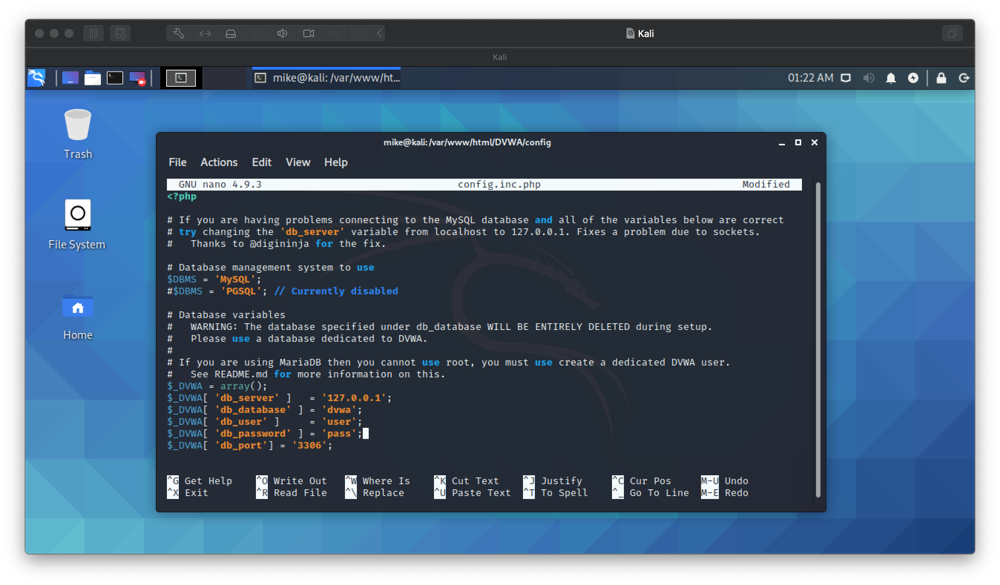
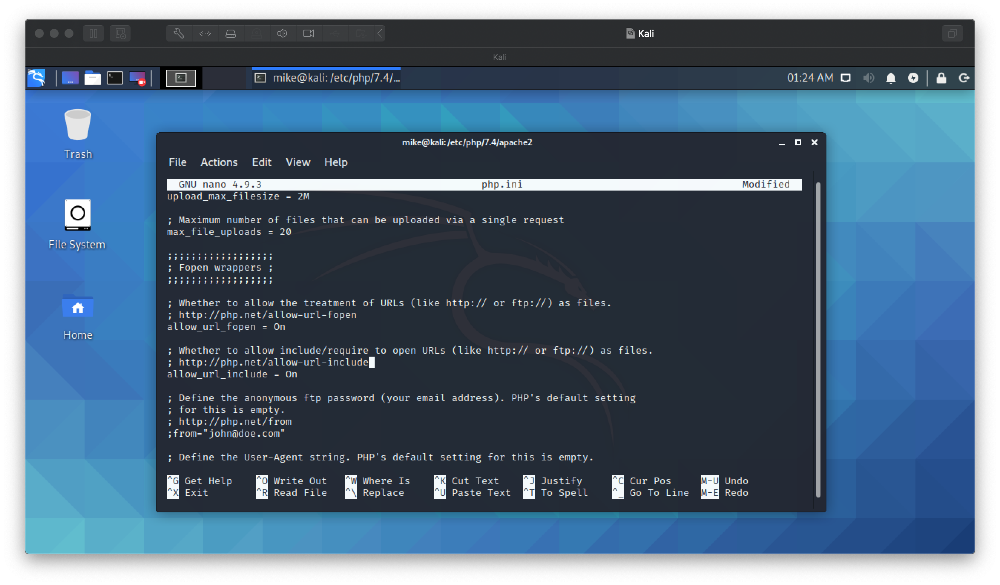
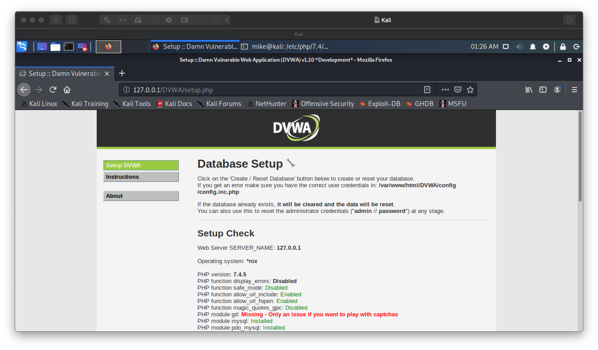

# Lab 12: Exploiting Vulnerabilities in DVWA and Experiencing WannaCry

Before attempting this lab, please make sure you have completed all of the material in the lessons tab.

Create a copy of this google document [lastname_lab12](https://docs.google.com/document/d/1JCsSaDh6O37OdoU08f0763WtdaNP6Xk4Ovk3N5OalDU/edit?usp=sharing) (File > Make a Copy) to record all of your assignment answers in.

> :warning: Failure to use answer document properly will result in a 10pt deduction from final score.

The table of contents for this lab is found below.

&nbsp;&nbsp;&nbsp;&nbsp;&nbsp;&nbsp; Part 1: DVWA Setup in Kali <br>
&nbsp;&nbsp;&nbsp;&nbsp;&nbsp;&nbsp; Part 2: SQL Injection Attack <br>
&nbsp;&nbsp;&nbsp;&nbsp;&nbsp;&nbsp; Part 3: DoS Attack <br>
&nbsp;&nbsp;&nbsp;&nbsp;&nbsp;&nbsp; Part 4: WannaCry <br>
&nbsp;&nbsp;&nbsp;&nbsp;&nbsp;&nbsp; Part 5: Submission <br>


**Statement of Ethics:** The tools used in this lab can be used to break into vulnerable computer systems. The use of these tools and skills should only be implemented in an ethical, professional and legal manner. By law, you must have the explicit, written consent from the owner of the systems that these tools are targeted against if they are not owned by you.

This week, we discussed a lot of really important cyber attacks that we might encounter as security professionals. One attack type that we didn't really touch base on this week is an `SQL Injection Attack`. 

The #01 web application security risks outlined in [The OWASP Top 10](https://owasp.org/www-project-top-ten/) is an injection attack. The Open Web Application Security Project® (OWASP) is a nonprofit foundation that works to improve the security of software. 

The OWASP Top 10 is a standard awareness document for developers and web application security. It represents a broad consensus about the most critical security risks to web applications. Companies should adopt this document and start the process of ensuring that their web applications minimize these risks. Using the OWASP Top 10 is perhaps the most effective first step towards changing the software development culture within your organization into one that produces more secure code.” [1](https://levelup.gitconnected.com/ethical-hacking-part-1-owasp-top-10-and-dvwa-3f2d55580ba8) - [PDF](files/file1.pdf)


## Part 1: DVWA Setup in Kali

For the first part of this lap, we are going to be setting up DVWA (Damn Vulnerable Web Application). DVWA is a web application security researchers, penetration testers or ethical hackers test their skills and run tools in a legal environment.

> Running DDoS or SQL Injection attacks against systems/websites without permission is *illegal*. So, to avoid legal trouble, we're going to be attacking a web application that we own (host on our systems localhost). 

**Step 1.1** Launch your Kali VM and open up a terminal.

In our Linux environments (our Kali machine), the localhost files are stored in /var/www/html directory.

**Step 1.2** Change our directory to where we should put localhost files using following command:

```text
mike@kali:~$ cd /var/www/html
```

**Step 1.3** Clone DVWA from it's Github repository by running the below command (run as root or with sudo):

```text
mike@kali:~$ sudo git clone https://github.com/ethicalhack3r/DVWA.git
```

**Step 1.4** Change the permissions on the DVWA directory by running the below command (run as root or with sudo):

```text
mike@kali:~$ sudo chmod -R 777 DVWA
```

> :bulb: chmod is an important command that you should be familiar with. chmod allows us to change the permissions levels (read (R), write (W), execute (X). You can read up a bit more about chmod [here](https://linuxize.com/post/what-does-chmod-777-mean/) - [PDF](files/file2.pdf).

Now we have to setup this web application to run properly. To do this, we need to enter the /DVWA/config directory and modify/inspect DVWA's config file.

**Step 1.5** Enter this directory by running the below command:

```text
mike@kali:~$ cd DVWA/config
```

If you `ls` the files in this directory, you should see the `config.inc.php.dist` file. This file contains default configurations for DVWA. We need to make a copy of this file with .php extension name, we are coping this file because in future if anything goes wrong then we have the default values. 

**Step 1.6** We can perform this operation by running the below command:

```text
mike@kali:~$ cp config.inc.php.dist config.inc.php
```

> :bulb: cp is another important command that allows us to copy file(s) and move them to different directories if needed.

Let's modify the config.inc.php we just created. We can do this using the `nano` command line text editor. Because config.inc.php is a protected file, you might need to edit it using root permissions. So either su into root, or run your command with sudo.

```text
mike@kali:~$ sudo nano config.inc.php
```

Lets just make a small change to this config file by making the username and passwords for the mysql database DVMA uses to something we won't forget, like `user` and `pass`.

**Step 1.7** Modify your config file so it matches the below screenshot.



**Step 1.8** Write these changes with ctrl+o / ctrl+x (and confirm changes with y + return / enter).

> :bulb: You can always check to see if a change you made to a text/config file persists by using `cat` to display the file contents to your terminal (e.g cat config.inc.php)

Next, we'll need to configure the DVWA database.

**Step 1.9** Run the below command to start mysql services (run as root or with sudo):

```text
mike@kali:~$ sudo service mysql start
```

> :bulb: MySQL Database Service is a fully managed database service to deploy cloud-native applications using one of the world's most popular open source database.

To add a user to this database, we need to run a few sql commands that will create a new DVWA user in the DVWA database.

**Step 1.10** Run the below command to issue mysql commands (be logged in to root or run with sudo):

```text
mike@kali:~$ sudo mysql -u root -p
```

**Step 1.11** Default password for Kali root user is `toor` (yes ~ that's root backwards). Enter the default root password (or whatever root password that was set up with your Kali Machine. Sometimes just enter will work as well.)

**Step 1.12** Run the below command to create a new user:

```text
MariaDB [(none)]> create user 'user'@'127.0.0.1' identified by 'pass';
```

Here using this command we are creating a user called 'user' running server on 127.0.0.1(localhost) and the password is 'pass'. Remember ~ this username and password should exactly same as the password and username we have entered in the configuration file of DVWA web application.

Now we need to grant this user all the privileges over the database. 

**Step 1.13** To do this, run the below command:

```text
MariaDB [(none)]> grant all privileges on dvwa.* to 'user'@'127.0.0.1' identified by 'pass';
```

**Step 1.14** Exit this database console by typing `exit`

Now that we've configured our database, lets configure our webserver (apache2) so we can host the DVWA web application. First, we'll need to get into the correct directory so we can modify another config file (this time, belonging to apache2).

**Step 1.15** cd /etc/php/7.4/apache2

> :warning: the **7.4** part of this directory might vary depending on the version PHP that is installed on your system. If the command above doesn't work, cd into /etc/php/ and ls all of the directories to find the right next-step directory. You can also type the command out using tab-complete (what I always do when running commands), instead of coping and pasting from the lab document. So, type in cd/e`<hit tab>`/php/7`<hit tab>`/a`<hit tab>`. This saves you the trouble of typing the whole word, and will only auto tab complete valid next steps in the directory path.

Typing ls in this directory should reveal a `php.ini` file. 

**Step 1.16** Let's modify by running the below command (run as root or with sudo):

```text
mike@kali:~$ sudo nano php.ini
```
We need to change the allow_url_fopen and allow_url_include fields in this document to `On`. In some cases when if it's the fist time configuring this file (which it is/should be), you might find that one  or both of these field values are set to 'Off'. 

**Step 1.17** Simply set the allow_url_fopen and allow_url_include field values to `On` as shown in the below screenshot.



> :bulb: Pro Tip - You can search documents while using nano by pressing `ctrl+w` and typing in the string that you want to find. This is akin to the `cmd/ctrl+f` key to search for words on macOS or Windows10.

**Step 1.18** Save and exit ths document once you've made your changes.

**Step 1.19** Start the apache2 webserver with the below command (run as root or with sudo):

```text
mike@kali:~$ sudo service apache2 start
```

Ok, everything should be in order for us to access our DVWA application thats being served by our localhost 127.0.0.1.

**Step 1.20** Open a browser and navigate to 127.0.0.1/DVWA/. You should be presented a window that matches the screenshot below:



**Step 1.21** Scroll down to the bottom of this page and click on the `Create/Reset Database` button.

It might take a few moments, but you should be redirected to a login page.

**Step 1.22** The default credentials for this application are `admin` and `password`. Log in.

:interrobang: Question 1 - Submit a screenshot of the DVWA welcome screen.

**Step 1.23** Let's reduce the security of this application by navigating to the menu option on the left hand side nav-bar and selecting `DVWA Security`.

**Step 1.24** Set the security level for this web application to be low.

This will emulate a webpage that has no security procedures in place.

## Part 2: SQL Injection Attack

SQL is a domain-specific language used in programming and designed for managing data held in a relational database management system, or for stream processing in a relational data stream management system [3](https://en.wikipedia.org/wiki/SQL) - [PDF](files/file3.pdf).

SQL injection attacks involve the manipulation of input (usually in a web application), resulting in a SQL statement that is different than intended by the designer. It allows an attacker to send commands to the database that the website or web application communicates with. This, in turn, lets the gain unauthorized data from the database or the ability to modify fields within the database.

Database developer should *never* construct a SQL query based on user input. An SQL statement that uses direct user input for a query might look like the below statement:

```sql
SELECT first_name, last_name FROM users WHERE user_id = '$id';
```

 Instead, they should always use “binds” ~ which is a feature that is included with all major programming languages. Bind variables are placeholders for actual values in SQL statements, so the user input is not directly injected into the SQL statement, like in the below query:
```sql
$sql = 'SELECT first_name, last_name FROM users WHERE user_id = :id';

/* *** then bind :id to $id ***
```

Because we've changed the security level to low in our DVWA website, we've made it vulnerable to SQL Injection attacks.

**Step 2.1** In the DVWA application, click on the “SQL Injection” menu item.

This looks like a typical front end website forum where you might enter your username or password to log in. What user name and password you enter usually gets hashed, and is compared against your hashed credentials sitting in on the back end of that website (their database).

That means, that this box that we can type characters into is used in some way or another to interface with a database that has user information in it. If the programmer did a poor job, we can exploit this point of the application.

**Step 2.2** Enter the number `1` into the User ID box and hit submit.

Strange output, right? Well what happened? Because the backend to this web forum is written poorly, the statement:

```sql
SELECT first_name, last_name FROM users WHERE user_id = '$id';
```

became...

```sql
SELECT first_name, last_name FROM users WHERE user_id = 1;
```

...which returned the account information (first name and last name) for the first user in this user account table. Fields like password, ssNum, ccNum, studentId, emplId, and other sensitive information can exist as fields in a relational database like this.

Because we were able to access the first user account in this database, lets see if we can get the whole table out in the open with some more sql syntax.

**Step 2.3** Enter the command `' or '1'='1` into the User ID box and hit submit.

:interrobang: Question 2 - Submit a screenshot of your sql injection result.

Because the backend to this web forum is written poorly, the statement:

```sql
SELECT first_name, last_name FROM users WHERE user_id = '$id';
```

became...

```sql
SELECT first_name, last_name FROM users WHERE user_id = '' or '1'='1';
```

`1 =1` is a boolean expression that resolves to the boolean value `true` because, one does equal one. The `or` part of this command makes it so only one expression needs to evaluate to true in this query to yield an affirmative action and in this case, that `1 = 1` expression will do the trick.

## Part 3: DoS Attack 

This DoS attack won't work fully on our DVWA application because it's currently being hosted on our loopback address of `127.0.0.1`, but I want to show you how easy it is to target an IP address with a synflood attack DoS attack. You could bring down your router or other network device on your network if you wanted (but, I'm not sure I would).

**Step 3.1** Open a new terminal in Kali. <br>

Metasploit comes preinstalled on Kali.

**Step 3.2** Launch Metasploit by typing the below command into your Kali terminal.

```txt
mike@kali:~$ sudo msfconsole
```

> The Metasploit framework is a very powerful tool which can be used by cyber criminals as well as ethical hackers to probe systematic vulnerabilities on networks and servers [4](https://www.varonis.com/blog/what-is-metasploit/) - [PDF](files/file4.pdf).

**Step 3.2** Once metasploit starts, run the below command:

```text
msf5 > use auxiliary/dos/tcp/synflood
```
**Step 3.3** Run the below command:

```text
msf5 auxiliary(dos/tcp/synflood) > set RHOST 127.0.0.1
```

**Step 3.4** Run the below command:

```text
msf5 auxiliary(dos/tcp/synflood) > exploit
```

:interrobang: Question 3 - Submit a screenshot of syn flood DoS attack running. <br>

As you can see, all it takes is four simple commands to launch a DoS attack.

**Step 3.5** Cancel the attack with `ctrl+c`

## Part 4: WannaCry

The below language is simply pulled from www.immersivelabs.com for your convenience. Please, read the information below and complete the [WannaCry](https://immersivelabs.online/labs/wannacry/) lab on immersivelabs.

The WannaCry attack was a worldwide event targeting Windows OS devices that took place in May 2017. Like most ransomware, WannaCry works by encrypting data and holding it until a payment is made (usually via cryptocurrency such as Bitcoin). <br>

In this module, you are given a plaintext file and a copy of the WannaCry malware. Your task is to run the file to see how the ransomware operates and presents itself. Please ensure you answer the first question BEFORE launching WannaCry, as the files will then be encrypted. <br>

:interrobang: Question 4 - Submit a screenshot of your badge demonstrating the completion of this immersivelab module.

## Part 5: Submission

Convert your network document into a **.PDF** and upload a single `lastname_lab12.pdf` file to Brightspace through the attachment uploads option. 