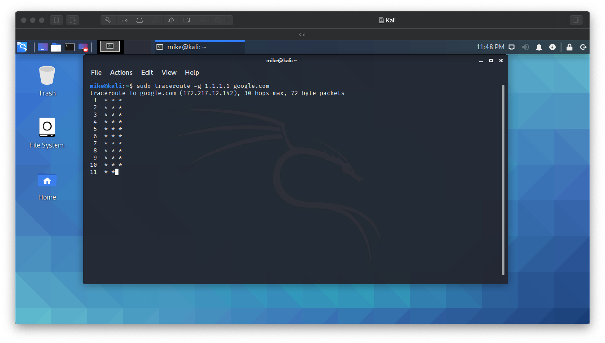
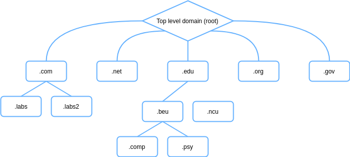

# Lab 13: Traceroute and DNS Zone Transfer Attack using Dig

Before attempting this lab, please make sure you have completed all of the material in the lessons tab.

Create a copy of this google document [lastname_lab13](https://docs.google.com/document/d/1OtPHk3WO9Xfgo6H9v4pYeinfJ2R_8kZR7NqYg-9VlZ4/edit?usp=sharing) (File > Make a Copy) to record all of your assignment answers in.

> :warning: Failure to use answer document properly will result in a 10pt deduction from final score.

The table of contents for this lab is found below.

&nbsp;&nbsp;&nbsp;&nbsp;&nbsp;&nbsp; Part 1: Traceroute <br>
&nbsp;&nbsp;&nbsp;&nbsp;&nbsp;&nbsp; Part 2: DNS Zone Transfer <br>
&nbsp;&nbsp;&nbsp;&nbsp;&nbsp;&nbsp; Part 3: Submission <br>

For this lab, we'll be using some of the command line tools that we discussed this week. It's possible that you've used some of these tools for several of the labs we've had this semester so we will be taking a closer look at some of the options that we can use each of these different tools

## Part 1: Traceroute

The `traceroute` command line tool can be useful when we want to know about the route and about all the hops that a packet takes. Traceroute can help identify issues in the routing policies on our networks, NAT services on our networks, and how many stops (hops) our traffic takes to reach it's intended destination.

Traceroute might not have been one of the tools that we pre-installed during our initial Kali installation, so the first that that we'll do is download it. 

**Step 1.1** Launch your Kali VM and open up a terminal. <br>

**Step 1.2** Run the below command to install traceroute <br>

```text
csf432-student@kali:~$ sudo apt-get install traceroute
```
Ok, lets see how many hops it takes for us to reach a google webserver. 

**Step 1.3** Run the below command <br>

```text
csf432-student@kali:~$ traceroute google.com
```
:interrobang: Question 1 - Submit a screenshot of your output. <br>

:bulb: **Understanding this output:** <br>

 * The first line shows the hostname and ip that is to be reached, the maximum number of hops to the host that traceroute will attempt and the size of the byte packets to be sent.  <br>

* Then each line lists a hop to get to the destination. The hostname is given, followed by the ip of the hostname, followed by the roudtrip time that it takes for a packet to get to the host and back to the initiating computer. <br>

* By default traceroute sends three packets for each host so three response times are listed. <br>

:interrobang: Question 2 - How many hops did it take to reach a google webserver? <br>

:interrobang: Question 3 - Assume you force all of your machine traffic to pass through a VPN concentrator that is located in Japan. How do you think this would affect the `latency (ms times)` shown in this traceroute report? <br>

Thankfully, there are a few options that we can spruce our traceroute commands with. 

General syntax:

```text
csf432-student@kali:~$ traceroute [options]  host_Address [pathlength]
```

> :bulb: note that optional parts of the command are denoted with square brackets `[` and `]`.

You can find a detailed description of the options traceroute commands by running the below command or reading through [this](https://www.pcwdld.com/traceroute) - [PDF](files/file1.pdf) resource (header: Traceroute Command Syntax and Options (for Linux)):

```text
csf432-student@kali:~$ man traceroute
```

> man or *manual* can be used with most command line tools, so if you're not sure how to format a command for any given tool, try giving the command *man `<toolname>`* a shot!

:interrobang: Question 4 - What does a packets TTL mean?.

:interrobang: Question 5 - Write a traceroute command that uses strictly uses IPv4 addresses, ICMP echos for probes, runs through your default gateway interface (not IP address, interface name), and is un-fragmented.   

> Hint: There are a few ways to get your default gateway interface name. ip route or netstat would be the first that come to mind.

If you're getting *'s as output, that means you're command is yielding empty responses ~ so it's not working as it should.



## Part 2: DNS Zone Transfer

The below language is simply pulled from www.immersivelabs.com for your convenience. Please, read the information below and complete the [Zone Transfer](https://immersivelabs.online/labs/zone-transfer/) lab on immersivelabs.

### Quick Summary

DNS zone transfer attack is simple but effective when it comes to reconnaissance. It allows an attacker to understand the topology of an organisation's DNS network, and so to identify domains that are vulnerable. In this lab you will be asked to conduct a zone transfer attack on a DNS server.

Your goals for this lab include:

* Read through the information on zone transfers
* Conduct a zone transfer on the domain immersivelabs.local
* Analyse and identify information on the network

### DNS (Port 53)

A DNS (Domain Name System) is used to give names to different IP domains that exist on a network. Without it, the network would consist of several IP addresses within different subnets. 

### DNS Zone

Every website has a root server containing the master domain name (.com). This master domain can be broken down into different zones. With a DNS server in place, these subdomains will be assigned a unique name which can be based on things like locations or departments within an organizations.

A company that operates all over the world will have different domains on the servers based on a particular location, e.g. company.co.uk (UK) and company.aus (Australia). The domain in Australia may also have subdomains throughout different cities, but having all this on one server can slow it down. To counter this, domains and their subdomains are organized into different zones. 

DNS zones are represented and organized hierarchically with the .com domain at the top. DNS zones may contain one domain, many domains or many subdomains.



### DNS Zone File

DNS records can hold a wealth of information. This file specifies all the information about a certain zone. Every DNS zone file must contain the name of the DNS zone and the TTL (time to live). TTL is used to specify how long records are kept in the DNS server cache. This file can also contain information about the network’s topology and DNS mapping (including IP addresses of other servers or potentially even email addresses of the admins of the server). Zone files also contain information about the DNS record type; they describe information about a specific object and different types have different associations. For example, a type A record specifies an IPv4 address for a given host. 

### Zone Transfer

A zone transfer is a specific DNS request to retrieve all information on that DNS server’s zone. A misconfigured DNS server will give anyone access to the DNS records if they ask for it. This technique can be valuable for penetration testers as it can reveal all the subdomains and IP addresses, enabling them to predict the IP schema and identify different servers that may exist in the network. It is a useful tool for reconnaissance of a target, especially during the enumeration stage. Zone transfers use TCP (Transmission Control Protocol) but where this is disabled, it is often possible to brute force addresses by using a word list of host names and submitting many queries to the server. 

In order to conduct a zone transfer in this module, you will need to use the command line tool `dig` on the DNS server with the domain `immersivelabs.local`

```text
dig @[DNS SERVER HERE] axfr [DOMAIN NAME HERE]
```

:interrobang: Question 6. Submit a screenshot of your badge demonstrating the completion of this immersivelab module.

## Part 3: Submission

Convert your network document into a **.PDF** and upload a single `lastname_lab13.pdf` file to Brightspace through the attachment uploads option. 